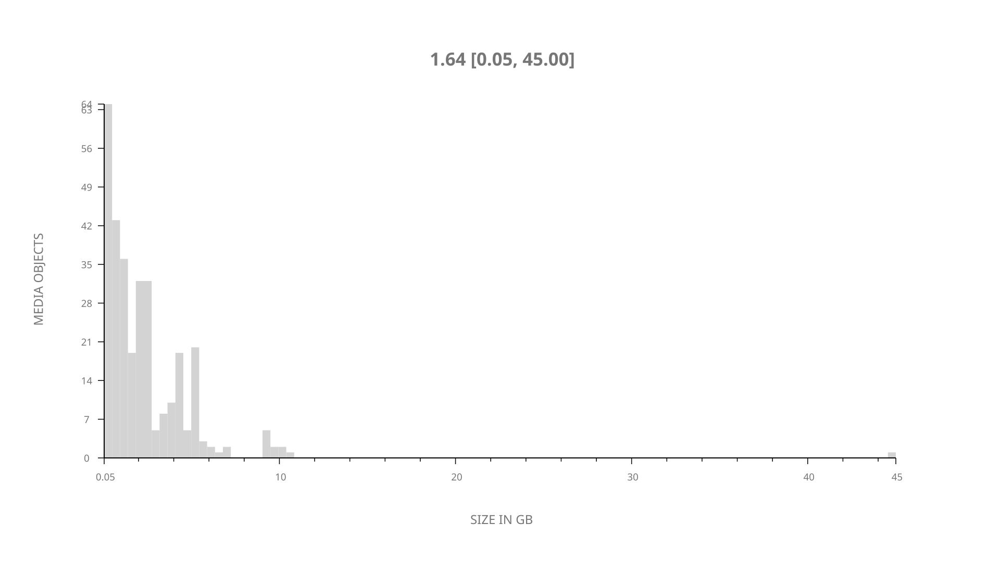
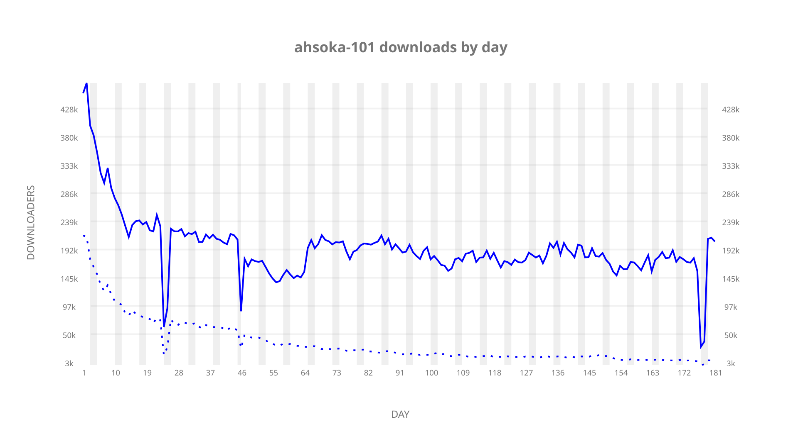
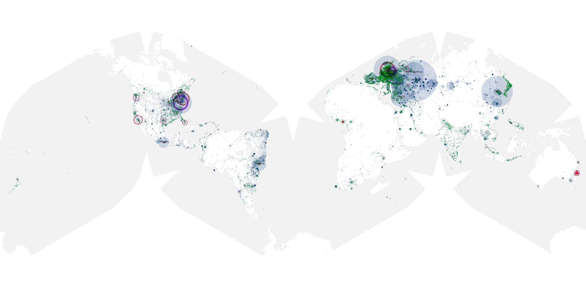
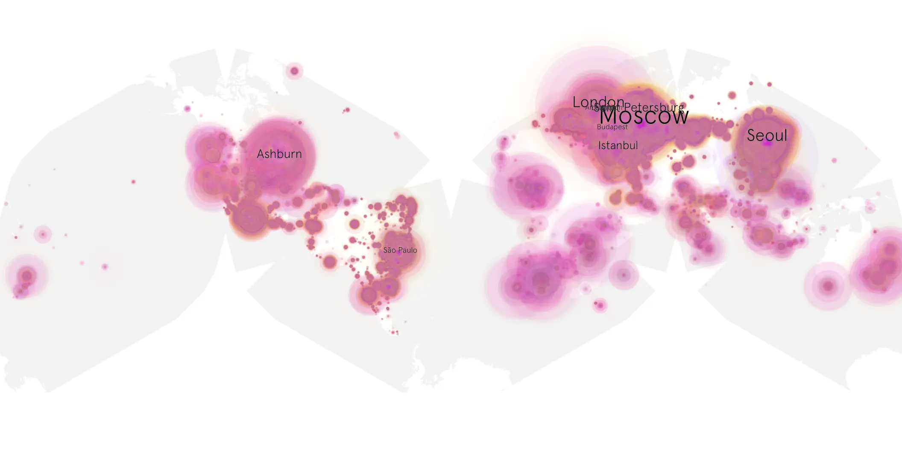
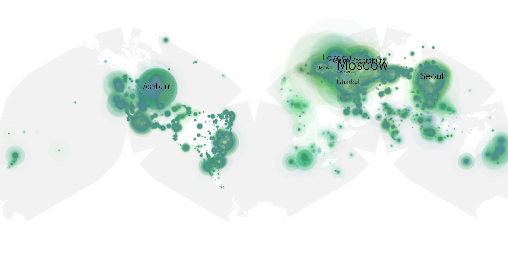

# ahsoka-101 sample cache audit

## 1. Media object

| Field | Value |
| --- | --- |
| Media object | Ahsoka |
| Collection key | `ahsoka-101` |
| imdb_id | [tt13622776](https://www.imdb.com/title/tt13622776/) |
| wikipedia_url | [Star Wars: Ahsoka](https://en.wikipedia.org/wiki/Star_Wars:_Ahsoka) |
| Sample dates | 2023-08-23-to-2024-02-20 |
| Sample days | 182 |
| BTIH count | 342 |
| Unique BTIH count | 312 |
| Downloaders total | 24,476,437 |
| Uploaders total | 2,999,564 |
| Data version | `2026-08-05` |
| IP geolocation version | `6:1777968300` |

## 2. Coverage report

- Generated: 2026-08-31T06:28:23Z
- Sample archive directory: `/run/media/bkoz/gold/src/alpha60-samples-raw.gold/ahsoka-101.xz`
- Hour directories: 4254
- Zero-length sample files: 0
- Other unparsable sample files: 0
- Hourly discontinuities: 3 (109 missing hours)
- Missing days: 1

### Sample archive discontinuities

- hourly gap: last `2023-09-15 01:06`, resumed `2023-09-16 20:06` — missing 42 hour(s)
- hourly gap: last `2023-10-06 22:06`, resumed `2023-10-08 18:43` — missing 43 hour(s)
- hourly gap: last `2024-02-16 19:06`, resumed `2024-02-17 21:00` — missing 24 hour(s)
- missing day: `2023-10-07`

## 3. File sizes histogram *median[lowest, highest]*

## 4. Graphs

### Downloads by week cumulative (normalized start)



### Downloads by day, Saturday and Sunday in gray

## 5. Cumulative Maps

<!-- https://raw.githubusercontent.com/alpha60-devops/alpha60-results-2023/refs/heads/main/data/ -->

### <a href="https://raw.githubusercontent.com/alpha60-devops/alpha60-results-2023/refs/heads/main/data/geojson.cumulative/ahsoka-101-cumulative-aggregate.geojson.gz" data-map-title="Ahsoka — ahsoka-101" onclick="leaflet_map_open_window(this.href, this.dataset.mapTitle); return false;" class="table-link" aria-label="Open Ahsoka (ahsoka-101) cumulative data map in new window" title="Opens interactive map for Ahsoka (ahsoka-101) data">Swarm Detail</a>

### Geographic Regions

| Africa | Americas | Asia | Europe | Oceania | Unknown |
| --- | --- | --- | --- | --- | --- |
| 2.82 | 22.90 | 18.96 | 51.17 | 1.45 | 0.49 |

### Network infrastructure

{:target="_blank" rel="noopener"}

### Resolution >= 1080p

{:target="_blank" rel="noopener"}

### Resolution < 1080p

{:target="_blank" rel="noopener"}
