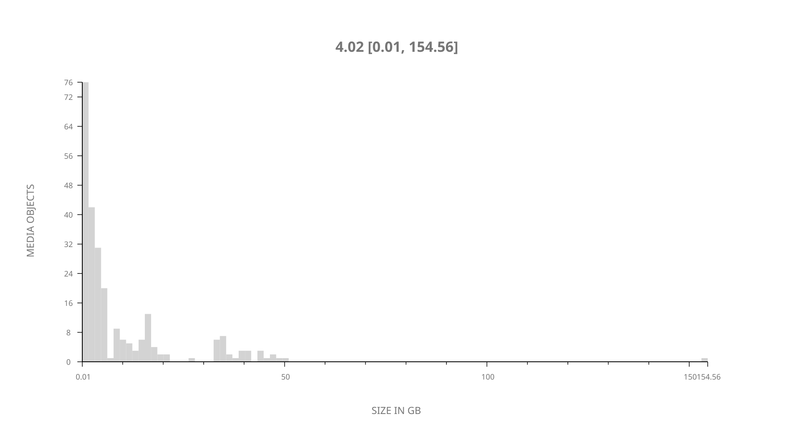
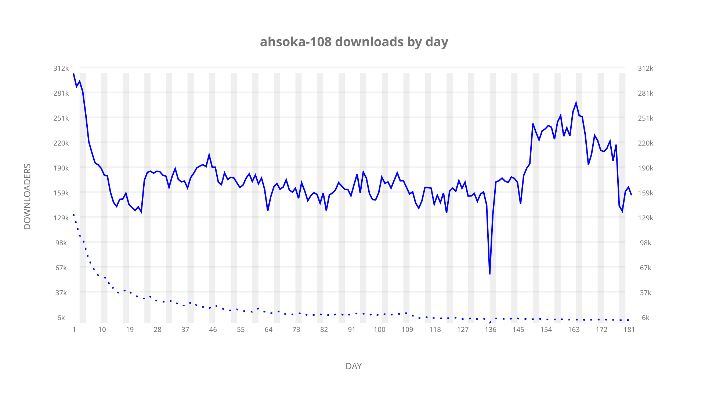
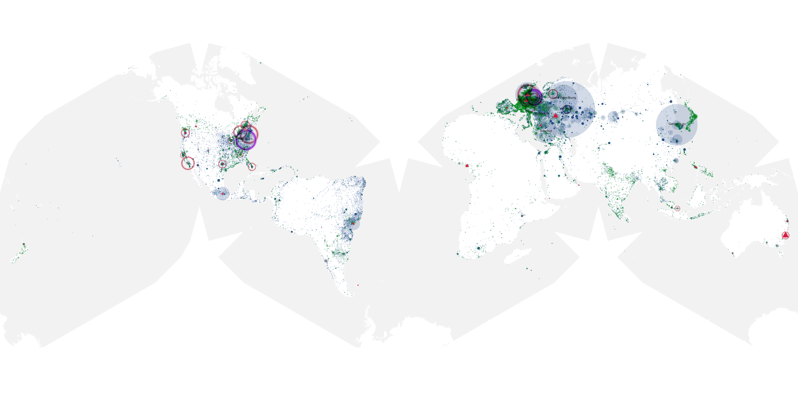
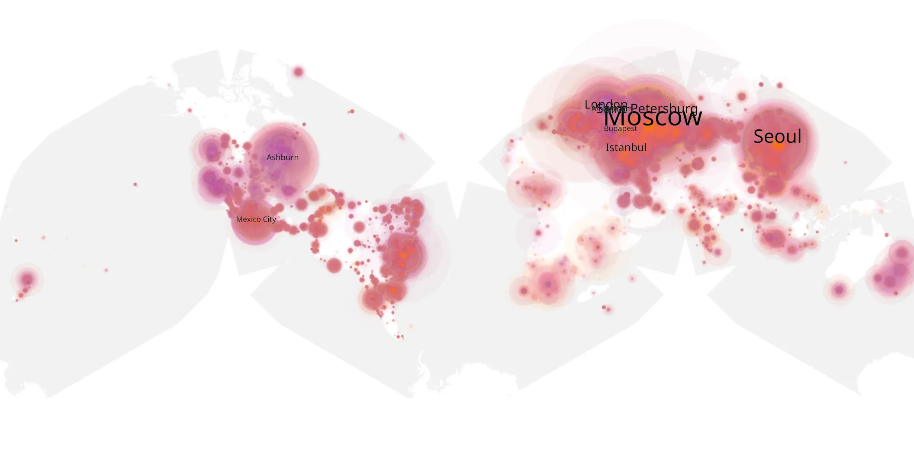
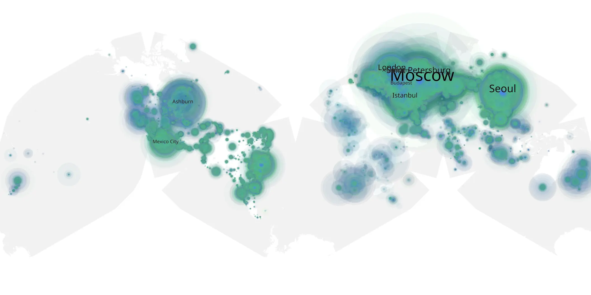

# ahsoka-108 sample cache audit

## 1. Media object

| Field | Value |
| --- | --- |
| Media object | Ahsoka |
| Collection key | `ahsoka-108` |
| imdb_id | [tt13622776](https://www.imdb.com/title/tt13622776/) |
| wikipedia_url | [Star Wars: Ahsoka](https://en.wikipedia.org/wiki/Star_Wars:_Ahsoka) |
| Sample dates | 2023-10-04-to-2024-04-02 |
| Sample days | 182 |
| BTIH count | 285 |
| Unique BTIH count | 252 |
| Downloaders total | 26,450,502 |
| Uploaders total | 1,935,807 |
| Data version | `2026-08-05` |
| IP geolocation version | `6:1777968300` |

## 2. Sample coverage report

- Generated: 2026-08-31T06:28:23Z
- Sample archive directory: `/run/media/bkoz/gold/src/alpha60-samples-raw.gold/ahsoka-108.xz`
- Hour directories: 4352
- Zero-length sample files: 0
- Other unparsable sample files: 0
- Hourly discontinuities: 2 (12 missing hours)
- Missing days: 0

### Sample archive discontinuities

- hourly gap: last `2024-02-16 19:03`, resumed `2024-02-17 07:03` — missing 11 hour(s)
- hourly gap: last `2024-03-31 01:03`, resumed `2024-03-31 03:03` — missing 1 hour(s)

## 3. Media objects file size histogram

## 4. Visualization pass — graphs

### Downloads by week cumulative (normalized start)



### Downloads by day, Saturday and Sunday in gray

## 5. Visualization pass — maps

### Cumulative geographic slices

| Africa | Americas | Asia | Europe | Oceania | Unknown |
| --- | --- | --- | --- | --- | --- |
| 1.63 | 20.77 | 20.25 | 53.61 | 1.04 | 0.53 |

### Cumulative network infrastructure

{:target="_blank" rel="noopener"}

### Cumulative data maps

**Cumulative >= 1080p**

{:target="_blank" rel="noopener"}

**Cumulative < 1080p**

{:target="_blank" rel="noopener"}
