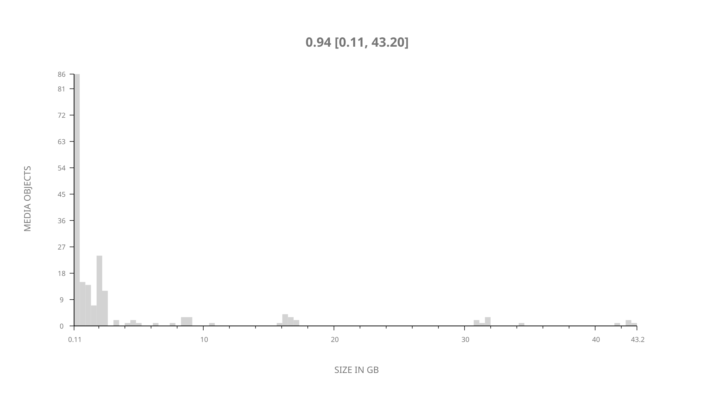
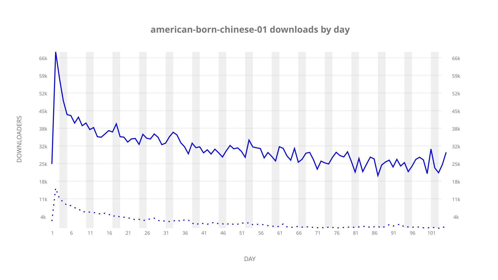
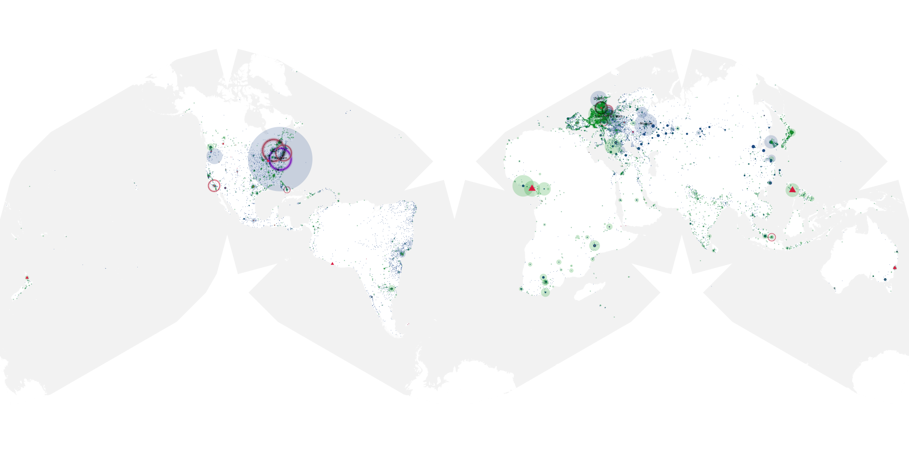
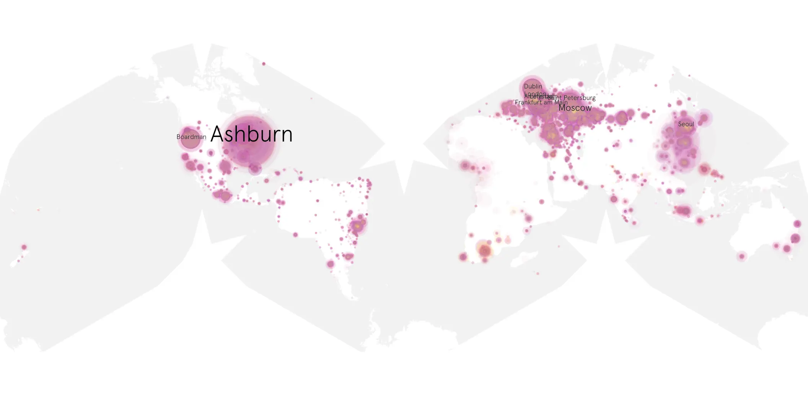
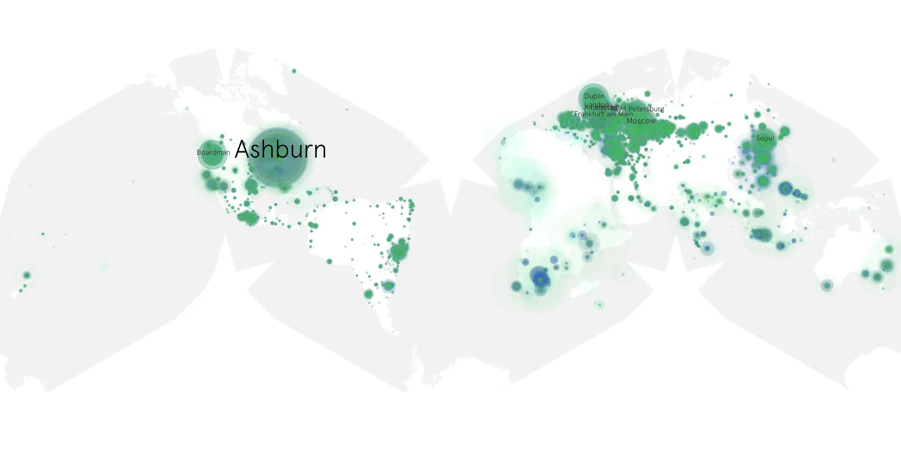

# american-born-chinese-01 sample cache audit

## 1. Media object

| Field | Value |
| --- | --- |
| Media object | American Born Chinese |
| Collection key | `american-born-chinese-01` |
| imdb_id | [tt15552018](https://www.imdb.com/title/tt15552018/) |
| wikipedia_url | [American Born Chinese (TV series)](https://en.wikipedia.org/wiki/American_Born_Chinese_(TV_series)) |
| Sample dates | 2023-05-24-to-2023-09-05 |
| Sample days | 105 |
| BTIH count | 233 |
| Unique BTIH count | 194 |
| Downloaders total | 2,654,030 |
| Uploaders total | 395,065 |
| Data version | `2026-08-05` |
| IP geolocation version | `6:1777968300` |

## 2. Sample coverage report

- Generated: 2026-08-31T06:28:23Z
- Sample archive directory: `/run/media/bkoz/gold/src/alpha60-samples-raw.gold/american-born-chinese-01.xz`
- Hour directories: 2503
- Zero-length sample files: 0
- Other unparsable sample files: 0
- Hourly discontinuities: 0 (0 missing hours)
- Missing days: 0

### Sample archive discontinuities

None detected.

## 3. Media objects file size histogram

## 4. Visualization pass — graphs

### Downloads by week cumulative (normalized start)



### Downloads by day, Saturday and Sunday in gray

## 5. Visualization pass — maps

### Cumulative geographic slices

| Africa | Americas | Asia | Europe | Oceania | Unknown |
| --- | --- | --- | --- | --- | --- |
| 3.44 | 26.84 | 18.85 | 44.18 | 1.17 | 0.55 |

### Cumulative network infrastructure

{:target="_blank" rel="noopener"}

### Cumulative data maps

**Cumulative >= 1080p**

{:target="_blank" rel="noopener"}

**Cumulative < 1080p**

{:target="_blank" rel="noopener"}
