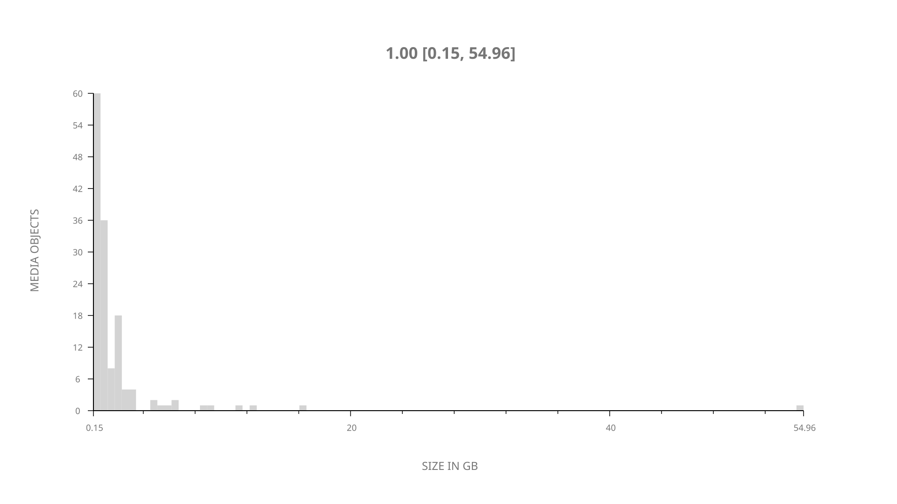
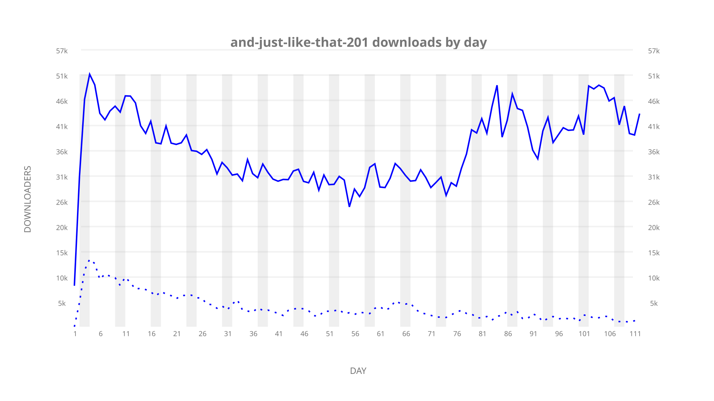
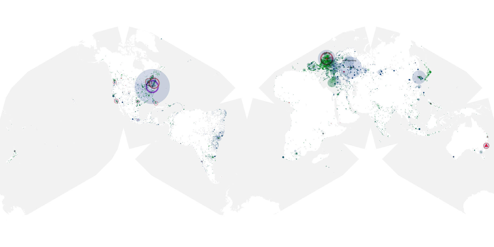
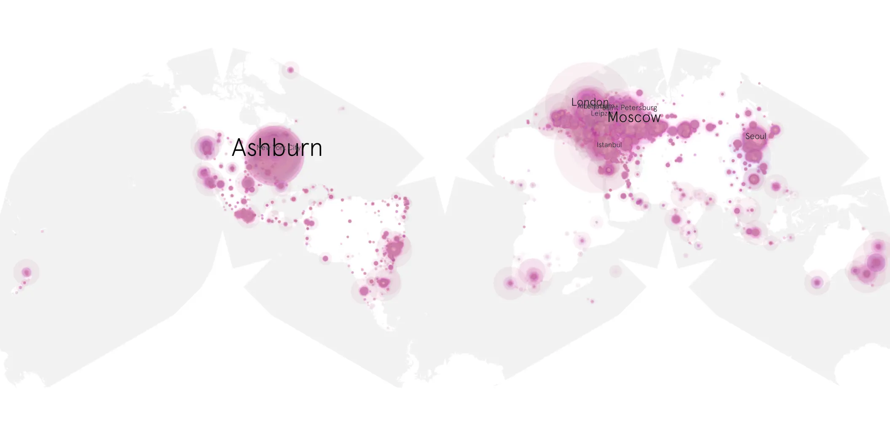
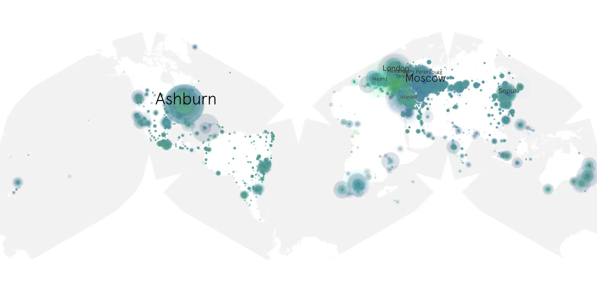

# and-just-like-that-201 sample cache audit

## 1. Media object

| Field | Value |
| --- | --- |
| Media object | And Just Like That... |
| Collection key | `and-just-like-that-201` |
| imdb_id | [tt13819960](https://www.imdb.com/title/tt13819960/) |
| wikipedia_url | [And Just Like That...](https://en.wikipedia.org/wiki/And_Just_Like_That...) |
| Sample dates | 2023-06-22-to-2023-10-11 |
| Sample days | 112 |
| BTIH count | 147 |
| Unique BTIH count | 142 |
| Downloaders total | 2,813,029 |
| Uploaders total | 366,112 |
| Data version | `2026-08-05` |
| IP geolocation version | `6:1777968300` |

## 2. Sample coverage report

- Generated: 2026-08-31T06:28:23Z
- Sample archive directory: `/run/media/bkoz/gold/src/alpha60-samples-raw.gold/and-just-like-that-201.xz`
- Hour directories: 2670
- Zero-length sample files: 0
- Other unparsable sample files: 0
- Hourly discontinuities: 0 (0 missing hours)
- Missing days: 0

### Sample archive discontinuities

None detected.

## 3. Media objects file size histogram

## 4. Visualization pass — graphs

### Downloads by week cumulative (normalized start)



### Downloads by day, Saturday and Sunday in gray

## 5. Visualization pass — maps

### Cumulative geographic slices

| Africa | Americas | Asia | Europe | Oceania | Unknown |
| --- | --- | --- | --- | --- | --- |
| 2.29 | 23.27 | 15.82 | 51.63 | 2.00 | 0.58 |

### Cumulative network infrastructure

{:target="_blank" rel="noopener"}

### Cumulative data maps

**Cumulative >= 1080p**

{:target="_blank" rel="noopener"}

**Cumulative < 1080p**

{:target="_blank" rel="noopener"}
