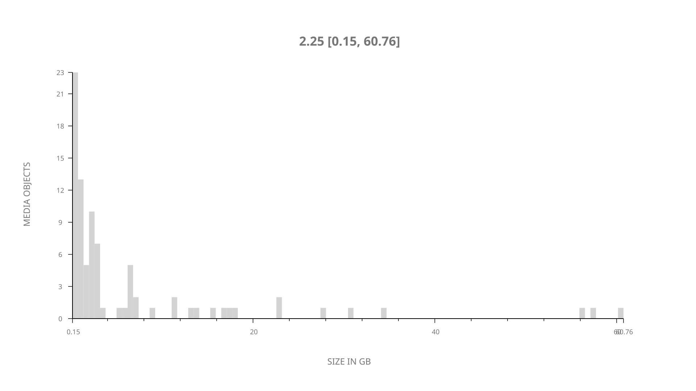
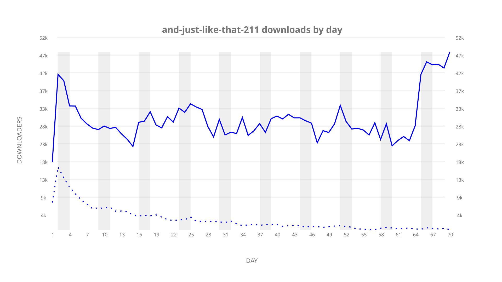
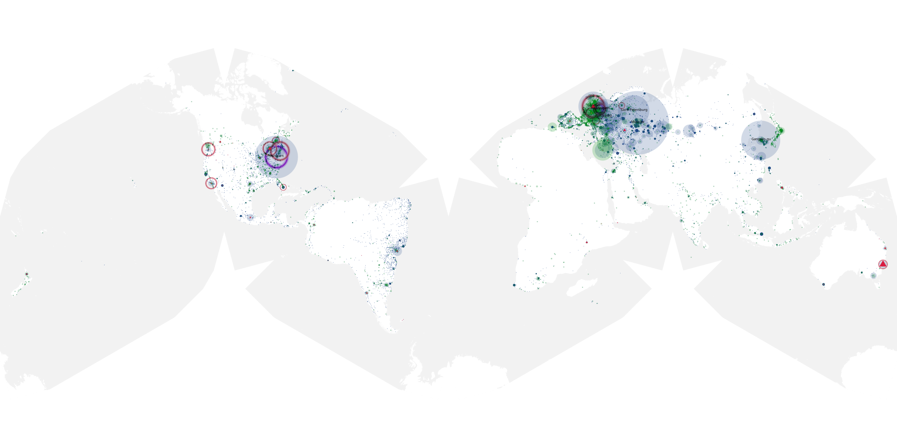
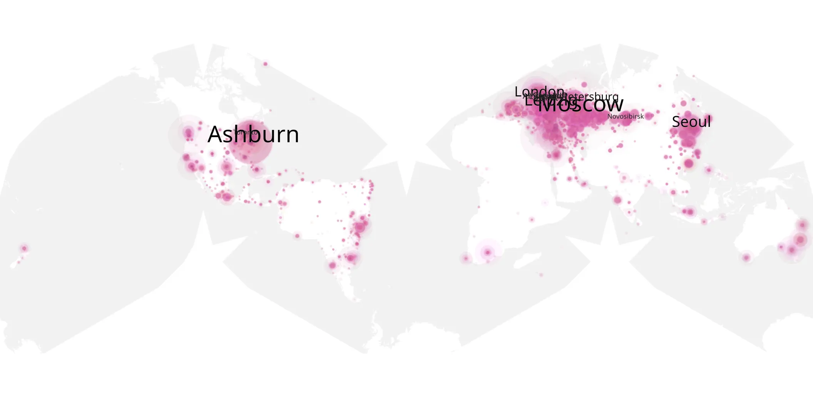
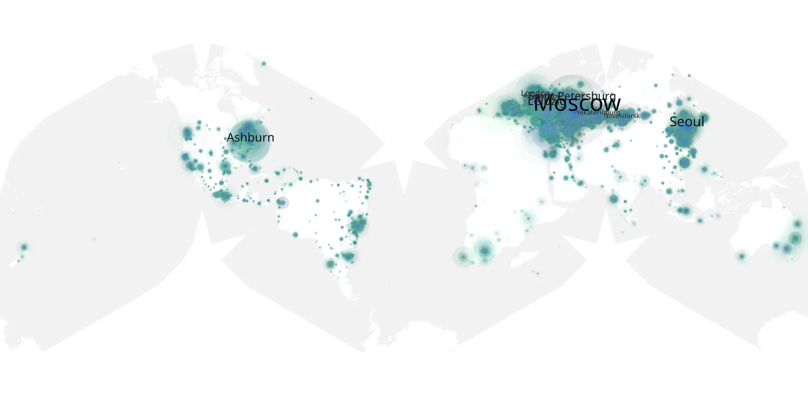

# and-just-like-that-211 sample cache audit

## 1. Media object

| Field | Value |
| --- | --- |
| Media object | And Just Like That... |
| Collection key | `and-just-like-that-211` |
| imdb_id | [tt13819960](https://www.imdb.com/title/tt13819960/) |
| wikipedia_url | [And Just Like That...](https://en.wikipedia.org/wiki/And_Just_Like_That...) |
| Sample dates | 2023-08-24-to-2023-11-01 |
| Sample days | 70 |
| BTIH count | 96 |
| Unique BTIH count | 85 |
| Downloaders total | 1,768,665 |
| Uploaders total | 242,020 |
| Data version | `2026-08-05` |
| IP geolocation version | `6:1777968300` |

## 2. Coverage report

- Generated: 2026-09-10T01:56:40Z
- Sample archive directory: `/mnt/gold/src/alpha60-samples-raw.gold/and-just-like-that-211.xz`
- Hour directories: 1665
- Zero-length sample files: 0
- Other unparsable sample files: 0
- Hourly discontinuities: 0 (0 missing hours)
- Missing days: 0

### Sample archive discontinuities

None detected.

## 3. File sizes histogram *median[lowest, highest]*

## 4. Graphs

### Downloads by week cumulative (normalized start)



### Downloads by day, Saturday and Sunday in gray

## 5. Cumulative Maps

<!-- https://raw.githubusercontent.com/alpha60-devops/alpha60-results-2023/refs/heads/main/data/ -->

### <a href="https://raw.githubusercontent.com/alpha60-devops/alpha60-results-2023/refs/heads/main/data/geojson.cumulative/and-just-like-that-211-cumulative-aggregate.geojson.gz" data-map-title="And Just Like That... — and-just-like-that-211" onclick="leaflet_map_open_window(this.href, this.dataset.mapTitle); return false;" class="table-link" aria-label="Open And Just Like That... (and-just-like-that-211) cumulative data map in new window" title="Opens interactive map for And Just Like That... (and-just-like-that-211) data">Swarm Detail</a>

### Geographic Regions

| Africa | Americas | Asia | Europe | Oceania | Unknown |
| --- | --- | --- | --- | --- | --- |
| 1.59 | 19.00 | 16.45 | 55.25 | 1.66 | 0.65 |

### Network infrastructure

{:target="_blank" rel="noopener"}

### Resolution >= 1080p

{:target="_blank" rel="noopener"}

### Resolution < 1080p

{:target="_blank" rel="noopener"}
