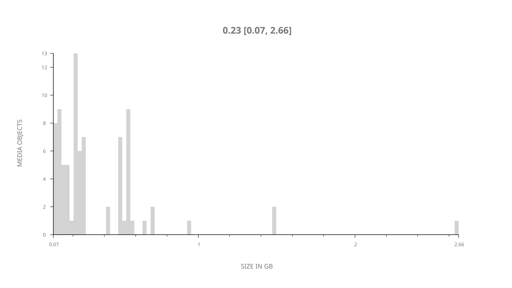
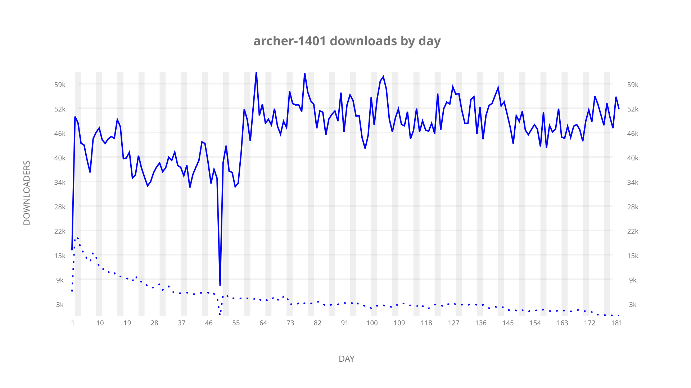
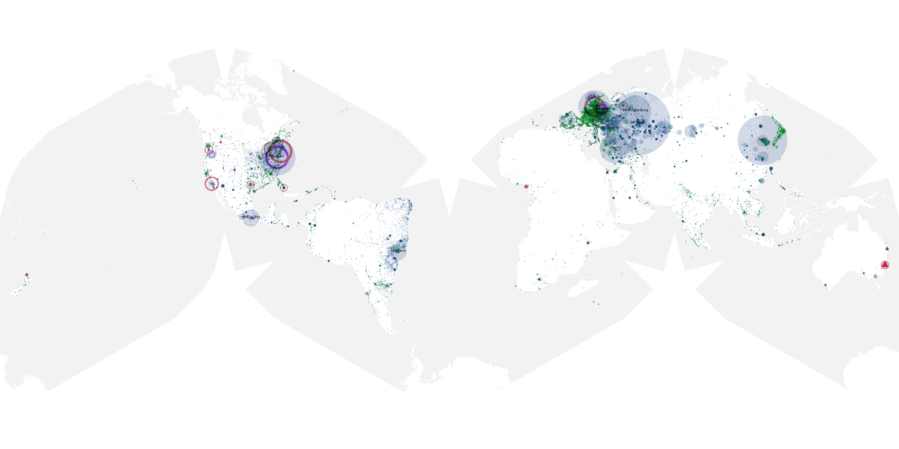
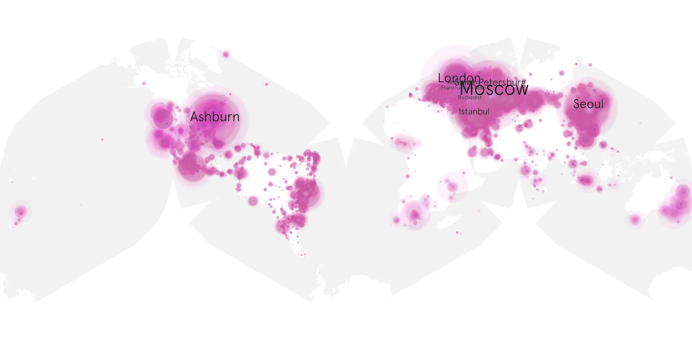
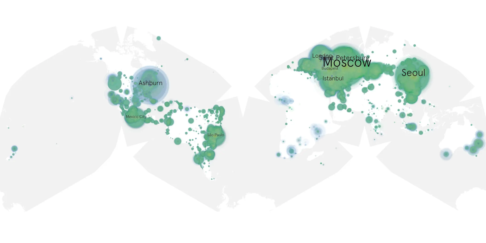

# archer-1401 sample cache audit

## 1. Media object

| Field | Value |
| --- | --- |
| Media object | Archer |
| Collection key | `archer-1401` |
| imdb_id | [tt1486217](https://www.imdb.com/title/tt1486217/) |
| wikipedia_url | [Archer (2009 TV series)](https://en.wikipedia.org/wiki/Archer_(2009_TV_series)) |
| Sample dates | 2023-08-31-to-2024-02-28 |
| Sample days | 182 |
| BTIH count | 85 |
| Unique BTIH count | 81 |
| Downloaders total | 6,485,884 |
| Uploaders total | 444,170 |
| Data version | `2026-08-05` |
| IP geolocation version | `6:1777968300` |

## 2. Sample coverage report

- Generated: 2026-08-31T06:28:23Z
- Sample archive directory: `/run/media/bkoz/gold/src/alpha60-samples-raw.gold/archer-1401.xz`
- Hour directories: 4319
- Zero-length sample files: 0
- Other unparsable sample files: 0
- Hourly discontinuities: 12 (33 missing hours)
- Missing days: 0

### Sample archive discontinuities

- hourly gap: last `2023-09-22 22:00`, resumed `2023-09-23 00:00` — missing 1 hour(s)
- hourly gap: last `2023-09-25 22:00`, resumed `2023-09-26 00:00` — missing 1 hour(s)
- hourly gap: last `2023-10-19 01:00`, resumed `2023-10-20 00:00` — missing 22 hour(s)
- hourly gap: last `2023-12-27 22:00`, resumed `2023-12-28 00:00` — missing 1 hour(s)
- hourly gap: last `2023-12-28 22:00`, resumed `2023-12-29 00:00` — missing 1 hour(s)
- hourly gap: last `2023-12-29 22:00`, resumed `2023-12-30 00:00` — missing 1 hour(s)
- hourly gap: last `2023-12-30 22:00`, resumed `2023-12-31 00:00` — missing 1 hour(s)
- hourly gap: last `2023-12-31 22:00`, resumed `2024-01-01 00:00` — missing 1 hour(s)
- hourly gap: last `2024-01-01 22:00`, resumed `2024-01-02 00:00` — missing 1 hour(s)
- hourly gap: last `2024-01-30 22:00`, resumed `2024-01-31 00:00` — missing 1 hour(s)
- hourly gap: last `2024-02-05 22:00`, resumed `2024-02-06 00:00` — missing 1 hour(s)
- hourly gap: last `2024-02-24 02:00`, resumed `2024-02-24 04:00` — missing 1 hour(s)

## 3. Media objects file size histogram

## 4. Visualization pass — graphs

### Downloads by week cumulative (normalized start)



### Downloads by day, Saturday and Sunday in gray

## 5. Visualization pass — maps

### Cumulative geographic slices

| Africa | Americas | Asia | Europe | Oceania | Unknown |
| --- | --- | --- | --- | --- | --- |
| 1.28 | 23.41 | 18.89 | 51.37 | 1.13 | 0.54 |

### Cumulative network infrastructure

{:target="_blank" rel="noopener"}

### Cumulative data maps

**Cumulative >= 1080p**

{:target="_blank" rel="noopener"}

**Cumulative < 1080p**

{:target="_blank" rel="noopener"}
