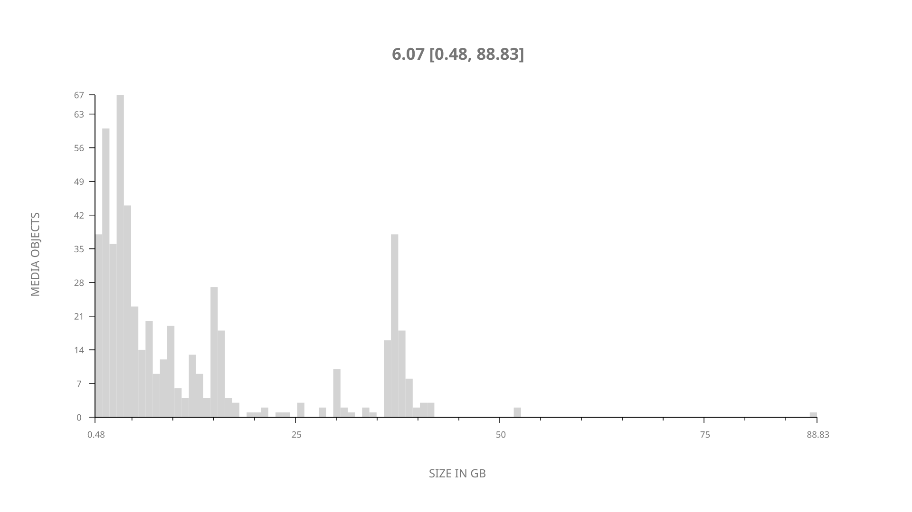
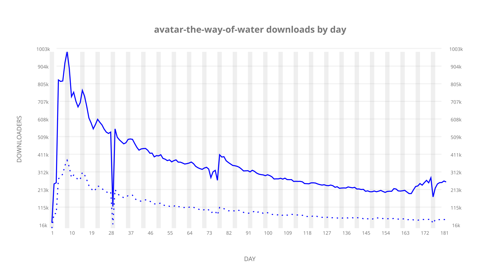
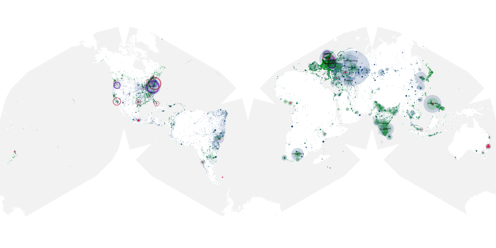
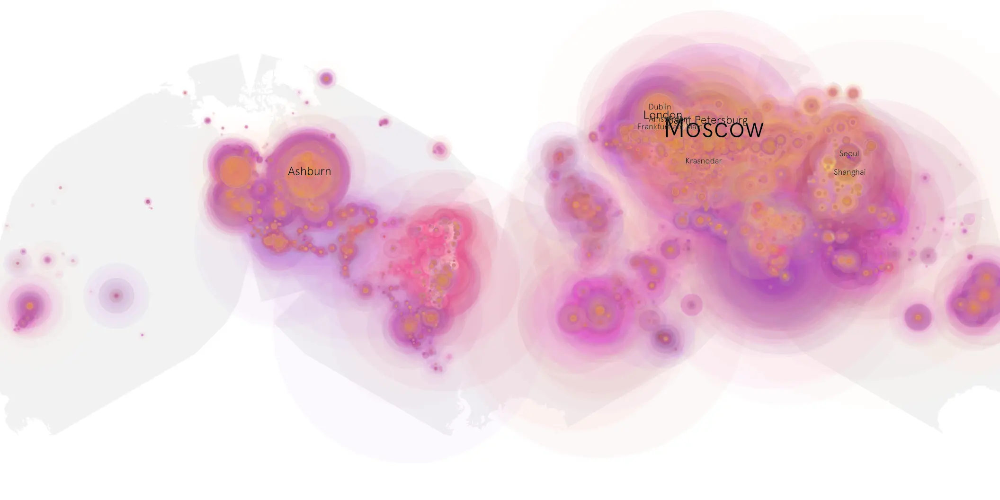
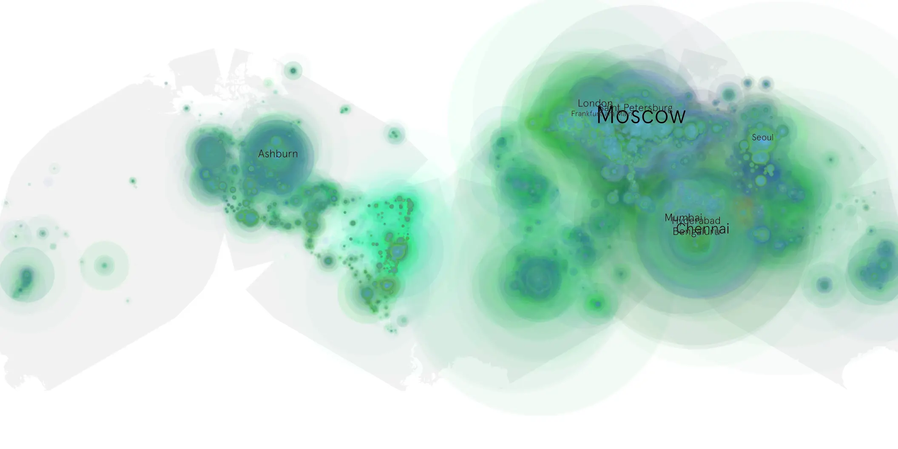

# avatar-the-way-of-water sample cache audit

## 1. Media object

| Field | Value |
| --- | --- |
| Media object | Avatar: The Way of Water |
| Collection key | `avatar-the-way-of-water` |
| imdb_id | [tt1630029](https://www.imdb.com/title/tt1630029/) |
| wikipedia_url | [Avatar: The Way of Water](https://en.wikipedia.org/wiki/Avatar:_The_Way_of_Water) |
| Sample dates | 2023-03-25-to-2023-09-29 |
| Sample days | 189 |
| BTIH count | 595 |
| Unique BTIH count | 548 |
| Downloaders total | 38,711,920 |
| Uploaders total | 12,393,790 |
| Data version | `2026-08-05` |
| IP geolocation version | `6:1777968300` |

## 2. Sample coverage report

- Generated: 2026-08-31T06:28:23Z
- Sample archive directory: `/run/media/bkoz/gold/src/alpha60-samples-raw.gold/avatar-the-way-of-water.xz`
- Hour directories: 4308
- Zero-length sample files: 0
- Other unparsable sample files: 0
- Hourly discontinuities: 5 (211 missing hours)
- Missing days: 7

### Sample archive discontinuities

- hourly gap: last `2023-03-26 01:03`, resumed `2023-03-26 03:03` — missing 1 hour(s)
- hourly gap: last `2023-04-22 00:03`, resumed `2023-04-23 00:03` — missing 23 hour(s)
- hourly gap: last `2023-06-06 08:03`, resumed `2023-06-06 15:03` — missing 6 hour(s)
- hourly gap: last `2023-09-15 23:03`, resumed `2023-09-23 00:03` — missing 168 hour(s)
- hourly gap: last `2023-09-23 13:03`, resumed `2023-09-24 03:03` — missing 13 hour(s)
- missing day: `2023-09-16`
- missing day: `2023-09-17`
- missing day: `2023-09-18`
- missing day: `2023-09-19`
- missing day: `2023-09-20`
- missing day: `2023-09-21`
- missing day: `2023-09-22`

## 3. Media objects file size histogram

## 4. Visualization pass — graphs

### Downloads by week cumulative (normalized start)



### Downloads by day, Saturday and Sunday in gray

## 5. Visualization pass — maps

### Cumulative geographic slices

| Africa | Americas | Asia | Europe | Oceania | Unknown |
| --- | --- | --- | --- | --- | --- |
| 6.39 | 17.73 | 27.12 | 40.94 | 1.44 | 0.47 |

### Cumulative network infrastructure

{:target="_blank" rel="noopener"}

### Cumulative data maps

**Cumulative >= 1080p**

{:target="_blank" rel="noopener"}

**Cumulative < 1080p**

{:target="_blank" rel="noopener"}
