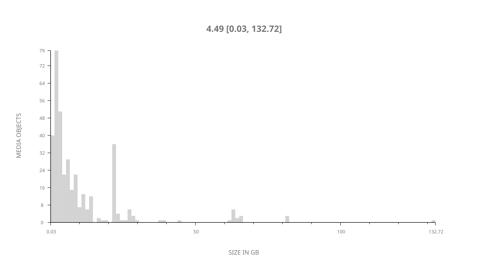
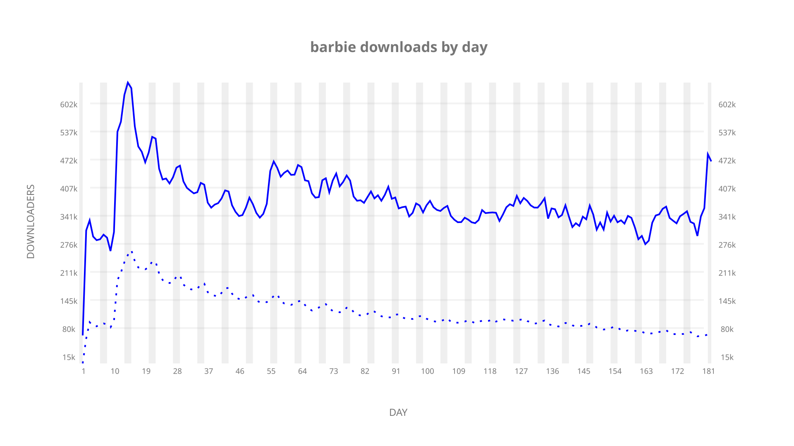
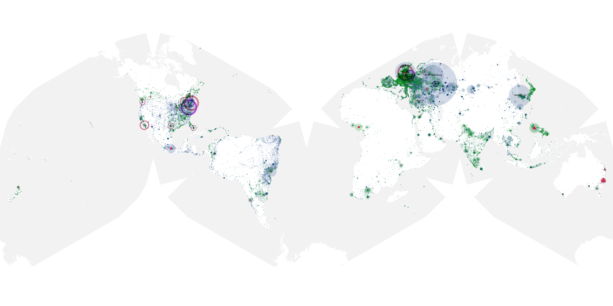
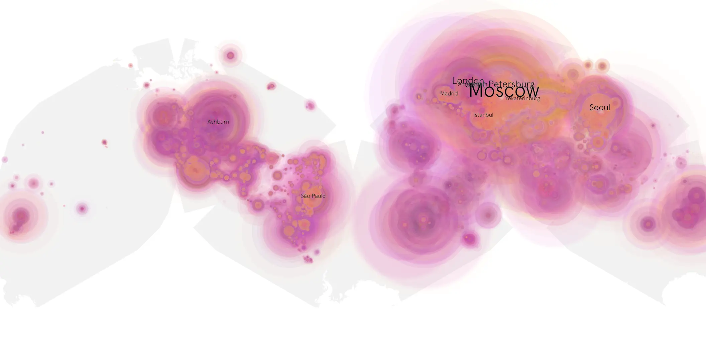
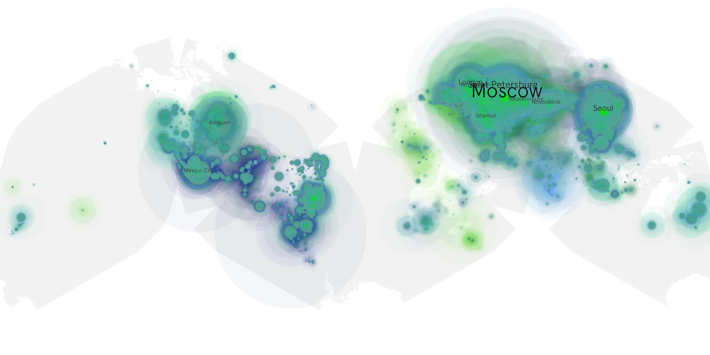

# barbie sample cache audit

## 1. Media object

| Field | Value |
| --- | --- |
| Media object | Barbie |
| Collection key | `barbie` |
| imdb_id | [tt1517268](https://www.imdb.com/title/tt1517268/) |
| wikipedia_url | [Barbie (film)](https://en.wikipedia.org/wiki/Barbie_(film)) |
| Sample dates | 2023-09-03-to-2024-03-02 |
| Sample days | 182 |
| BTIH count | 446 |
| Unique BTIH count | 371 |
| Downloaders total | 51,700,810 |
| Uploaders total | 12,817,797 |
| Data version | `2026-08-05` |
| IP geolocation version | `6:1777968300` |

## 2. Sample coverage report

- Generated: 2026-08-31T06:28:23Z
- Sample archive directory: `/run/media/bkoz/gold/src/alpha60-samples-raw.gold/barbie.xz`
- Hour directories: 4364
- Zero-length sample files: 0
- Other unparsable sample files: 0
- Hourly discontinuities: 0 (0 missing hours)
- Missing days: 0

### Sample archive discontinuities

None detected.

## 3. Media objects file size histogram

## 4. Visualization pass — graphs

### Downloads by week cumulative (normalized start)



### Downloads by day, Saturday and Sunday in gray

## 5. Visualization pass — maps

### Cumulative geographic slices

| Africa | Americas | Asia | Europe | Oceania | Unknown |
| --- | --- | --- | --- | --- | --- |
| 3.57 | 20.04 | 20.30 | 50.67 | 1.41 | 0.57 |

### Cumulative network infrastructure

{:target="_blank" rel="noopener"}

### Cumulative data maps

**Cumulative >= 1080p**

{:target="_blank" rel="noopener"}

**Cumulative < 1080p**

{:target="_blank" rel="noopener"}
