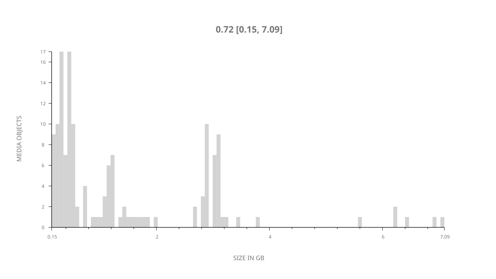
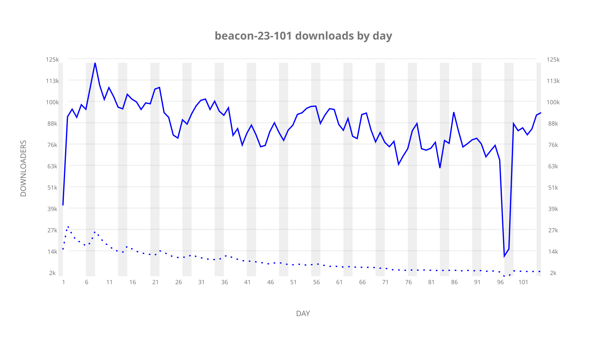
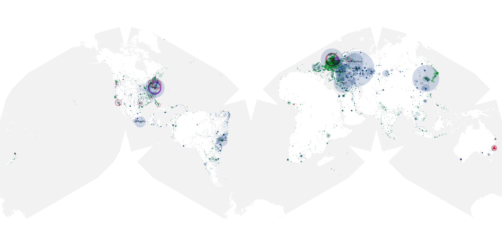
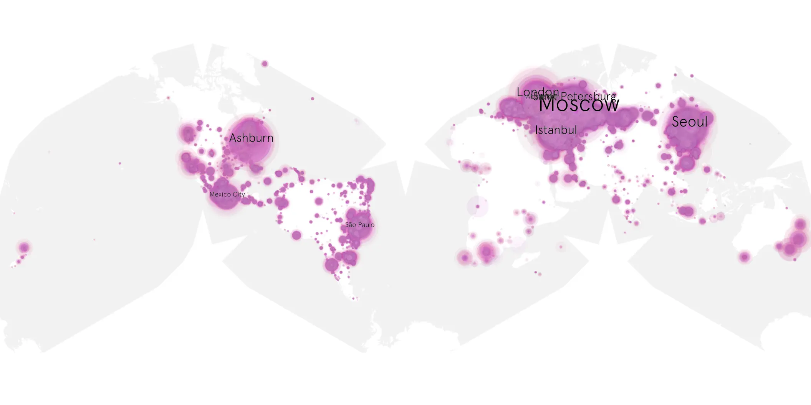
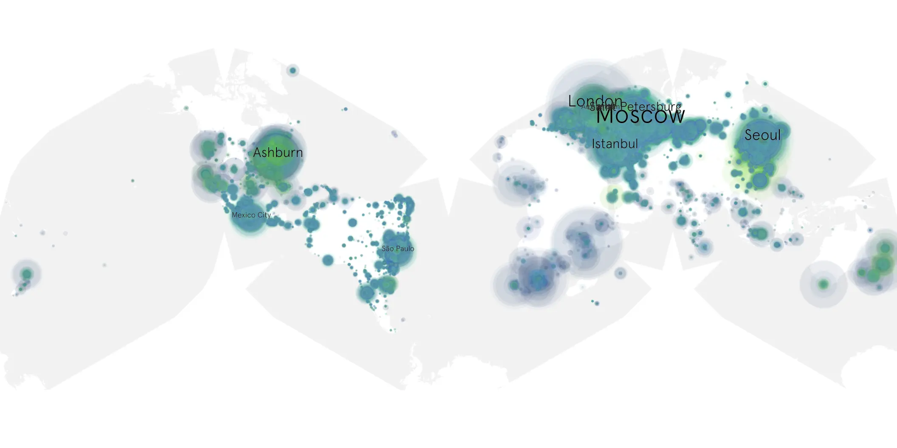

# beacon-23-101 sample cache audit

## 1. Media object

| Field | Value |
| --- | --- |
| Media object | Beacon 23 |
| Collection key | `beacon-23-101` |
| imdb_id | [tt9174724](https://www.imdb.com/title/tt9174724/) |
| wikipedia_url | [Beacon 23](https://en.wikipedia.org/wiki/Beacon_23) |
| Sample dates | 2023-11-12-to-2024-02-24 |
| Sample days | 105 |
| BTIH count | 159 |
| Unique BTIH count | 146 |
| Downloaders total | 7,440,997 |
| Uploaders total | 469,316 |
| Data version | `2026-08-05` |
| IP geolocation version | `6:1777968300` |

## 2. Sample coverage report

- Generated: 2026-08-31T06:28:23Z
- Sample archive directory: `/run/media/bkoz/gold/src/alpha60-samples-raw.gold/beacon-23-101.xz`
- Hour directories: 2476
- Zero-length sample files: 1
- Other unparsable sample files: 0
- Hourly discontinuities: 2 (27 missing hours)
- Missing days: 0

Zero-length files are sampler-failure evidence: a sampler killed
before writing the file, or a sampling host whose disk filled
before the write completed. Caching proceeded past every file
listed here.

### Zero-length sample files

- `/run/media/bkoz/gold/src/alpha60-samples-raw.gold/beacon-23-101.xz/2023-12-17-at-11-03.tar.xz`

### Sample archive discontinuities

- hourly gap: last `2023-12-28 23:03`, resumed `2023-12-29 02:03` — missing 2 hour(s)
- hourly gap: last `2024-02-16 19:03`, resumed `2024-02-17 21:03` — missing 25 hour(s)

## 3. Media objects file size histogram

## 4. Visualization pass — graphs

### Downloads by week cumulative (normalized start)



### Downloads by day, Saturday and Sunday in gray

## 5. Visualization pass — maps

### Cumulative geographic slices

| Africa | Americas | Asia | Europe | Oceania | Unknown |
| --- | --- | --- | --- | --- | --- |
| 2.22 | 23.15 | 19.19 | 50.91 | 1.32 | 0.54 |

### Cumulative network infrastructure

{:target="_blank" rel="noopener"}

### Cumulative data maps

**Cumulative >= 1080p**

{:target="_blank" rel="noopener"}

**Cumulative < 1080p**

{:target="_blank" rel="noopener"}
