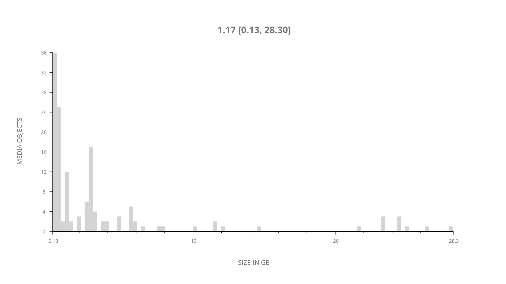
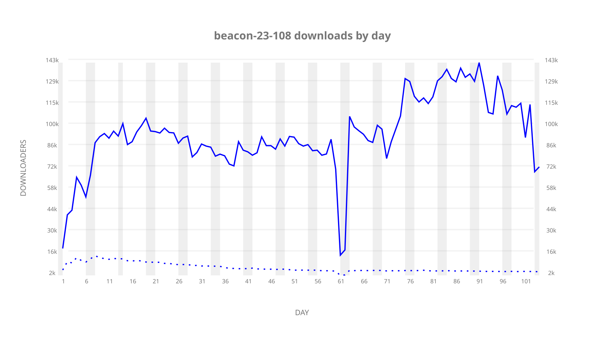
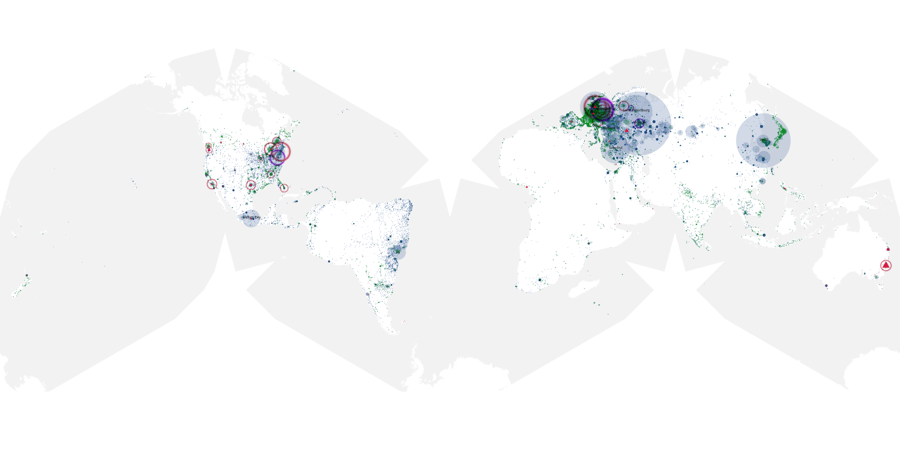
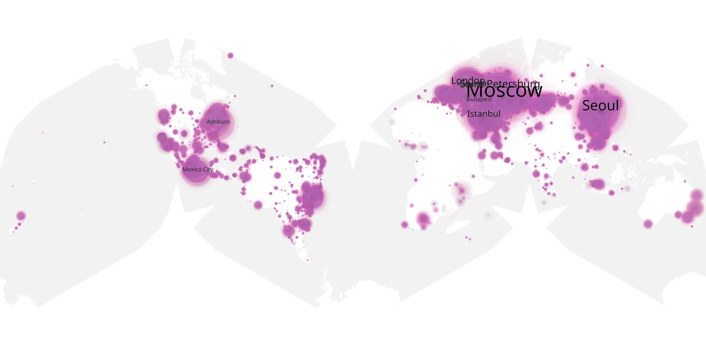
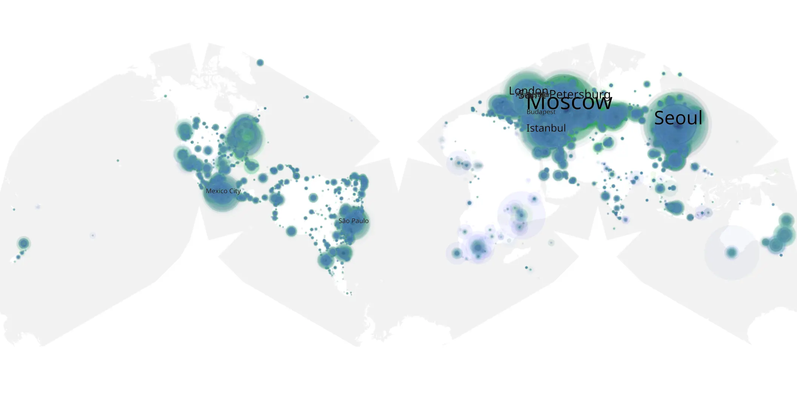

# beacon-23-108 sample cache audit

## 1. Media object

| Field | Value |
| --- | --- |
| Media object | Beacon 23 |
| Collection key | `beacon-23-108` |
| imdb_id | [tt9174724](https://www.imdb.com/title/tt9174724/) |
| wikipedia_url | [Beacon 23](https://en.wikipedia.org/wiki/Beacon_23) |
| Sample dates | 2023-12-17-to-2024-03-30 |
| Sample days | 105 |
| BTIH count | 157 |
| Unique BTIH count | 139 |
| Downloaders total | 8,345,858 |
| Uploaders total | 260,583 |
| Data version | `2026-08-05` |
| IP geolocation version | `6:1777968300` |

## 2. Sample coverage report

- Generated: 2026-08-31T06:28:23Z
- Sample archive directory: `/run/media/bkoz/gold/src/alpha60-samples-raw.gold/beacon-23-108.xz`
- Hour directories: 2451
- Zero-length sample files: 0
- Other unparsable sample files: 0
- Hourly discontinuities: 3 (50 missing hours)
- Missing days: 1

### Sample archive discontinuities

- hourly gap: last `2023-12-30 23:00`, resumed `2024-01-01 00:00` — missing 24 hour(s)
- hourly gap: last `2024-01-03 11:00`, resumed `2024-01-03 13:00` — missing 1 hour(s)
- hourly gap: last `2024-02-16 19:00`, resumed `2024-02-17 21:06` — missing 25 hour(s)
- missing day: `2023-12-31`

## 3. Media objects file size histogram

## 4. Visualization pass — graphs

### Downloads by week cumulative (normalized start)



### Downloads by day, Saturday and Sunday in gray

## 5. Visualization pass — maps

### Cumulative geographic slices

| Africa | Americas | Asia | Europe | Oceania | Unknown |
| --- | --- | --- | --- | --- | --- |
| 1.20 | 20.26 | 21.41 | 52.51 | 1.07 | 0.54 |

### Cumulative network infrastructure

{:target="_blank" rel="noopener"}

### Cumulative data maps

**Cumulative >= 1080p**

{:target="_blank" rel="noopener"}

**Cumulative < 1080p**

{:target="_blank" rel="noopener"}
