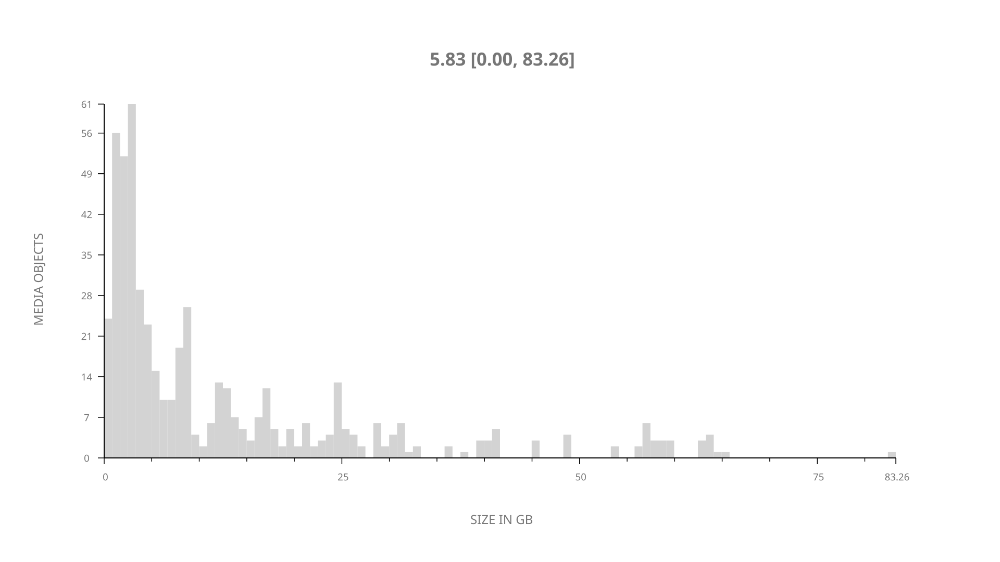
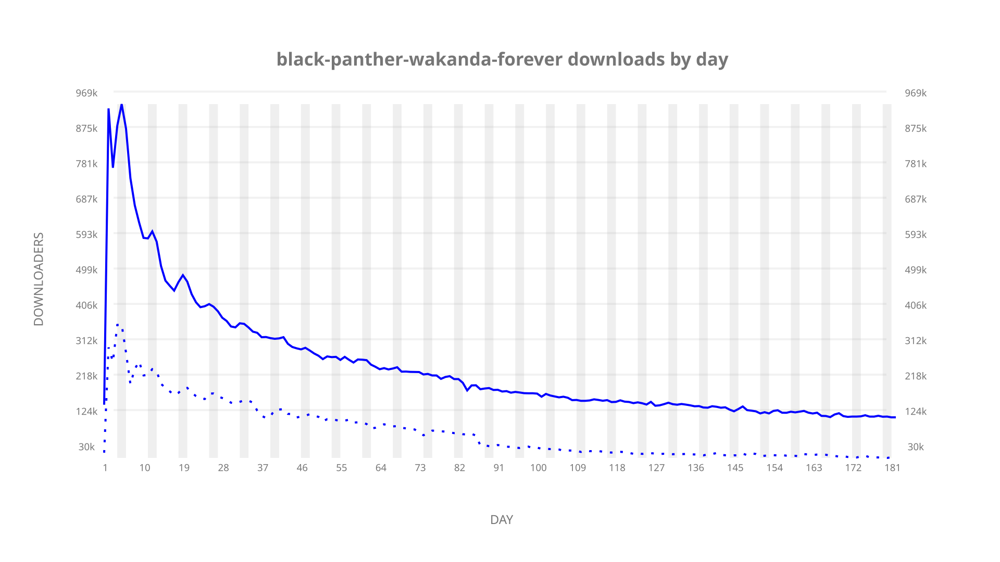
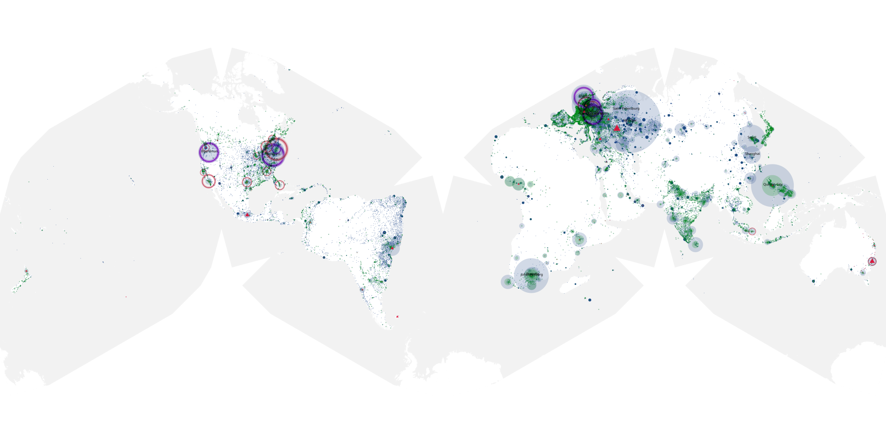
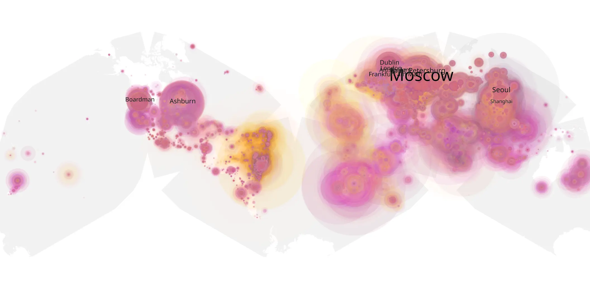
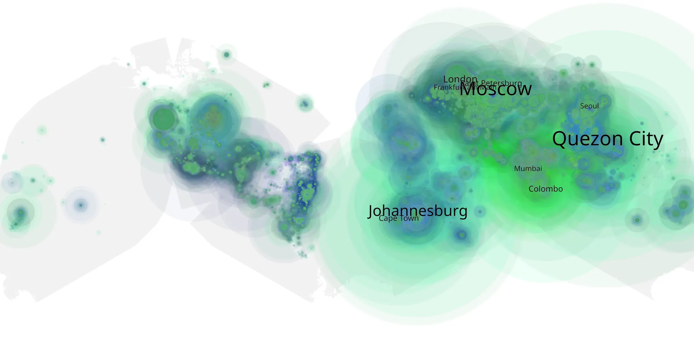

# black-panther-wakanda-forever sample cache audit

## 1. Media object

| Field | Value |
| --- | --- |
| Media object | Black Panther: Wakanda Forever |
| Collection key | `black-panther-wakanda-forever` |
| imdb_id | [tt9114286](https://www.imdb.com/title/tt9114286/) |
| wikipedia_url | [Black Panther: Wakanda Forever](https://en.wikipedia.org/wiki/Black_Panther:_Wakanda_Forever) |
| Sample dates | 2023-01-31-to-2023-07-31 |
| Sample days | 182 |
| BTIH count | 592 |
| Unique BTIH count | 520 |
| Downloaders total | 30,520,127 |
| Uploaders total | 9,874,774 |
| Data version | `2026-08-05` |
| IP geolocation version | `6:1777968300` |

## 2. Coverage report

- Generated: 2026-08-31T06:28:23Z
- Sample archive directory: `/run/media/bkoz/gold/src/alpha60-samples-raw.gold/black-panther-wakanda-forever.xz`
- Hour directories: 6226
- Zero-length sample files: 0
- Other unparsable sample files: 0
- Hourly discontinuities: 0 (0 missing hours)
- Missing days: 0

### Sample archive discontinuities

None detected.

## 3. File sizes histogram *median[lowest, highest]*

## 4. Graphs

### Downloads by week cumulative (normalized start)



### Downloads by day, Saturday and Sunday in gray

## 5. Cumulative Maps

<!-- https://raw.githubusercontent.com/alpha60-devops/alpha60-results-2023/refs/heads/main/data/ -->

### <a href="https://raw.githubusercontent.com/alpha60-devops/alpha60-results-2023/refs/heads/main/data/geojson.cumulative/black-panther-wakanda-forever-cumulative-aggregate.geojson.gz" data-map-title="Black Panther: Wakanda Forever — black-panther-wakanda-forever" onclick="leaflet_map_open_window(this.href, this.dataset.mapTitle); return false;" class="table-link" aria-label="Open Black Panther: Wakanda Forever (black-panther-wakanda-forever) cumulative data map in new window" title="Opens interactive map for Black Panther: Wakanda Forever (black-panther-wakanda-forever) data">Swarm Detail</a>

### Geographic Regions

| Africa | Americas | Asia | Europe | Oceania | Unknown |
| --- | --- | --- | --- | --- | --- |
| 9.80 | 16.35 | 26.81 | 38.92 | 1.22 | 0.49 |

### Network infrastructure

{:target="_blank" rel="noopener"}

### Resolution >= 1080p

{:target="_blank" rel="noopener"}

### Resolution < 1080p

{:target="_blank" rel="noopener"}
