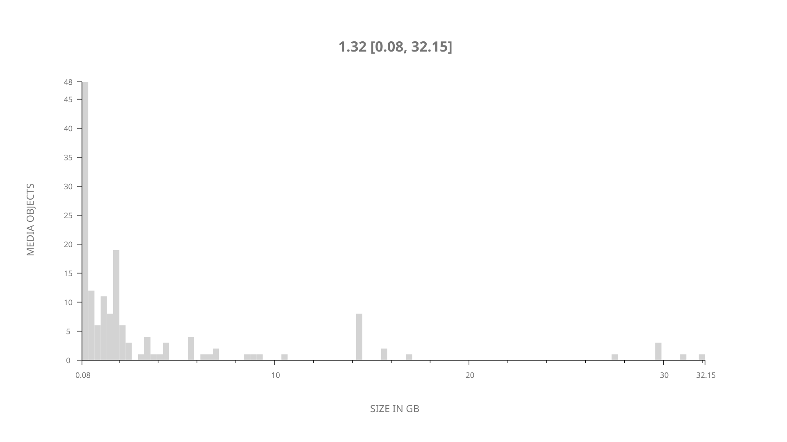
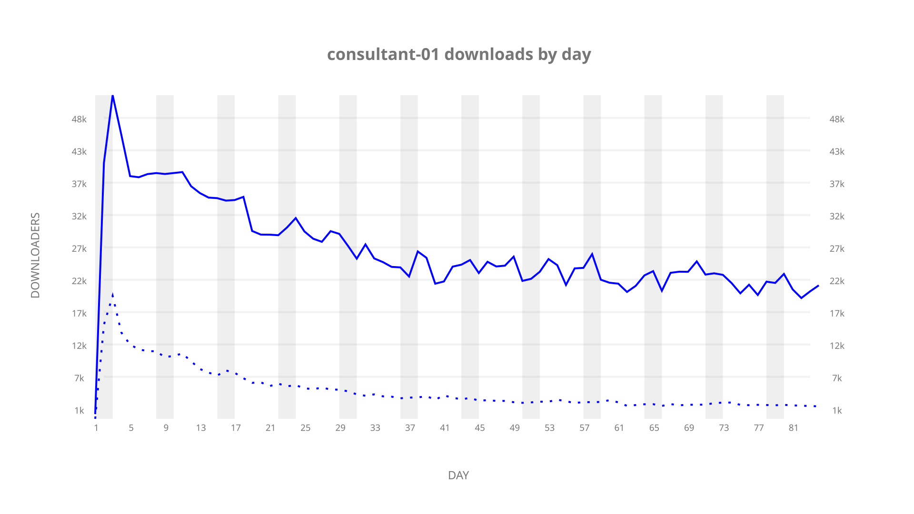
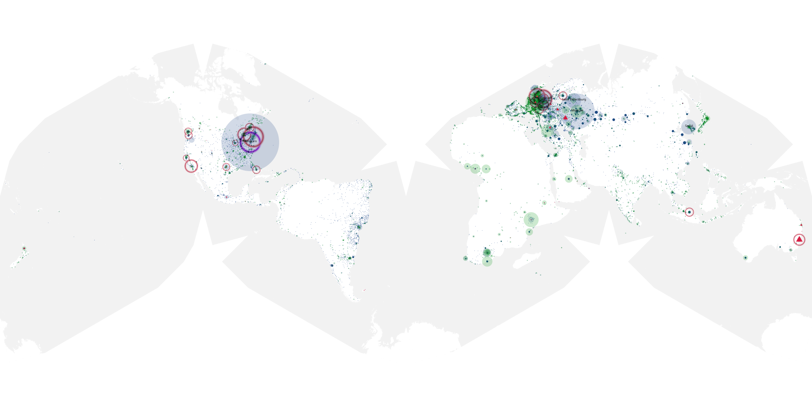
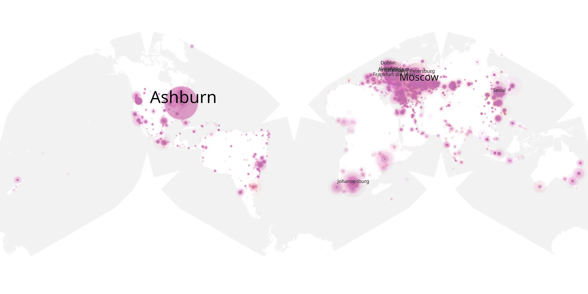
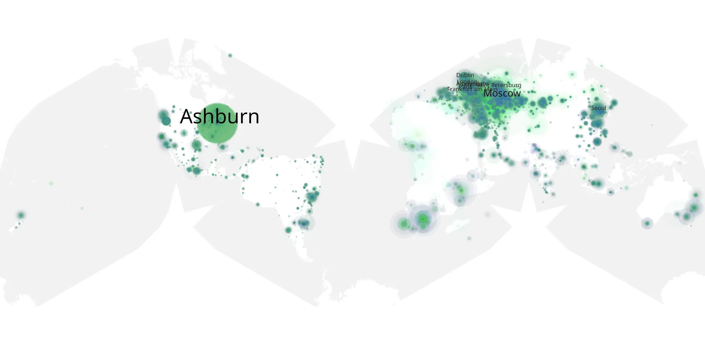

# consultant-01 sample cache audit

## 1. Media object

| Field | Value |
| --- | --- |
| Media object | The Consultant |
| Collection key | `consultant-01` |
| imdb_id | [tt16152716](https://www.imdb.com/title/tt16152716/) |
| wikipedia_url | [The Consultant (TV series)](https://en.wikipedia.org/wiki/The_Consultant_(TV_series)) |
| Sample dates | 2023-02-24-to-2023-05-18 |
| Sample days | 84 |
| BTIH count | 167 |
| Unique BTIH count | 152 |
| Downloaders total | 1,579,048 |
| Uploaders total | 267,241 |
| Data version | `2026-08-05` |
| IP geolocation version | `6:1777968300` |

## 2. Sample coverage report

- Generated: 2026-08-31T06:28:23Z
- Sample archive directory: `/run/media/bkoz/gold/src/alpha60-samples-raw.gold/consultant-01.xz`
- Hour directories: 2010
- Zero-length sample files: 0
- Other unparsable sample files: 0
- Hourly discontinuities: 1 (1 missing hours)
- Missing days: 0

### Sample archive discontinuities

- hourly gap: last `2023-03-26 01:03`, resumed `2023-03-26 03:03` — missing 1 hour(s)

## 3. Media objects file size histogram

## 4. Visualization pass — graphs

### Downloads by week cumulative (normalized start)



### Downloads by day, Saturday and Sunday in gray

## 5. Visualization pass — maps

### Cumulative geographic slices

| Africa | Americas | Asia | Europe | Oceania | Unknown |
| --- | --- | --- | --- | --- | --- |
| 5.98 | 23.00 | 16.85 | 47.72 | 1.57 | 0.55 |

### Cumulative network infrastructure

{:target="_blank" rel="noopener"}

### Cumulative data maps

**Cumulative >= 1080p**

{:target="_blank" rel="noopener"}

**Cumulative < 1080p**

{:target="_blank" rel="noopener"}
