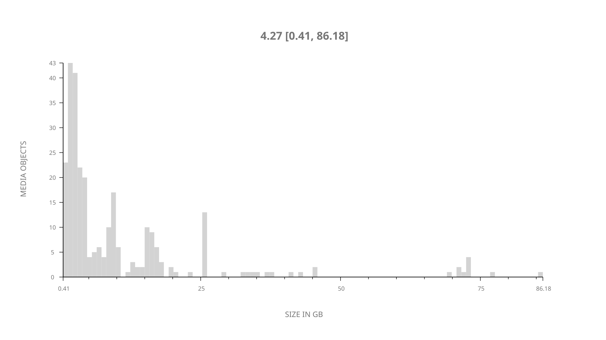
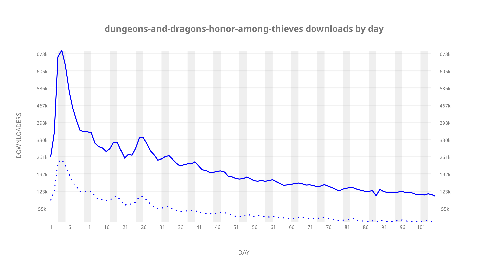
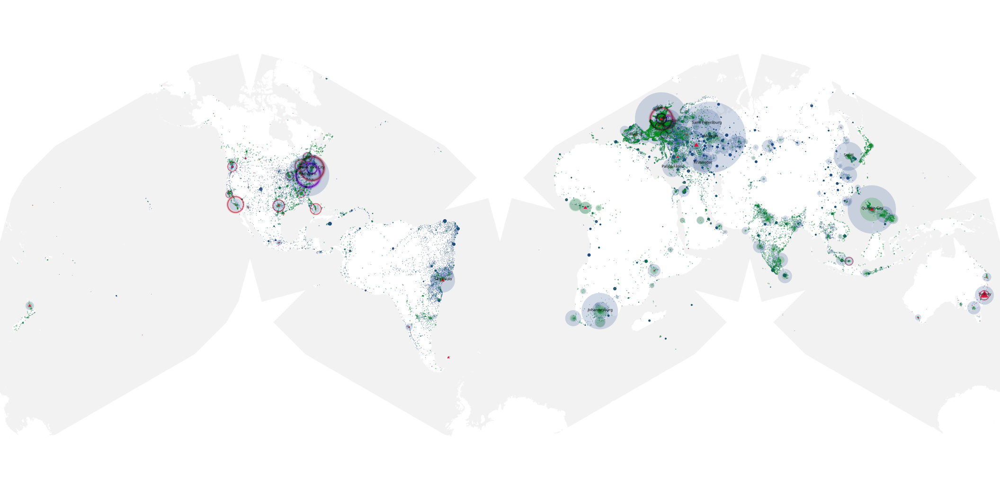
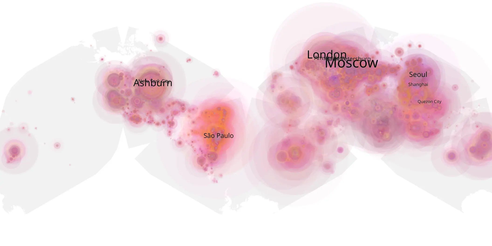
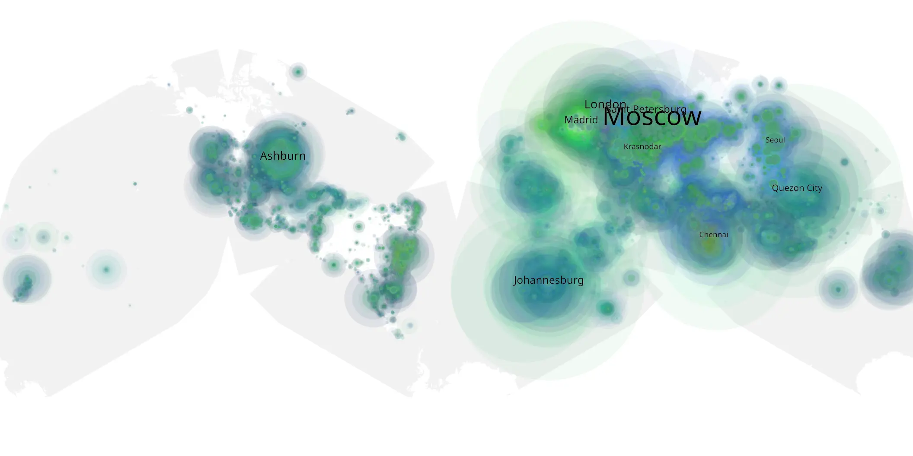

# dungeons-and-dragons-honor-among-thieves sample cache audit

## 1. Media object

| Field | Value |
| --- | --- |
| Media object | Dungeons & Dragons: Honor Among Thieves |
| Collection key | `dungeons-and-dragons-honor-among-thieves` |
| imdb_id | [tt2906216](https://www.imdb.com/title/tt2906216/) |
| wikipedia_url | [Dungeons & Dragons: Honor Among Thieves](https://en.wikipedia.org/wiki/Dungeons_%26_Dragons:_Honor_Among_Thieves) |
| Sample dates | 2023-05-03-to-2023-08-15 |
| Sample days | 105 |
| BTIH count | 311 |
| Unique BTIH count | 275 |
| Downloaders total | 15,554,691 |
| Uploaders total | 5,496,207 |
| Data version | `2026-08-05` |
| IP geolocation version | `6:1777968300` |

## 2. Coverage report

- Generated: 2026-08-31T06:28:23Z
- Sample archive directory: `/run/media/bkoz/gold/src/alpha60-samples-raw.gold/dungeons-and-dragons-honor-among-thieves.xz`
- Hour directories: 2504
- Zero-length sample files: 0
- Other unparsable sample files: 0
- Hourly discontinuities: 2 (10 missing hours)
- Missing days: 0

### Sample archive discontinuities

- hourly gap: last `2023-05-23 09:06`, resumed `2023-05-23 14:06` — missing 4 hour(s)
- hourly gap: last `2023-07-30 12:06`, resumed `2023-07-30 19:06` — missing 6 hour(s)

## 3. File sizes histogram *median[lowest, highest]*

## 4. Graphs

### Downloads by week cumulative (normalized start)



### Downloads by day, Saturday and Sunday in gray

## 5. Cumulative Maps

<!-- https://raw.githubusercontent.com/alpha60-devops/alpha60-results-2023/refs/heads/main/data/ -->

### <a href="https://raw.githubusercontent.com/alpha60-devops/alpha60-results-2023/refs/heads/main/data/geojson.cumulative/dungeons-and-dragons-honor-among-thieves-cumulative-aggregate.geojson.gz" data-map-title="Dungeons &amp; Dragons: Honor Among Thieves — dungeons-and-dragons-honor-among-thieves" onclick="leaflet_map_open_window(this.href, this.dataset.mapTitle); return false;" class="table-link" aria-label="Open Dungeons &amp; Dragons: Honor Among Thieves (dungeons-and-dragons-honor-among-thieves) cumulative data map in new window" title="Opens interactive map for Dungeons &amp; Dragons: Honor Among Thieves (dungeons-and-dragons-honor-among-thieves) data">Swarm Detail</a>

### Geographic Regions

| Africa | Americas | Asia | Europe | Oceania | Unknown |
| --- | --- | --- | --- | --- | --- |
| 8.32 | 18.02 | 23.75 | 39.09 | 2.13 | 0.52 |

### Network infrastructure

{:target="_blank" rel="noopener"}

### Resolution >= 1080p

{:target="_blank" rel="noopener"}

### Resolution < 1080p

{:target="_blank" rel="noopener"}
