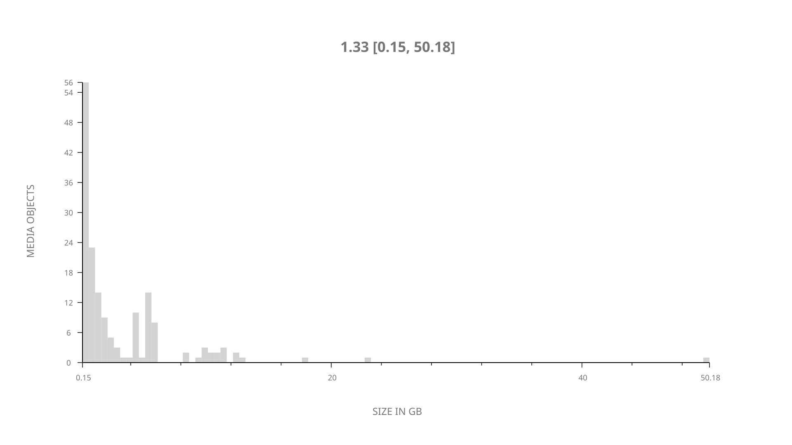
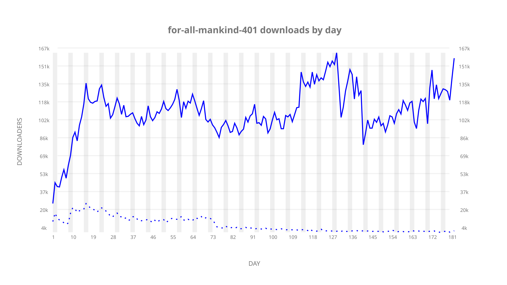
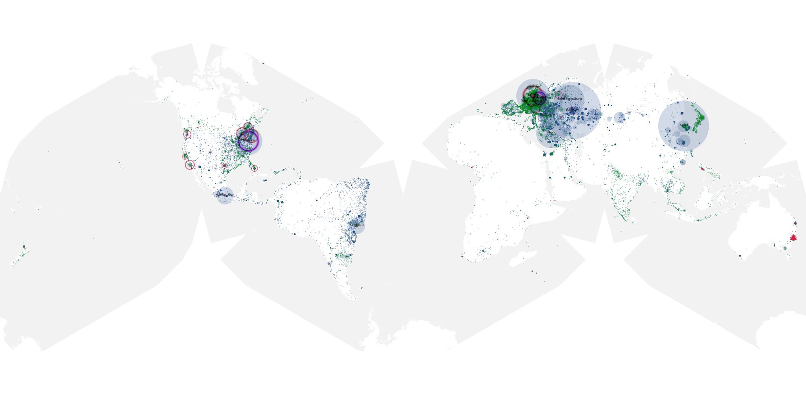
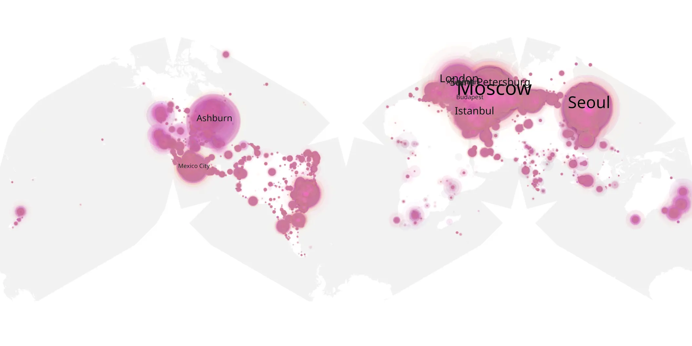
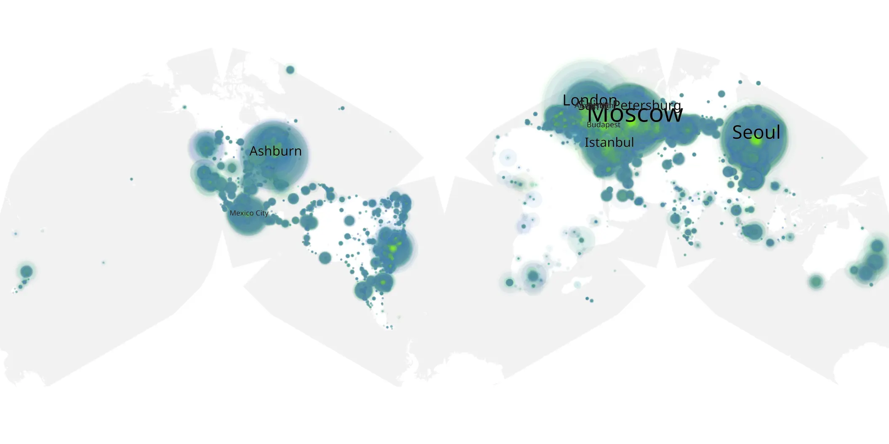

# for-all-mankind-401 sample cache audit

## 1. Media object

| Field | Value |
| --- | --- |
| Media object | For All Mankind |
| Collection key | `for-all-mankind-401` |
| imdb_id | [tt7772588](https://www.imdb.com/title/tt7772588/) |
| wikipedia_url | [For All Mankind (TV series)](https://en.wikipedia.org/wiki/For_All_Mankind_(TV_series)) |
| Sample dates | 2023-11-10-to-2024-05-09 |
| Sample days | 182 |
| BTIH count | 170 |
| Unique BTIH count | 164 |
| Downloaders total | 15,535,315 |
| Uploaders total | 648,563 |
| Data version | `2026-08-05` |
| IP geolocation version | `6:1777968300` |

## 2. Coverage report

- Generated: 2026-08-31T06:28:23Z
- Sample archive directory: `/run/media/bkoz/gold/src/alpha60-samples-raw.gold/for-all-mankind-401.xz`
- Hour directories: 4349
- Zero-length sample files: 0
- Other unparsable sample files: 0
- Hourly discontinuities: 1 (1 missing hours)
- Missing days: 0

### Sample archive discontinuities

- hourly gap: last `2024-03-31 01:03`, resumed `2024-03-31 03:03` — missing 1 hour(s)

## 3. File sizes histogram *median[lowest, highest]*

## 4. Graphs

### Downloads by week cumulative (normalized start)



### Downloads by day, Saturday and Sunday in gray

## 5. Cumulative Maps

<!-- https://raw.githubusercontent.com/alpha60-devops/alpha60-results-2023/refs/heads/main/data/ -->

### <a href="https://raw.githubusercontent.com/alpha60-devops/alpha60-results-2023/refs/heads/main/data/geojson.cumulative/for-all-mankind-401-cumulative-aggregate.geojson.gz" data-map-title="For All Mankind — for-all-mankind-401" onclick="leaflet_map_open_window(this.href, this.dataset.mapTitle); return false;" class="table-link" aria-label="Open For All Mankind (for-all-mankind-401) cumulative data map in new window" title="Opens interactive map for For All Mankind (for-all-mankind-401) data">Swarm Detail</a>

### Geographic Regions

| Africa | Americas | Asia | Europe | Oceania | Unknown |
| --- | --- | --- | --- | --- | --- |
| 1.01 | 22.30 | 21.02 | 51.63 | 1.03 | 0.54 |

### Network infrastructure

{:target="_blank" rel="noopener"}

### Resolution >= 1080p

{:target="_blank" rel="noopener"}

### Resolution < 1080p

{:target="_blank" rel="noopener"}
