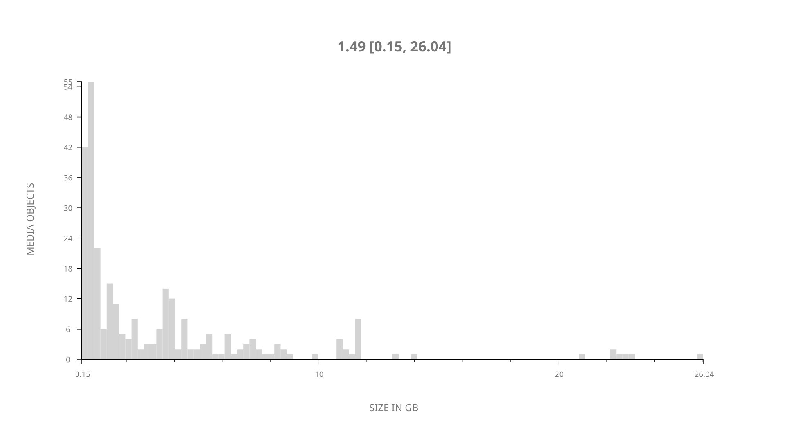
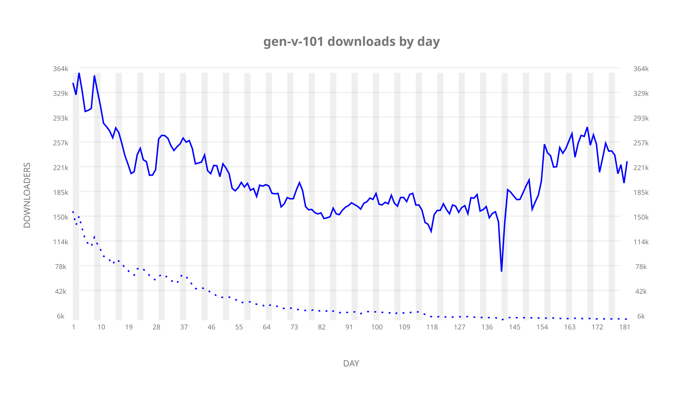
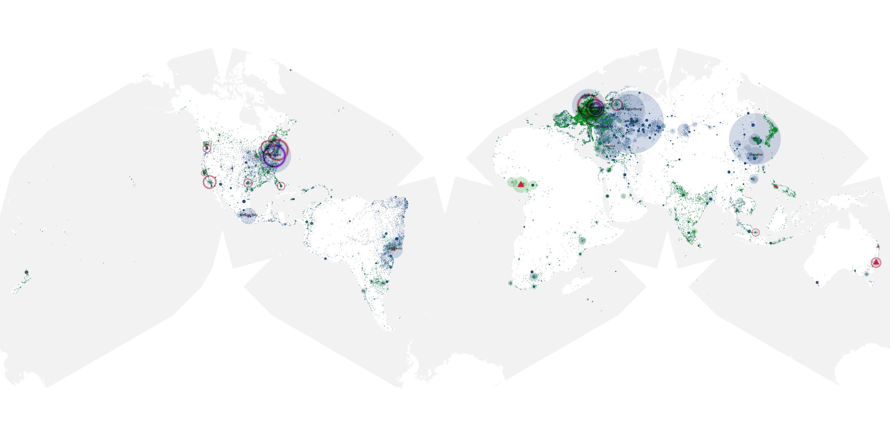
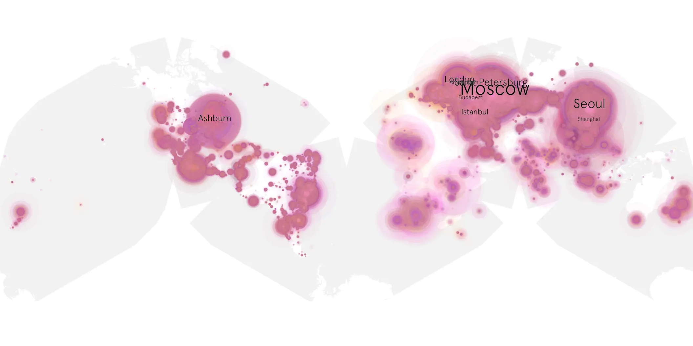
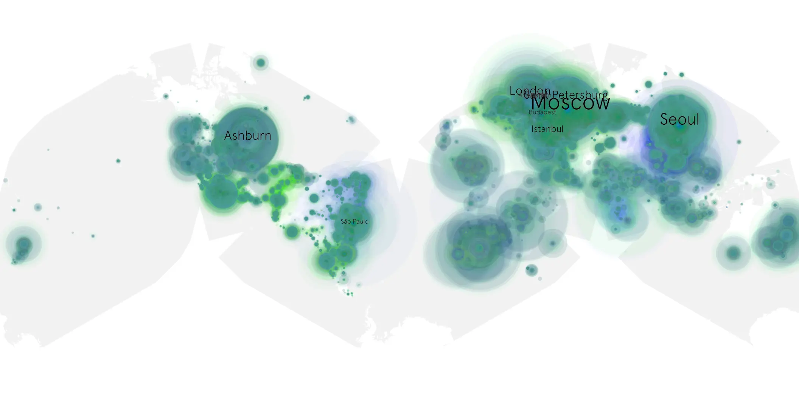

# gen-v-101 sample cache audit

## 1. Media object

| Field | Value |
| --- | --- |
| Media object | Gen V |
| Collection key | `gen-v-101` |
| imdb_id | [tt13159924](https://www.imdb.com/title/tt13159924/) |
| wikipedia_url | [Gen V](https://en.wikipedia.org/wiki/Gen_V) |
| Sample dates | 2023-09-29-to-2024-03-28 |
| Sample days | 182 |
| BTIH count | 317 |
| Unique BTIH count | 282 |
| Downloaders total | 28,495,254 |
| Uploaders total | 2,966,275 |
| Data version | `2026-08-05` |
| IP geolocation version | `6:1777968300` |

## 2. Sample coverage report

- Generated: 2026-08-31T06:28:23Z
- Sample archive directory: `/run/media/bkoz/gold/src/alpha60-samples-raw.gold/gen-v-101.xz`
- Hour directories: 4353
- Zero-length sample files: 0
- Other unparsable sample files: 0
- Hourly discontinuities: 1 (10 missing hours)
- Missing days: 0

### Sample archive discontinuities

- hourly gap: last `2024-02-16 19:00`, resumed `2024-02-17 06:00` — missing 10 hour(s)

## 3. Media objects file size histogram

## 4. Visualization pass — graphs

### Downloads by week cumulative (normalized start)



### Downloads by day, Saturday and Sunday in gray

## 5. Visualization pass — maps

### Cumulative geographic slices

| Africa | Americas | Asia | Europe | Oceania | Unknown |
| --- | --- | --- | --- | --- | --- |
| 3.90 | 21.27 | 22.22 | 48.34 | 1.28 | 0.51 |

### Cumulative network infrastructure

{:target="_blank" rel="noopener"}

### Cumulative data maps

**Cumulative >= 1080p**

{:target="_blank" rel="noopener"}

**Cumulative < 1080p**

{:target="_blank" rel="noopener"}
