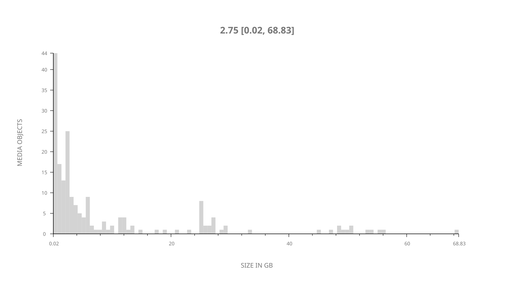
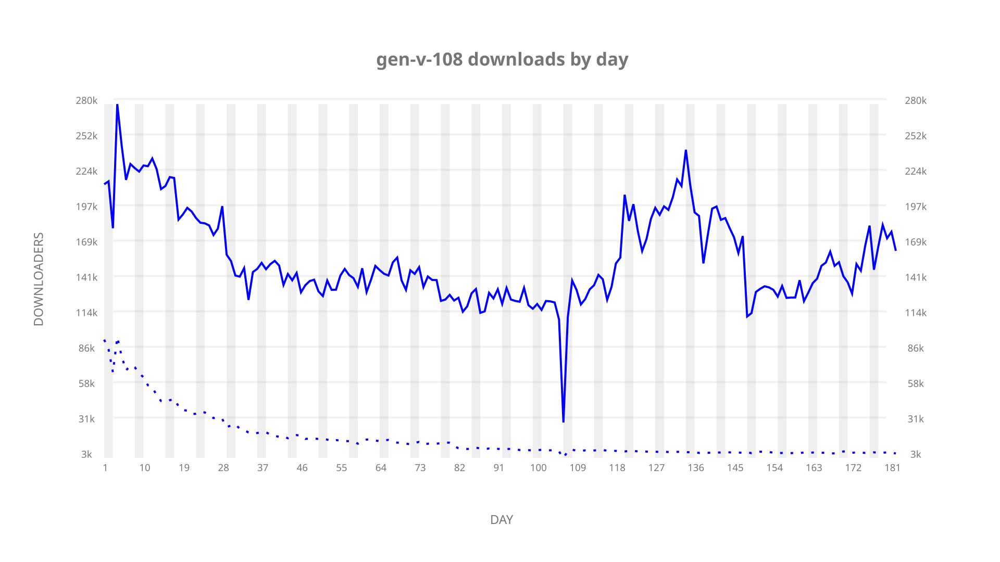
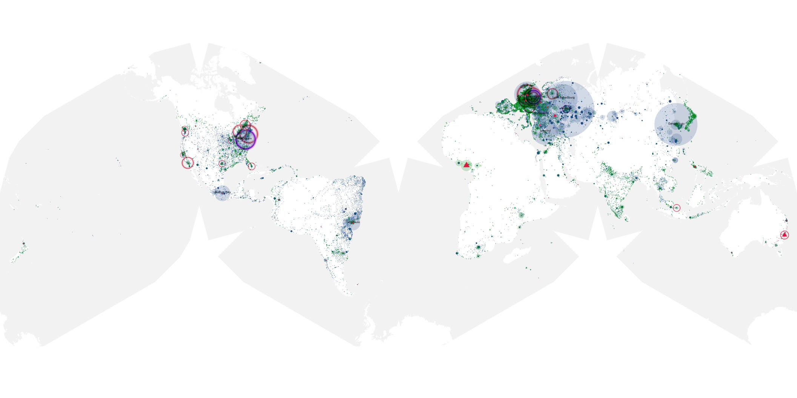
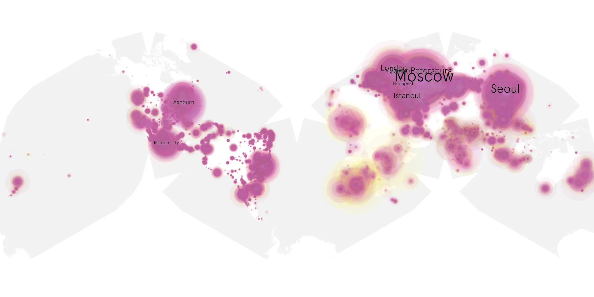
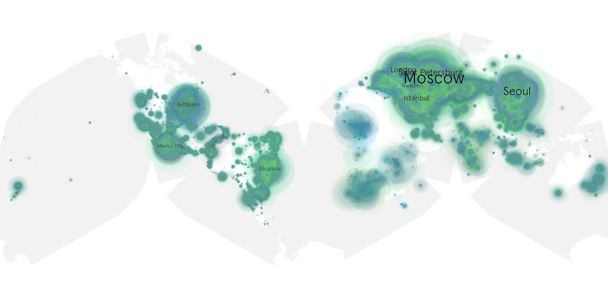

# gen-v-108 sample cache audit

## 1. Media object

| Field | Value |
| --- | --- |
| Media object | Gen V |
| Collection key | `gen-v-108` |
| imdb_id | [tt13159924](https://www.imdb.com/title/tt13159924/) |
| wikipedia_url | [Gen V](https://en.wikipedia.org/wiki/Gen_V) |
| Sample dates | 2023-11-03-to-2024-05-02 |
| Sample days | 182 |
| BTIH count | 223 |
| Unique BTIH count | 192 |
| Downloaders total | 23,065,586 |
| Uploaders total | 1,671,996 |
| Data version | `2026-08-05` |
| IP geolocation version | `6:1777968300` |

## 2. Coverage report

- Generated: 2026-08-31T06:28:23Z
- Sample archive directory: `/run/media/bkoz/gold/src/alpha60-samples-raw.gold/gen-v-108.xz`
- Hour directories: 4343
- Zero-length sample files: 0
- Other unparsable sample files: 0
- Hourly discontinuities: 3 (19 missing hours)
- Missing days: 0

### Sample archive discontinuities

- hourly gap: last `2023-12-05 23:00`, resumed `2023-12-06 01:06` — missing 1 hour(s)
- hourly gap: last `2024-02-16 12:06`, resumed `2024-02-17 06:06` — missing 17 hour(s)
- hourly gap: last `2024-03-31 01:06`, resumed `2024-03-31 03:06` — missing 1 hour(s)

## 3. File sizes histogram *median[lowest, highest]*

## 4. Graphs

### Downloads by week cumulative (normalized start)



### Downloads by day, Saturday and Sunday in gray

## 5. Cumulative Maps

<!-- https://raw.githubusercontent.com/alpha60-devops/alpha60-results-2023/refs/heads/main/data/ -->

### <a href="https://raw.githubusercontent.com/alpha60-devops/alpha60-results-2023/refs/heads/main/data/geojson.cumulative/gen-v-108-cumulative-aggregate.geojson.gz" data-map-title="Gen V — gen-v-108" onclick="leaflet_map_open_window(this.href, this.dataset.mapTitle); return false;" class="table-link" aria-label="Open Gen V (gen-v-108) cumulative data map in new window" title="Opens interactive map for Gen V (gen-v-108) data">Swarm Detail</a>

### Geographic Regions

| Africa | Americas | Asia | Europe | Oceania | Unknown |
| --- | --- | --- | --- | --- | --- |
| 3.10 | 20.68 | 21.99 | 51.00 | 0.97 | 0.52 |

### Network infrastructure

{:target="_blank" rel="noopener"}

### Resolution >= 1080p

{:target="_blank" rel="noopener"}

### Resolution < 1080p

{:target="_blank" rel="noopener"}
