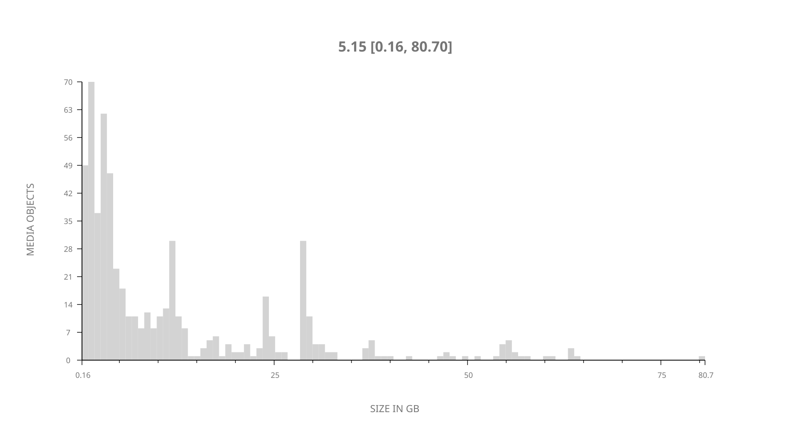
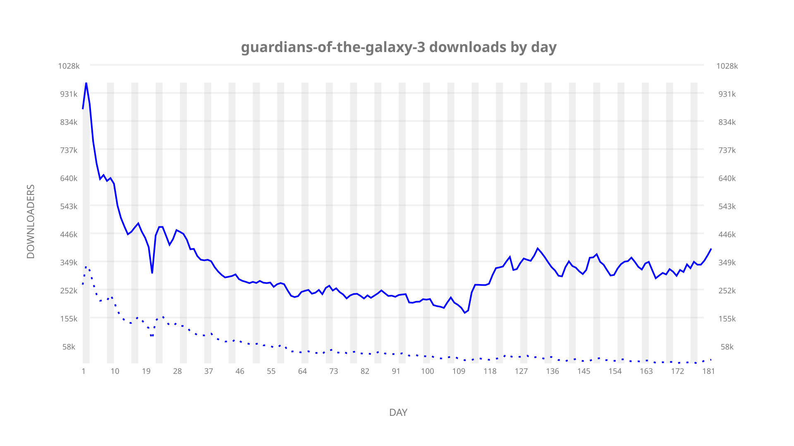
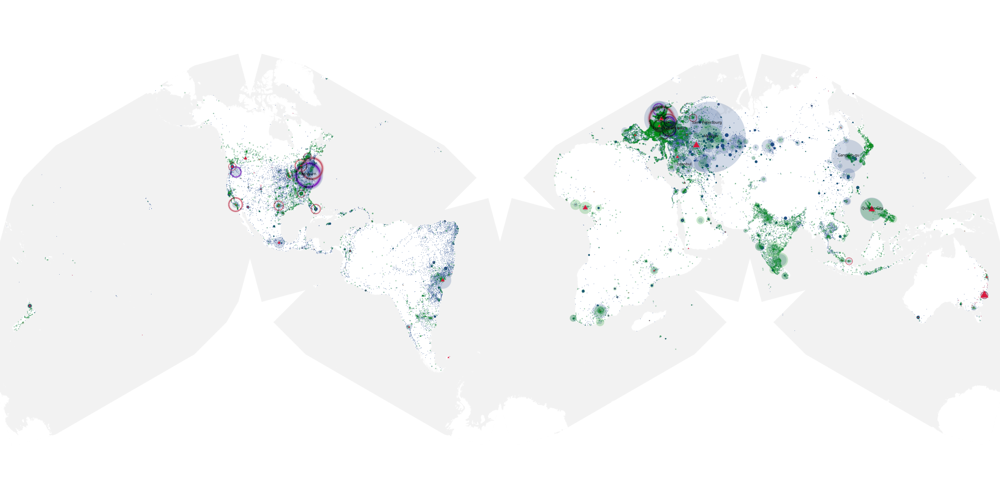
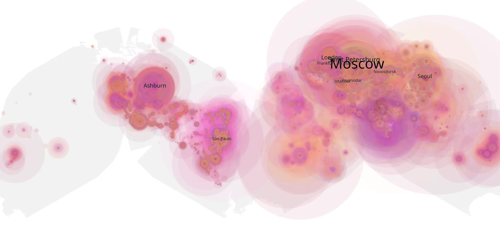
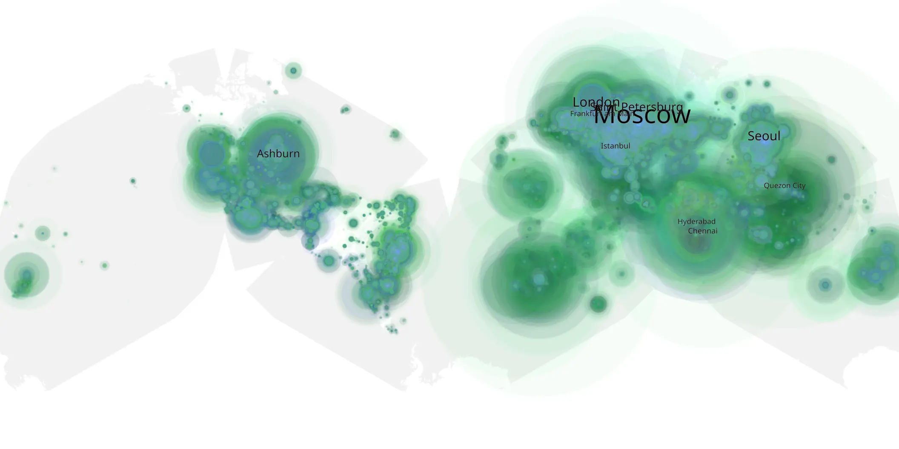

# guardians-of-the-galaxy-3 sample cache audit

## 1. Media object

| Field | Value |
| --- | --- |
| Media object | Guardians of the Galaxy Vol. 3 |
| Collection key | `guardians-of-the-galaxy-3` |
| imdb_id | [tt6791350](https://www.imdb.com/title/tt6791350/) |
| wikipedia_url | [Guardians of the Galaxy Vol. 3](https://en.wikipedia.org/wiki/Guardians_of_the_Galaxy_Vol._3) |
| Sample dates | 2023-07-07-to-2024-01-04 |
| Sample days | 182 |
| BTIH count | 648 |
| Unique BTIH count | 580 |
| Downloaders total | 48,064,640 |
| Uploaders total | 11,434,401 |
| Data version | `2026-08-05` |
| IP geolocation version | `6:1777968300` |

## 2. Coverage report

- Generated: 2026-08-31T06:28:23Z
- Sample archive directory: `/run/media/bkoz/gold/src/alpha60-samples-raw.gold/guardians-of-the-galaxy-3.xz`
- Hour directories: 4367
- Zero-length sample files: 0
- Other unparsable sample files: 0
- Hourly discontinuities: 0 (0 missing hours)
- Missing days: 0

### Sample archive discontinuities

None detected.

## 3. File sizes histogram *median[lowest, highest]*

## 4. Graphs

### Downloads by week cumulative (normalized start)



### Downloads by day, Saturday and Sunday in gray

## 5. Cumulative Maps

<!-- https://raw.githubusercontent.com/alpha60-devops/alpha60-results-2023/refs/heads/main/data/ -->

### <a href="https://raw.githubusercontent.com/alpha60-devops/alpha60-results-2023/refs/heads/main/data/geojson.cumulative/guardians-of-the-galaxy-3-cumulative-aggregate.geojson.gz" data-map-title="Guardians of the Galaxy Vol. 3 — guardians-of-the-galaxy-3" onclick="leaflet_map_open_window(this.href, this.dataset.mapTitle); return false;" class="table-link" aria-label="Open Guardians of the Galaxy Vol. 3 (guardians-of-the-galaxy-3) cumulative data map in new window" title="Opens interactive map for Guardians of the Galaxy Vol. 3 (guardians-of-the-galaxy-3) data">Swarm Detail</a>

### Geographic Regions

| Africa | Americas | Asia | Europe | Oceania | Unknown |
| --- | --- | --- | --- | --- | --- |
| 4.69 | 18.29 | 24.26 | 47.02 | 1.22 | 0.54 |

### Network infrastructure

{:target="_blank" rel="noopener"}

### Resolution >= 1080p

{:target="_blank" rel="noopener"}

### Resolution < 1080p

{:target="_blank" rel="noopener"}
