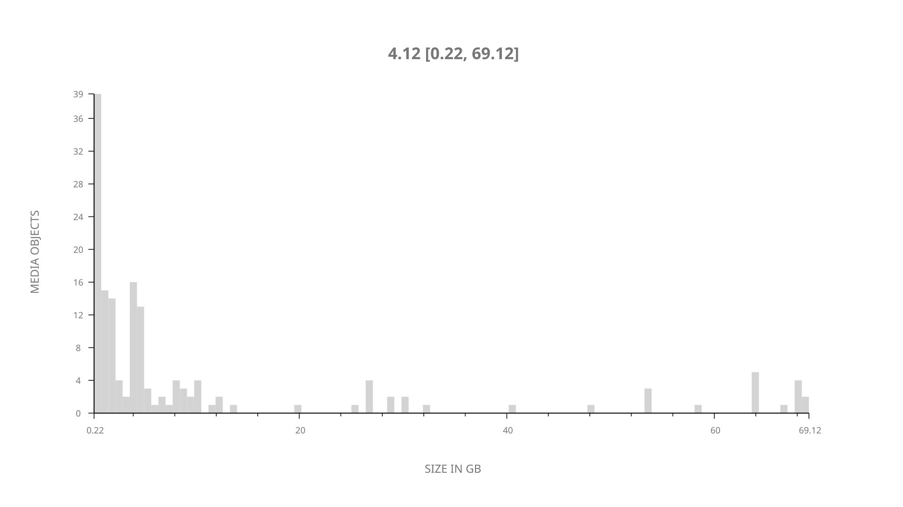
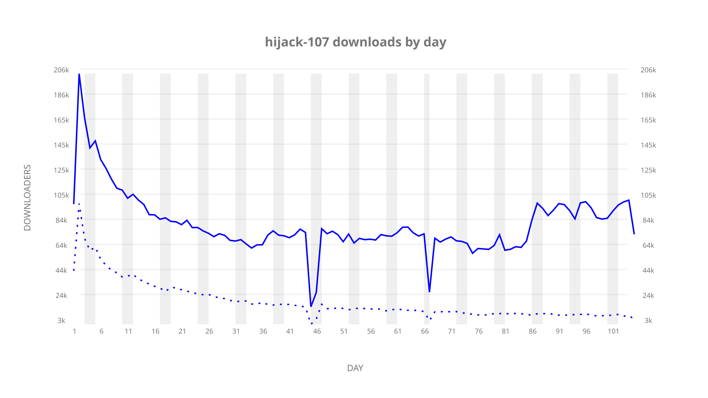
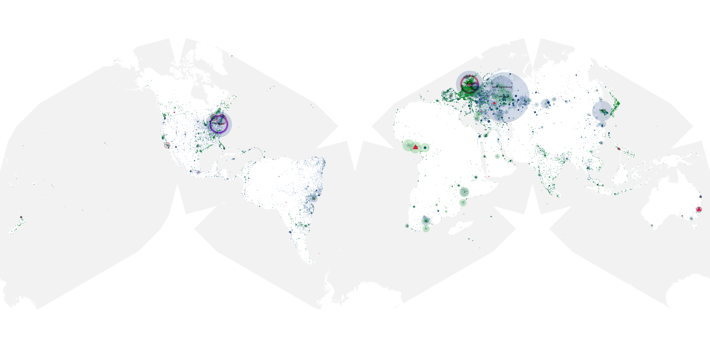
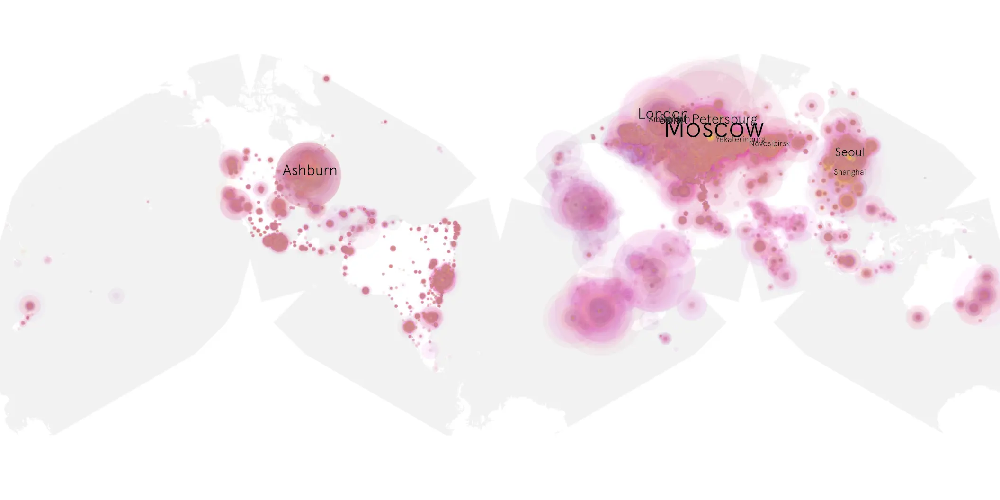
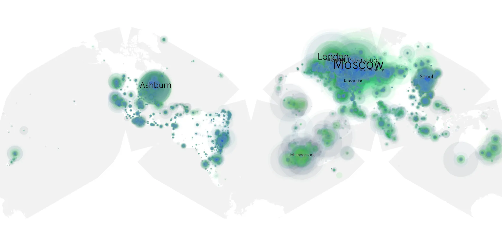

# hijack-107 sample cache audit

## 1. Media object

| Field | Value |
| --- | --- |
| Media object | Hijack |
| Collection key | `hijack-107` |
| imdb_id | [tt19854762](https://www.imdb.com/title/tt19854762/) |
| wikipedia_url | [Hijack (TV series)](https://en.wikipedia.org/wiki/Hijack_(TV_series)) |
| Sample dates | 2023-08-02-to-2023-11-15 |
| Sample days | 106 |
| BTIH count | 177 |
| Unique BTIH count | 156 |
| Downloaders total | 6,415,091 |
| Uploaders total | 1,362,597 |
| Data version | `2026-08-05` |
| IP geolocation version | `6:1777968300` |

## 2. Coverage report

- Generated: 2026-08-31T06:28:23Z
- Sample archive directory: `/run/media/bkoz/gold/src/alpha60-samples-raw.gold/hijack-107.xz`
- Hour directories: 2431
- Zero-length sample files: 0
- Other unparsable sample files: 0
- Hourly discontinuities: 2 (86 missing hours)
- Missing days: 1

### Sample archive discontinuities

- hourly gap: last `2023-09-15 01:00`, resumed `2023-09-16 20:00` — missing 42 hour(s)
- hourly gap: last `2023-10-06 22:00`, resumed `2023-10-08 19:00` — missing 44 hour(s)
- missing day: `2023-10-07`

## 3. File sizes histogram *median[lowest, highest]*

## 4. Graphs

### Downloads by week cumulative (normalized start)



### Downloads by day, Saturday and Sunday in gray

## 5. Cumulative Maps

<!-- https://raw.githubusercontent.com/alpha60-devops/alpha60-results-2023/refs/heads/main/data/ -->

### <a href="https://raw.githubusercontent.com/alpha60-devops/alpha60-results-2023/refs/heads/main/data/geojson.cumulative/hijack-107-cumulative-aggregate.geojson.gz" data-map-title="Hijack — hijack-107" onclick="leaflet_map_open_window(this.href, this.dataset.mapTitle); return false;" class="table-link" aria-label="Open Hijack (hijack-107) cumulative data map in new window" title="Opens interactive map for Hijack (hijack-107) data">Swarm Detail</a>

### Geographic Regions

| Africa | Americas | Asia | Europe | Oceania | Unknown |
| --- | --- | --- | --- | --- | --- |
| 7.41 | 17.11 | 17.34 | 52.44 | 1.70 | 0.55 |

### Network infrastructure

{:target="_blank" rel="noopener"}

### Resolution >= 1080p

{:target="_blank" rel="noopener"}

### Resolution < 1080p

{:target="_blank" rel="noopener"}
