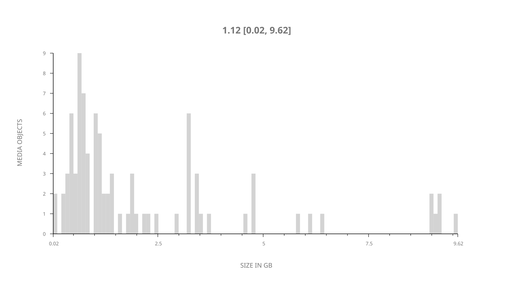
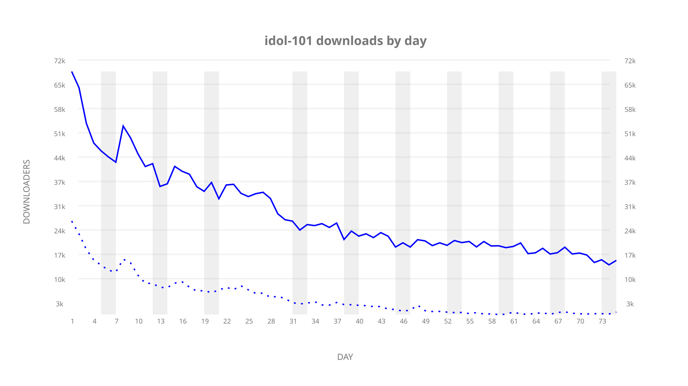
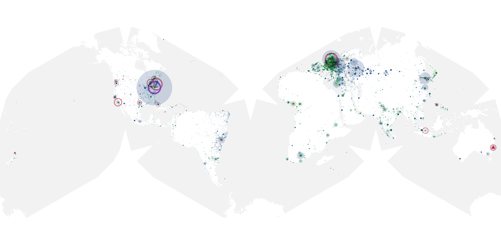
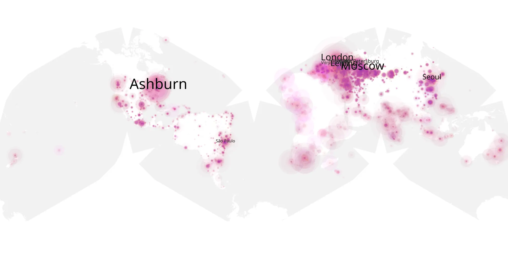
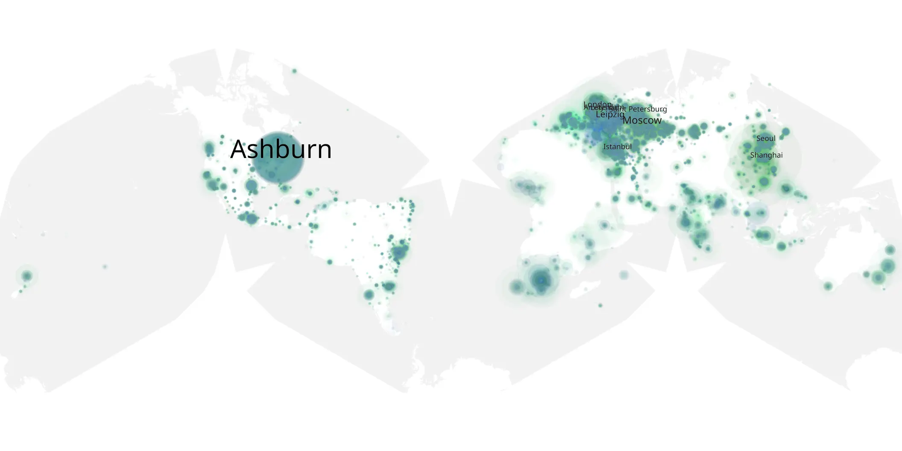

# idol-101 sample cache audit

## 1. Media object

| Field | Value |
| --- | --- |
| Media object | The Idol |
| Collection key | `idol-101` |
| imdb_id | [tt14954666](https://www.imdb.com/title/tt14954666/) |
| wikipedia_url | [The Idol (TV series)](https://en.wikipedia.org/wiki/The_Idol_(TV_series)) |
| Sample dates | 2023-06-05-to-2023-08-20 |
| Sample days | 77 |
| BTIH count | 102 |
| Unique BTIH count | 88 |
| Downloaders total | 1,619,116 |
| Uploaders total | 337,007 |
| Data version | `2026-08-05` |
| IP geolocation version | `6:1777968300` |

## 2. Sample coverage report

- Generated: 2026-08-31T06:28:23Z
- Sample archive directory: `/run/media/bkoz/gold/src/alpha60-samples-raw.gold/idol-101.xz`
- Hour directories: 1796
- Zero-length sample files: 0
- Other unparsable sample files: 0
- Hourly discontinuities: 1 (48 missing hours)
- Missing days: 2

### Sample archive discontinuities

- hourly gap: last `2023-06-30 23:03`, resumed `2023-07-03 00:03` — missing 48 hour(s)
- missing day: `2023-07-01`
- missing day: `2023-07-02`

## 3. Media objects file size histogram

## 4. Visualization pass — graphs

### Downloads by week cumulative (normalized start)



### Downloads by day, Saturday and Sunday in gray

## 5. Visualization pass — maps

### Cumulative geographic slices

| Africa | Americas | Asia | Europe | Oceania | Unknown |
| --- | --- | --- | --- | --- | --- |
| 7.01 | 20.66 | 18.90 | 41.11 | 1.76 | 0.44 |

### Cumulative network infrastructure

{:target="_blank" rel="noopener"}

### Cumulative data maps

**Cumulative >= 1080p**

{:target="_blank" rel="noopener"}

**Cumulative < 1080p**

{:target="_blank" rel="noopener"}
