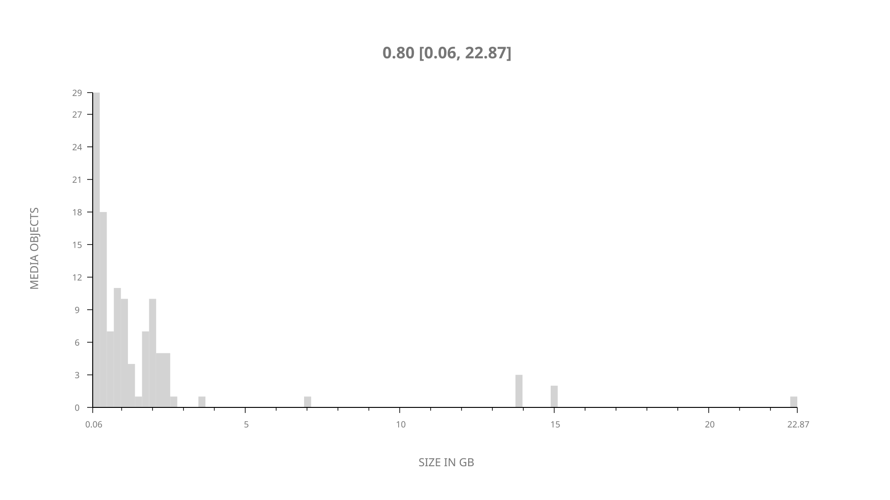
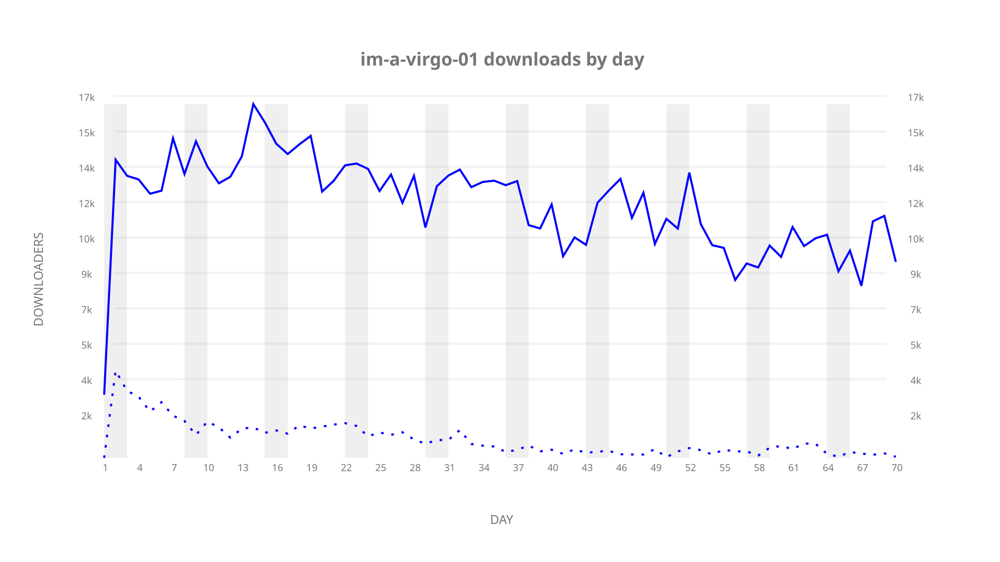
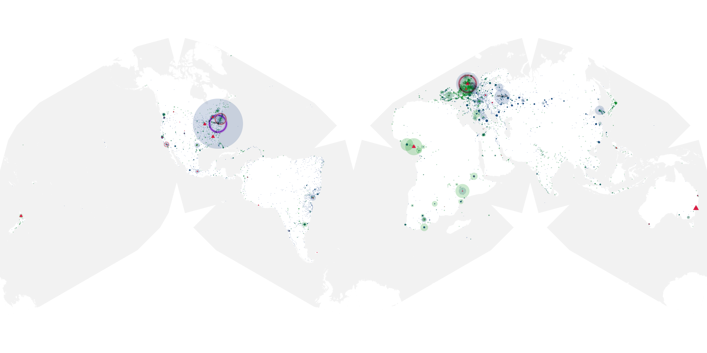
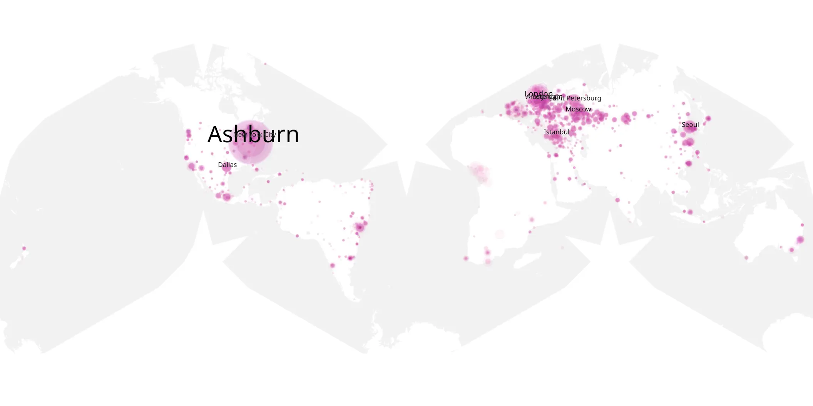
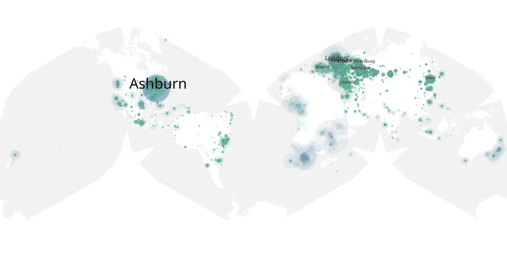

# im-a-virgo-01 sample cache audit

## 1. Media object

| Field | Value |
| --- | --- |
| Media object | I'm A Virgo |
| Collection key | `im-a-virgo-01` |
| imdb_id | [tt13649510](https://www.imdb.com/title/tt13649510/) |
| wikipedia_url | [I'm a Virgo](https://en.wikipedia.org/wiki/I%27m_a_Virgo) |
| Sample dates | 2023-06-23-to-2023-08-31 |
| Sample days | 70 |
| BTIH count | 121 |
| Unique BTIH count | 116 |
| Downloaders total | 637,054 |
| Uploaders total | 83,943 |
| Data version | `2026-08-05` |
| IP geolocation version | `6:1777968300` |

## 2. Coverage report

- Generated: 2026-08-31T06:28:23Z
- Sample archive directory: `/run/media/bkoz/gold/src/alpha60-samples-raw.gold/im-a-virgo-01.xz`
- Hour directories: 1657
- Zero-length sample files: 0
- Other unparsable sample files: 0
- Hourly discontinuities: 5 (7 missing hours)
- Missing days: 0

### Sample archive discontinuities

- hourly gap: last `2023-07-04 09:00`, resumed `2023-07-04 13:00` — missing 3 hour(s)
- hourly gap: last `2023-07-26 22:00`, resumed `2023-07-27 00:00` — missing 1 hour(s)
- hourly gap: last `2023-08-11 22:00`, resumed `2023-08-12 00:00` — missing 1 hour(s)
- hourly gap: last `2023-08-14 22:00`, resumed `2023-08-15 00:00` — missing 1 hour(s)
- hourly gap: last `2023-08-15 22:00`, resumed `2023-08-16 00:00` — missing 1 hour(s)

## 3. File sizes histogram *median[lowest, highest]*

## 4. Graphs

### Downloads by week cumulative (normalized start)



### Downloads by day, Saturday and Sunday in gray

## 5. Cumulative Maps

<!-- https://raw.githubusercontent.com/alpha60-devops/alpha60-results-2023/refs/heads/main/data/ -->

### <a href="https://raw.githubusercontent.com/alpha60-devops/alpha60-results-2023/refs/heads/main/data/geojson.cumulative/im-a-virgo-01-cumulative-aggregate.geojson.gz" data-map-title="I&#x27;m A Virgo — im-a-virgo-01" onclick="leaflet_map_open_window(this.href, this.dataset.mapTitle); return false;" class="table-link" aria-label="Open I&#x27;m A Virgo (im-a-virgo-01) cumulative data map in new window" title="Opens interactive map for I&#x27;m A Virgo (im-a-virgo-01) data">Swarm Detail</a>

### Geographic Regions

| Africa | Americas | Asia | Europe | Oceania | Unknown |
| --- | --- | --- | --- | --- | --- |
| 5.02 | 26.36 | 13.64 | 44.01 | 1.49 | 0.39 |

### Network infrastructure

{:target="_blank" rel="noopener"}

### Resolution >= 1080p

{:target="_blank" rel="noopener"}

### Resolution < 1080p

{:target="_blank" rel="noopener"}
