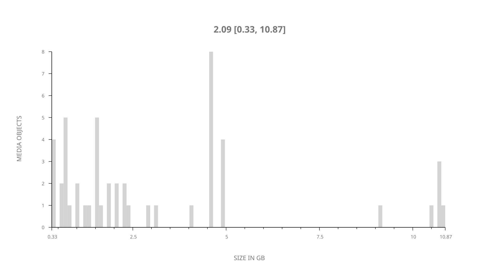
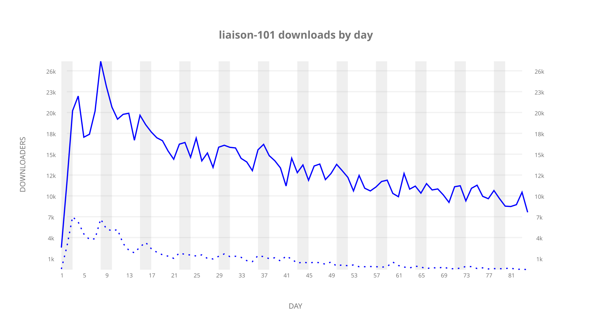
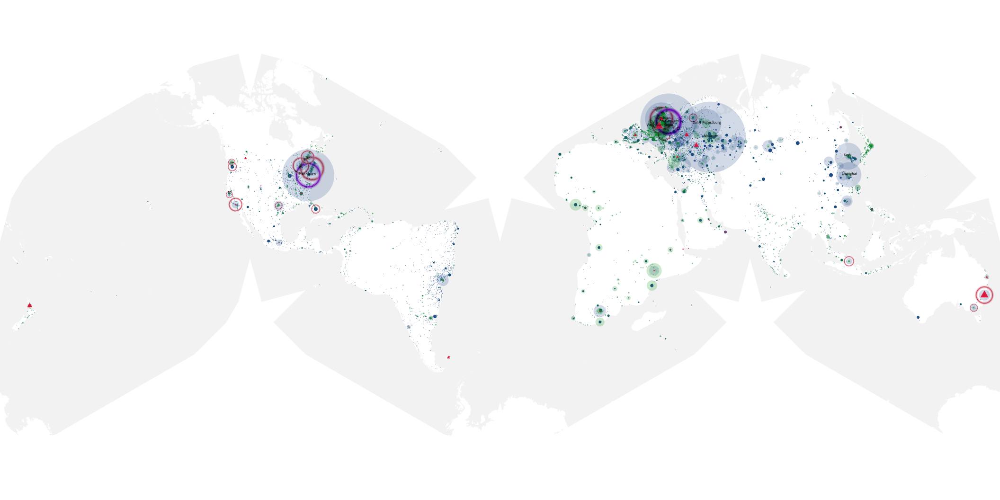
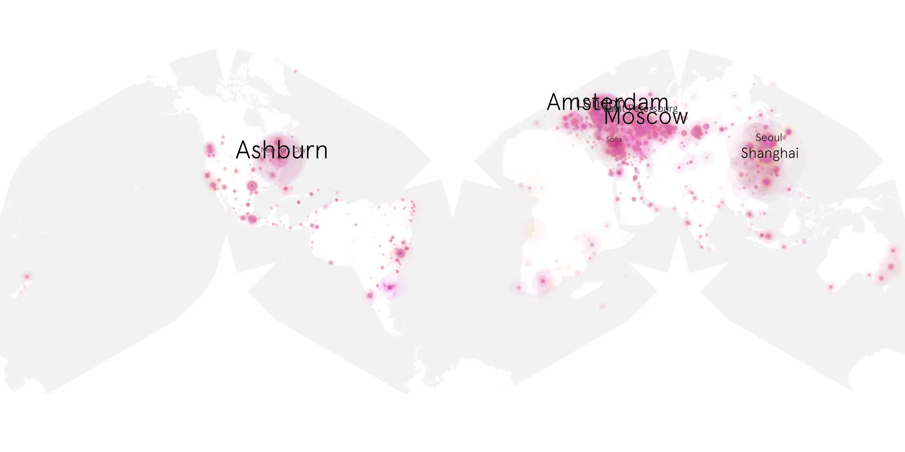
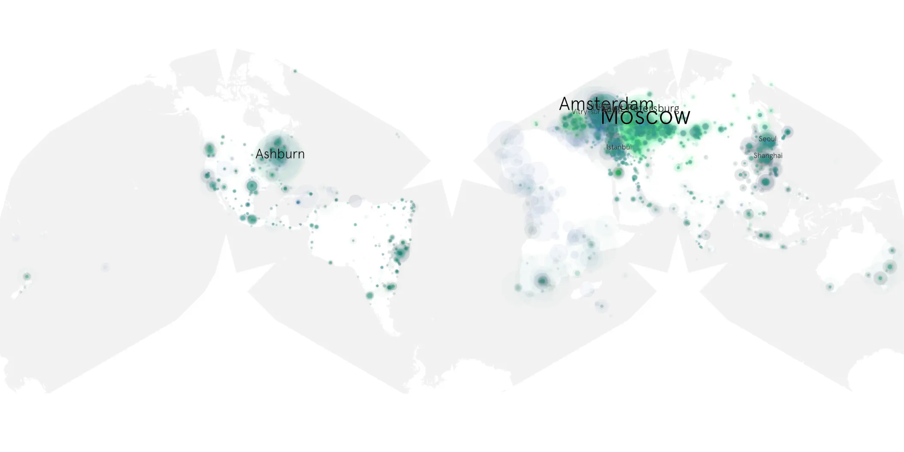

# liaison-101 sample cache audit

## 1. Media object

| Field | Value |
| --- | --- |
| Media object | Liaison |
| Collection key | `liaison-101` |
| imdb_id | [tt14792896](https://www.imdb.com/title/tt14792896/) |
| wikipedia_url | [Liaison (TV series)](https://en.wikipedia.org/wiki/Liaison_(TV_series)) |
| Sample dates | 2023-02-24-to-2023-05-18 |
| Sample days | 84 |
| BTIH count | 60 |
| Unique BTIH count | 50 |
| Downloaders total | 816,979 |
| Uploaders total | 134,270 |
| Data version | `2026-08-05` |
| IP geolocation version | `6:1777968300` |

## 2. Coverage report

- Generated: 2026-08-31T06:28:23Z
- Sample archive directory: `/run/media/bkoz/gold/src/alpha60-samples-raw.gold/liaison-101.xz`
- Hour directories: 1996
- Zero-length sample files: 0
- Other unparsable sample files: 0
- Hourly discontinuities: 1 (1 missing hours)
- Missing days: 0

### Sample archive discontinuities

- hourly gap: last `2023-03-26 01:06`, resumed `2023-03-26 03:06` — missing 1 hour(s)

## 3. File sizes histogram *median[lowest, highest]*

## 4. Graphs

### Downloads by week cumulative (normalized start)



### Downloads by day, Saturday and Sunday in gray

## 5. Cumulative Maps

<!-- https://raw.githubusercontent.com/alpha60-devops/alpha60-results-2023/refs/heads/main/data/ -->

### <a href="https://raw.githubusercontent.com/alpha60-devops/alpha60-results-2023/refs/heads/main/data/geojson.cumulative/liaison-101-cumulative-aggregate.geojson.gz" data-map-title="Liaison — liaison-101" onclick="leaflet_map_open_window(this.href, this.dataset.mapTitle); return false;" class="table-link" aria-label="Open Liaison (liaison-101) cumulative data map in new window" title="Opens interactive map for Liaison (liaison-101) data">Swarm Detail</a>

### Geographic Regions

| Africa | Americas | Asia | Europe | Oceania | Unknown |
| --- | --- | --- | --- | --- | --- |
| 4.38 | 17.19 | 18.23 | 50.53 | 1.34 | 0.67 |

### Network infrastructure

{:target="_blank" rel="noopener"}

### Resolution >= 1080p

{:target="_blank" rel="noopener"}

### Resolution < 1080p

{:target="_blank" rel="noopener"}
