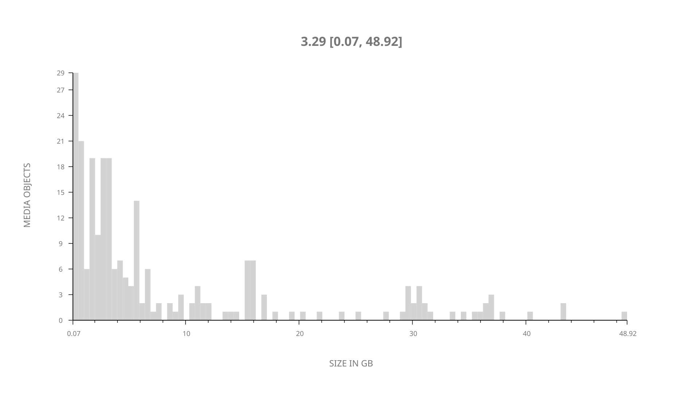
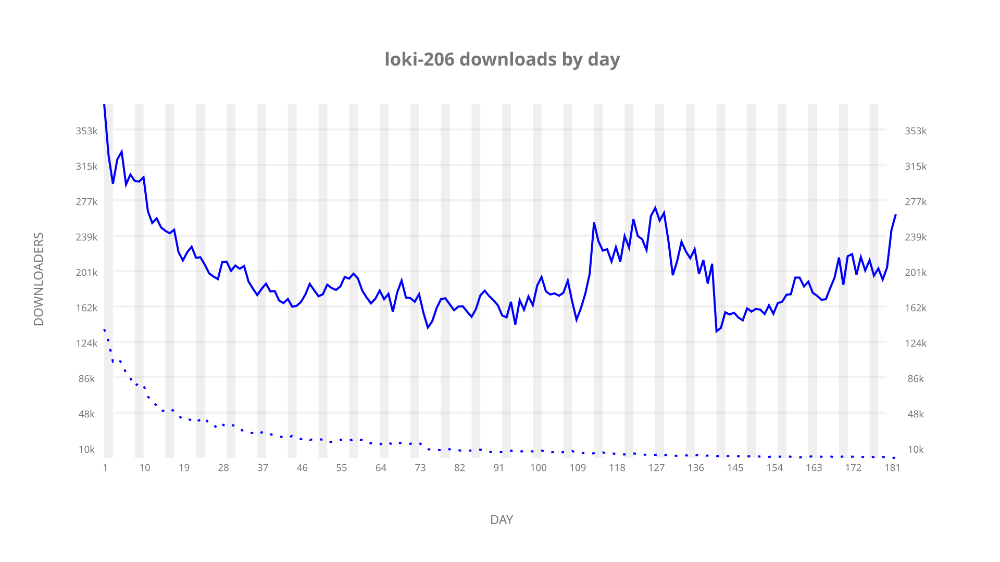
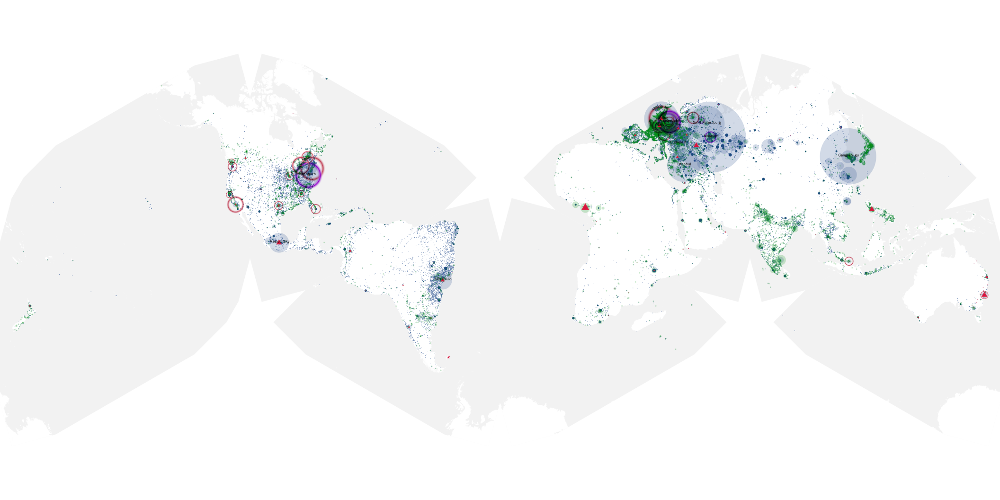
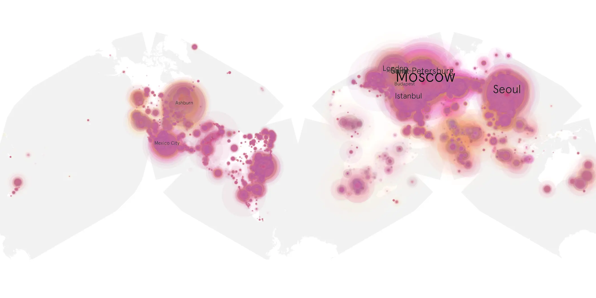
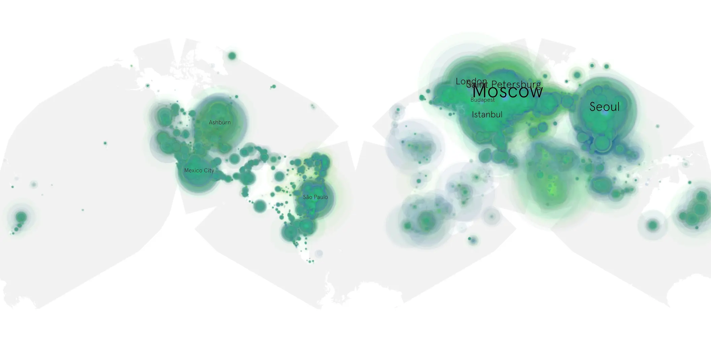

# loki-206 sample cache audit

## 1. Media object

| Field | Value |
| --- | --- |
| Media object | Loki |
| Collection key | `loki-206` |
| imdb_id | [tt9140554](https://www.imdb.com/title/tt9140554/) |
| wikipedia_url | [Loki (TV series)](https://en.wikipedia.org/wiki/Loki_(TV_series)) |
| Sample dates | 2023-11-10-to-2024-05-09 |
| Sample days | 182 |
| BTIH count | 257 |
| Unique BTIH count | 241 |
| Downloaders total | 28,271,366 |
| Uploaders total | 2,266,335 |
| Data version | `2026-08-05` |
| IP geolocation version | `6:1777968300` |

## 2. Coverage report

- Generated: 2026-08-31T06:28:23Z
- Sample archive directory: `/run/media/bkoz/gold/src/alpha60-samples-raw.gold/loki-206.xz`
- Hour directories: 4363
- Zero-length sample files: 0
- Other unparsable sample files: 0
- Hourly discontinuities: 1 (1 missing hours)
- Missing days: 0

### Sample archive discontinuities

- hourly gap: last `2024-03-31 01:06`, resumed `2024-03-31 03:06` — missing 1 hour(s)

## 3. File sizes histogram *median[lowest, highest]*

## 4. Graphs

### Downloads by week cumulative (normalized start)



### Downloads by day, Saturday and Sunday in gray

## 5. Cumulative Maps

<!-- https://raw.githubusercontent.com/alpha60-devops/alpha60-results-2023/refs/heads/main/data/ -->

### <a href="https://raw.githubusercontent.com/alpha60-devops/alpha60-results-2023/refs/heads/main/data/geojson.cumulative/loki-206-cumulative-aggregate.geojson.gz" data-map-title="Loki — loki-206" onclick="leaflet_map_open_window(this.href, this.dataset.mapTitle); return false;" class="table-link" aria-label="Open Loki (loki-206) cumulative data map in new window" title="Opens interactive map for Loki (loki-206) data">Swarm Detail</a>

### Geographic Regions

| Africa | Americas | Asia | Europe | Oceania | Unknown |
| --- | --- | --- | --- | --- | --- |
| 2.40 | 20.14 | 24.05 | 49.78 | 0.87 | 0.57 |

### Network infrastructure

{:target="_blank" rel="noopener"}

### Resolution >= 1080p

{:target="_blank" rel="noopener"}

### Resolution < 1080p

{:target="_blank" rel="noopener"}
