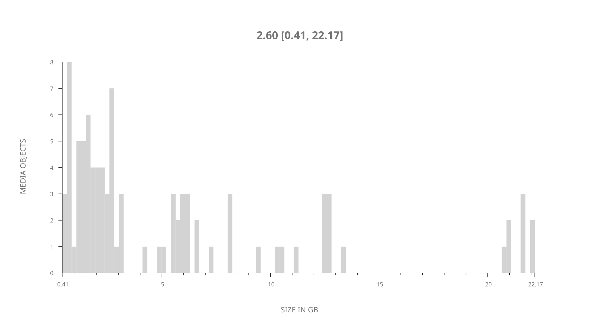
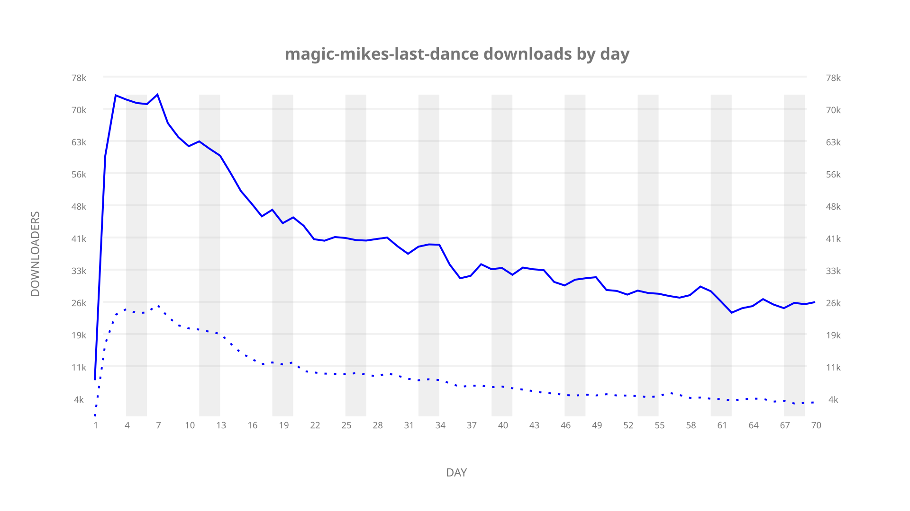
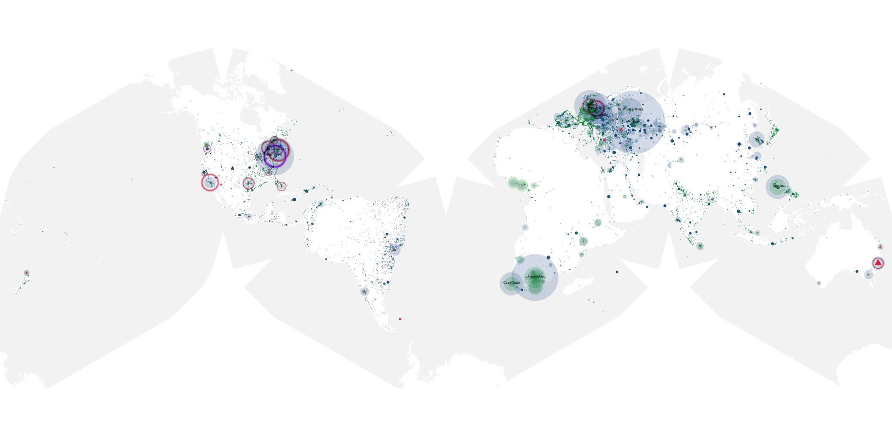
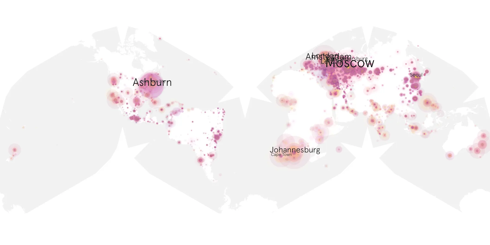
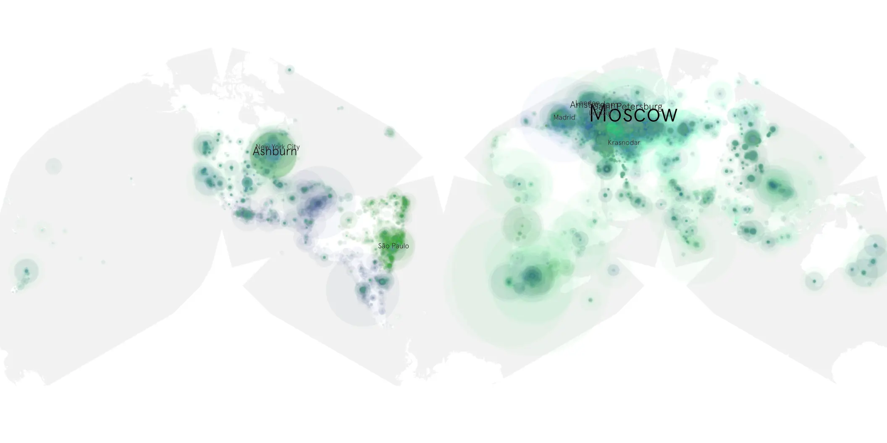

# magic-mikes-last-dance sample cache audit

## 1. Media object

| Field | Value |
| --- | --- |
| Media object | Magic Mike's Last Dance |
| Collection key | `magic-mikes-last-dance` |
| imdb_id | [tt16280138](https://www.imdb.com/title/tt16280138/) |
| wikipedia_url | [Magic Mike's Last Dance](https://en.wikipedia.org/wiki/Magic_Mike%27s_Last_Dance) |
| Sample dates | 2023-02-28-to-2023-05-08 |
| Sample days | 70 |
| BTIH count | 102 |
| Unique BTIH count | 93 |
| Downloaders total | 1,798,311 |
| Uploaders total | 487,729 |
| Data version | `2026-08-05` |
| IP geolocation version | `6:1777968300` |

## 2. Sample coverage report

- Generated: 2026-08-31T06:28:23Z
- Sample archive directory: `/run/media/bkoz/gold/src/alpha60-samples-raw.gold/magic-mikes-last-dance.xz`
- Hour directories: 1659
- Zero-length sample files: 0
- Other unparsable sample files: 0
- Hourly discontinuities: 1 (1 missing hours)
- Missing days: 0

### Sample archive discontinuities

- hourly gap: last `2023-03-26 01:06`, resumed `2023-03-26 03:06` — missing 1 hour(s)

## 3. Media objects file size histogram

## 4. Visualization pass — graphs

### Downloads by week cumulative (normalized start)



### Downloads by day, Saturday and Sunday in gray

## 5. Visualization pass — maps

### Cumulative geographic slices

| Africa | Americas | Asia | Europe | Oceania | Unknown |
| --- | --- | --- | --- | --- | --- |
| 5.79 | 19.59 | 13.83 | 43.70 | 1.88 | 0.47 |

### Cumulative network infrastructure

{:target="_blank" rel="noopener"}

### Cumulative data maps

**Cumulative >= 1080p**

{:target="_blank" rel="noopener"}

**Cumulative < 1080p**

{:target="_blank" rel="noopener"}
