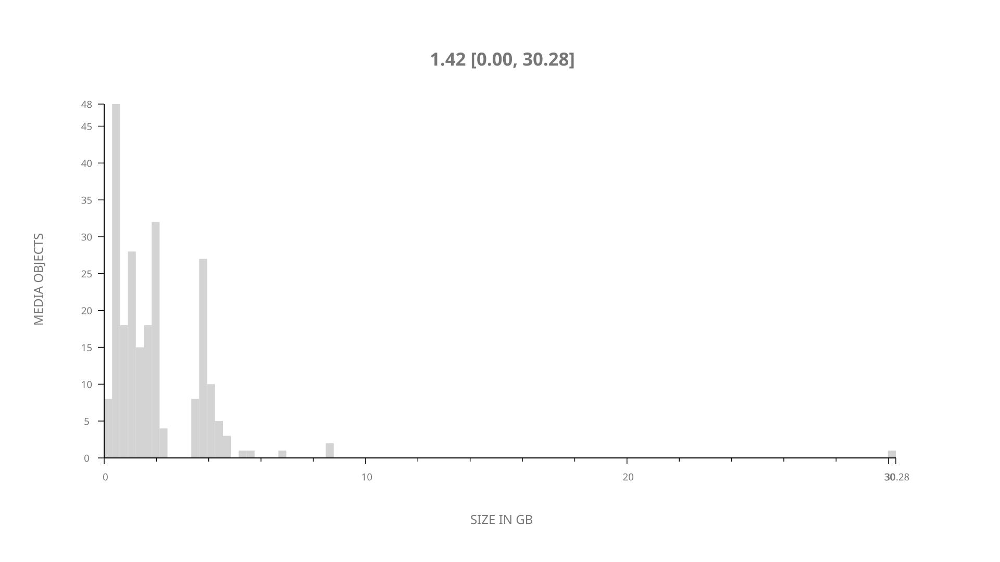
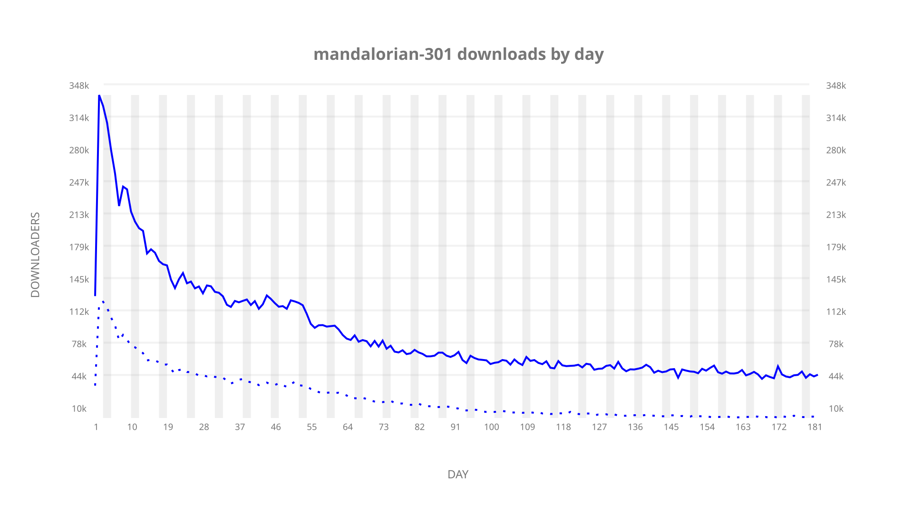
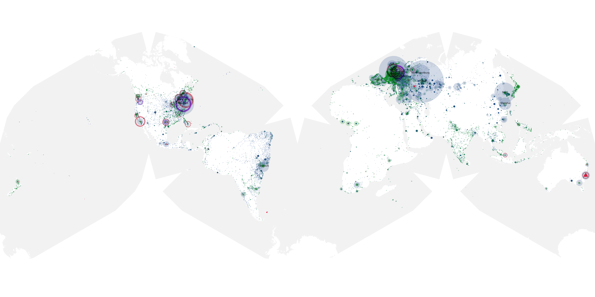
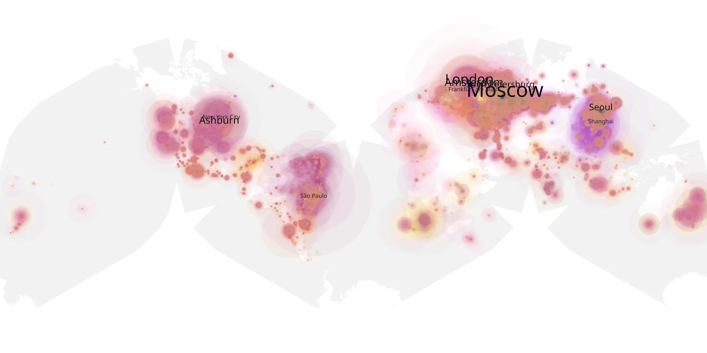
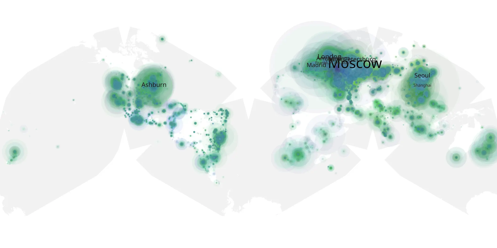

# mandalorian-301 sample cache audit

## 1. Media object

| Field | Value |
| --- | --- |
| Media object | The Mandalorian |
| Collection key | `mandalorian-301` |
| imdb_id | [tt8111088](https://www.imdb.com/title/tt8111088/) |
| wikipedia_url | [The Mandalorian](https://en.wikipedia.org/wiki/The_Mandalorian) |
| Sample dates | 2023-03-01-to-2023-08-29 |
| Sample days | 182 |
| BTIH count | 252 |
| Unique BTIH count | 230 |
| Downloaders total | 9,852,929 |
| Uploaders total | 2,329,478 |
| Data version | `2026-08-05` |
| IP geolocation version | `6:1777968300` |

## 2. Sample coverage report

- Generated: 2026-08-31T06:28:23Z
- Sample archive directory: `/run/media/bkoz/gold/src/alpha60-samples-raw.gold/mandalorian-301.xz`
- Hour directories: 4350
- Zero-length sample files: 1
- Other unparsable sample files: 0
- Hourly discontinuities: 1 (1 missing hours)
- Missing days: 0

Zero-length files are sampler-failure evidence: a sampler killed
before writing the file, or a sampling host whose disk filled
before the write completed. Caching proceeded past every file
listed here.

### Zero-length sample files

- `/run/media/bkoz/gold/src/alpha60-samples-raw.gold/mandalorian-301.xz/2023-04-18-at-13-00.tar.xz`

### Sample archive discontinuities

- hourly gap: last `2023-03-26 01:00`, resumed `2023-03-26 03:00` — missing 1 hour(s)

## 3. Media objects file size histogram

## 4. Visualization pass — graphs

### Downloads by week cumulative (normalized start)



### Downloads by day, Saturday and Sunday in gray

## 5. Visualization pass — maps

### Cumulative geographic slices

| Africa | Americas | Asia | Europe | Oceania | Unknown |
| --- | --- | --- | --- | --- | --- |
| 3.10 | 21.59 | 17.77 | 49.88 | 1.93 | 0.51 |

### Cumulative network infrastructure

{:target="_blank" rel="noopener"}

### Cumulative data maps

**Cumulative >= 1080p**

{:target="_blank" rel="noopener"}

**Cumulative < 1080p**

{:target="_blank" rel="noopener"}
