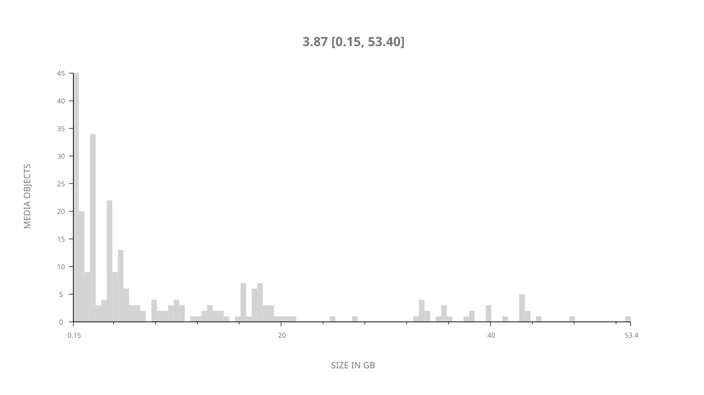
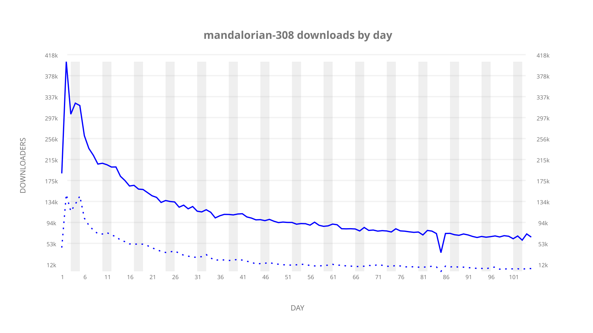
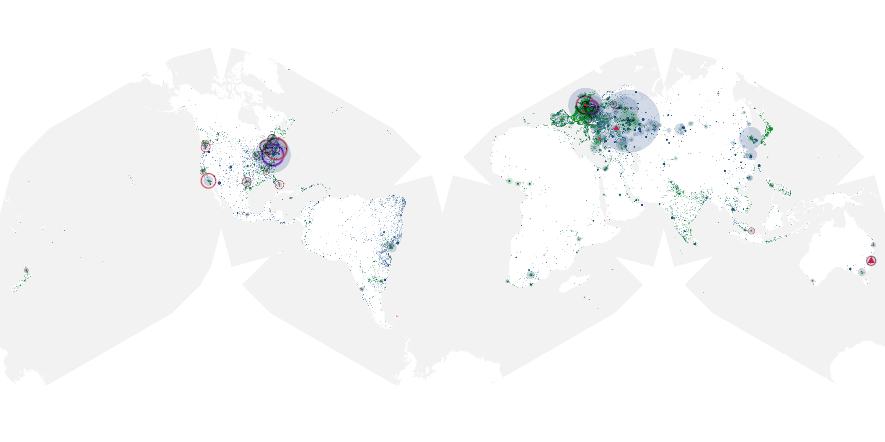
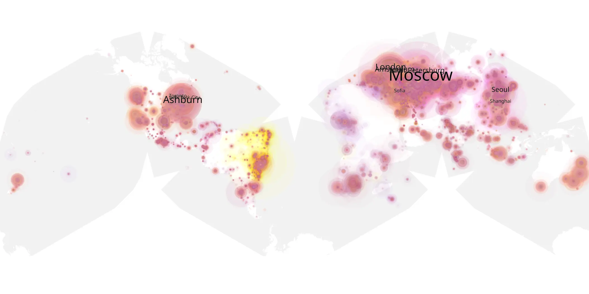
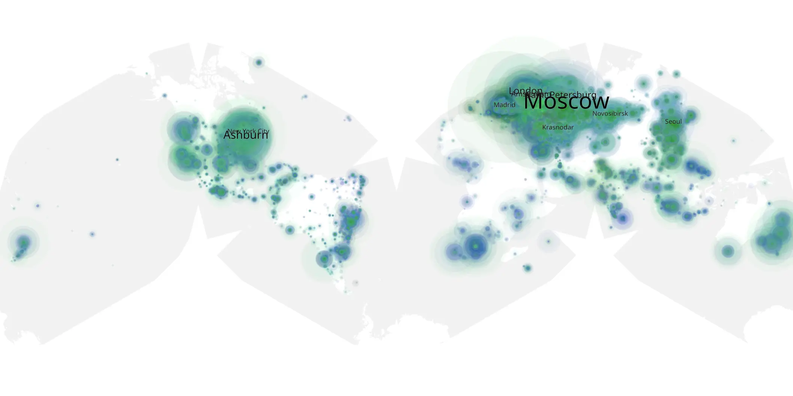

# mandalorian-308 sample cache audit

## 1. Media object

| Field | Value |
| --- | --- |
| Media object | The Mandalorian |
| Collection key | `mandalorian-308` |
| imdb_id | [tt8111088](https://www.imdb.com/title/tt8111088/) |
| wikipedia_url | [The Mandalorian](https://en.wikipedia.org/wiki/The_Mandalorian) |
| Sample dates | 2023-04-19-to-2023-08-01 |
| Sample days | 105 |
| BTIH count | 312 |
| Unique BTIH count | 266 |
| Downloaders total | 7,629,635 |
| Uploaders total | 2,051,761 |
| Data version | `2026-08-05` |
| IP geolocation version | `6:1777968300` |

## 2. Coverage report

- Generated: 2026-08-31T06:28:23Z
- Sample archive directory: `/run/media/bkoz/gold/src/alpha60-samples-raw.gold/mandalorian-308.xz`
- Hour directories: 2474
- Zero-length sample files: 0
- Other unparsable sample files: 0
- Hourly discontinuities: 6 (30 missing hours)
- Missing days: 0

### Sample archive discontinuities

- hourly gap: last `2023-04-19 22:00`, resumed `2023-04-20 00:00` — missing 1 hour(s)
- hourly gap: last `2023-04-20 22:00`, resumed `2023-04-21 00:00` — missing 1 hour(s)
- hourly gap: last `2023-04-21 22:00`, resumed `2023-04-22 00:00` — missing 1 hour(s)
- hourly gap: last `2023-05-23 09:00`, resumed `2023-05-23 14:00` — missing 4 hour(s)
- hourly gap: last `2023-07-11 23:00`, resumed `2023-07-12 17:00` — missing 17 hour(s)
- hourly gap: last `2023-07-30 12:00`, resumed `2023-07-30 19:00` — missing 6 hour(s)

## 3. File sizes histogram *median[lowest, highest]*

## 4. Graphs

### Downloads by week cumulative (normalized start)



### Downloads by day, Saturday and Sunday in gray

## 5. Cumulative Maps

<!-- https://raw.githubusercontent.com/alpha60-devops/alpha60-results-2023/refs/heads/main/data/ -->

### <a href="https://raw.githubusercontent.com/alpha60-devops/alpha60-results-2023/refs/heads/main/data/geojson.cumulative/mandalorian-308-cumulative-aggregate.geojson.gz" data-map-title="The Mandalorian — mandalorian-308" onclick="leaflet_map_open_window(this.href, this.dataset.mapTitle); return false;" class="table-link" aria-label="Open The Mandalorian (mandalorian-308) cumulative data map in new window" title="Opens interactive map for The Mandalorian (mandalorian-308) data">Swarm Detail</a>

### Geographic Regions

| Africa | Americas | Asia | Europe | Oceania | Unknown |
| --- | --- | --- | --- | --- | --- |
| 3.34 | 19.86 | 16.21 | 53.42 | 2.30 | 0.51 |

### Network infrastructure

{:target="_blank" rel="noopener"}

### Resolution >= 1080p

{:target="_blank" rel="noopener"}

### Resolution < 1080p

{:target="_blank" rel="noopener"}
