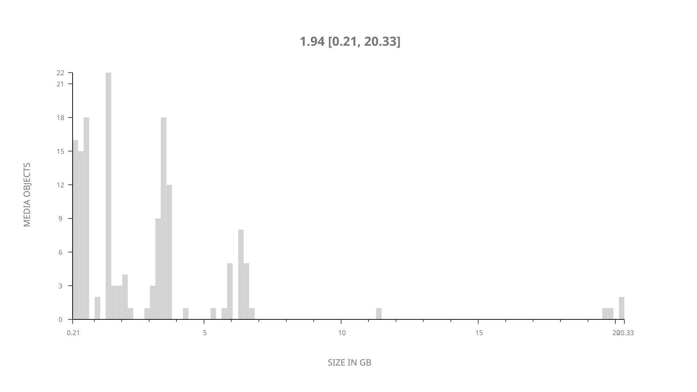
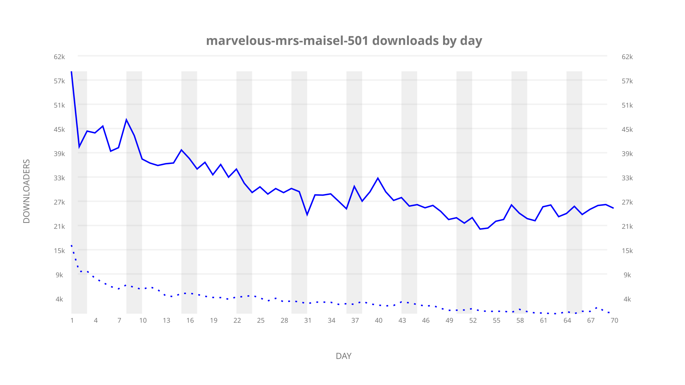
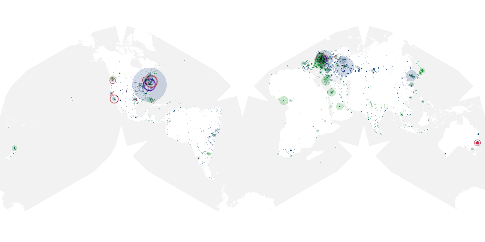
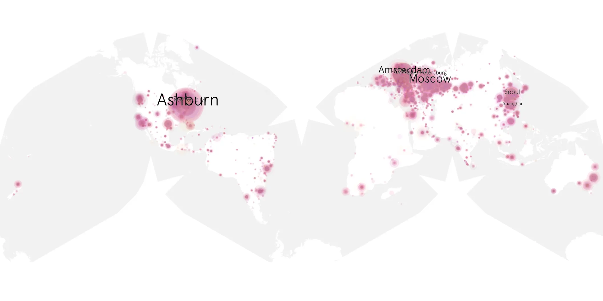
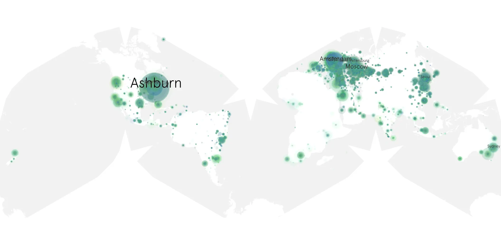

# marvelous-mrs-maisel-501 sample cache audit

## 1. Media object

| Field | Value |
| --- | --- |
| Media object | Marvelous Mrs. Maisel |
| Collection key | `marvelous-mrs-maisel-501` |
| imdb_id | [tt5788792](https://www.imdb.com/title/tt5788792/) |
| wikipedia_url | [The Marvelous Mrs. Maisel](https://en.wikipedia.org/wiki/The_Marvelous_Mrs._Maisel) |
| Sample dates | 2023-04-14-to-2023-06-22 |
| Sample days | 70 |
| BTIH count | 176 |
| Unique BTIH count | 154 |
| Downloaders total | 1,433,430 |
| Uploaders total | 208,900 |
| Data version | `2026-08-05` |
| IP geolocation version | `6:1777968300` |

## 2. Sample coverage report

- Generated: 2026-08-31T06:28:24Z
- Sample archive directory: `/run/media/bkoz/gold/src/alpha60-samples-raw.gold/marvelous-mrs-maisel-501.xz`
- Hour directories: 1674
- Zero-length sample files: 0
- Other unparsable sample files: 0
- Hourly discontinuities: 0 (0 missing hours)
- Missing days: 0

### Sample archive discontinuities

None detected.

## 3. Media objects file size histogram

## 4. Visualization pass — graphs

### Downloads by week cumulative (normalized start)



### Downloads by day, Saturday and Sunday in gray

## 5. Visualization pass — maps

### Cumulative geographic slices

| Africa | Americas | Asia | Europe | Oceania | Unknown |
| --- | --- | --- | --- | --- | --- |
| 2.06 | 25.92 | 18.30 | 48.10 | 2.33 | 0.56 |

### Cumulative network infrastructure

{:target="_blank" rel="noopener"}

### Cumulative data maps

**Cumulative >= 1080p**

{:target="_blank" rel="noopener"}

**Cumulative < 1080p**

{:target="_blank" rel="noopener"}
