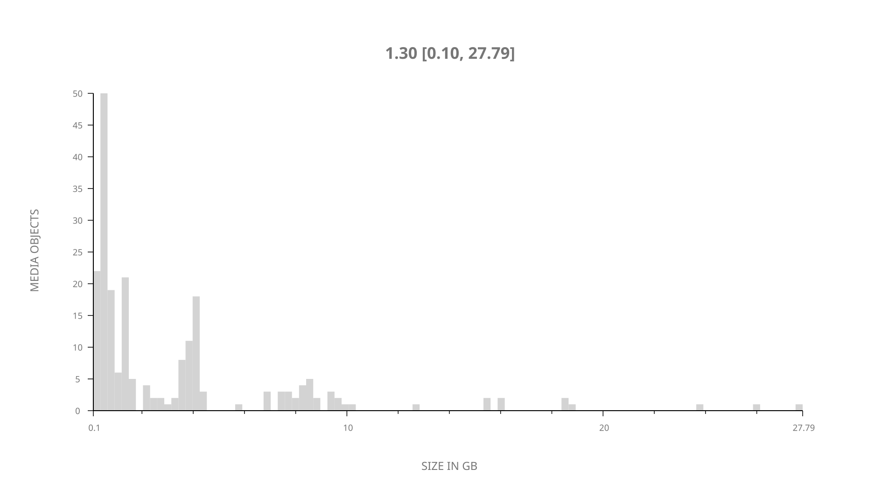
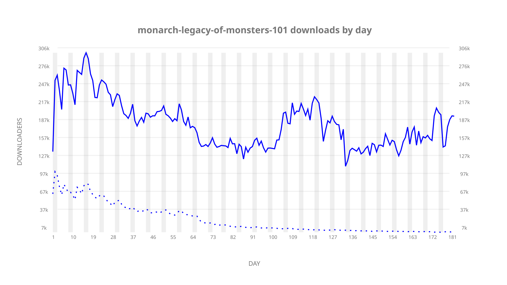
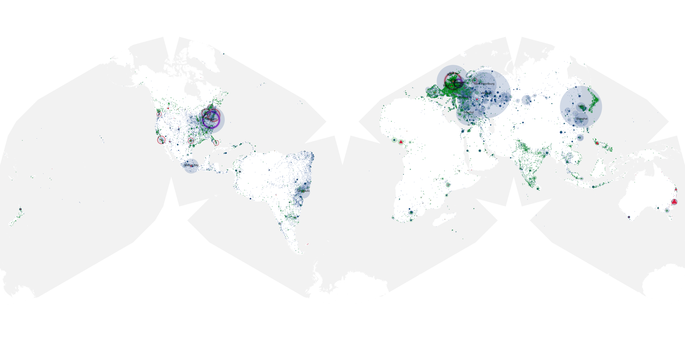
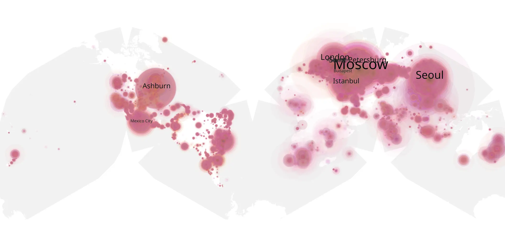
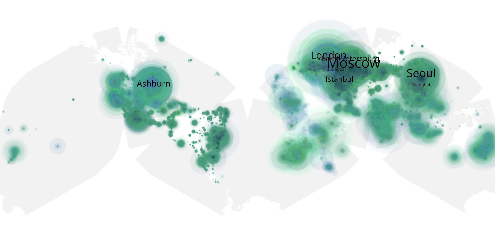

# monarch-legacy-of-monsters-101 sample cache audit

## 1. Media object

| Field | Value |
| --- | --- |
| Media object | Monarch: Legacy of Monsters |
| Collection key | `monarch-legacy-of-monsters-101` |
| imdb_id | [tt17220216](https://www.imdb.com/title/tt17220216/) |
| wikipedia_url | [Monarch: Legacy of Monsters](https://en.wikipedia.org/wiki/Monarch:_Legacy_of_Monsters) |
| Sample dates | 2023-11-17-to-2024-05-17 |
| Sample days | 183 |
| BTIH count | 227 |
| Unique BTIH count | 215 |
| Downloaders total | 24,347,795 |
| Uploaders total | 2,249,782 |
| Data version | `2026-08-05` |
| IP geolocation version | `6:1777968300` |

## 2. Sample coverage report

- Generated: 2026-08-31T06:28:24Z
- Sample archive directory: `/run/media/bkoz/gold/src/alpha60-samples-raw.gold/monarch-legacy-of-monsters-101.xz`
- Hour directories: 4530
- Zero-length sample files: 0
- Other unparsable sample files: 0
- Hourly discontinuities: 2 (25 missing hours)
- Missing days: 1

### Sample archive discontinuities

- hourly gap: last `2024-02-01 23:00`, resumed `2024-02-03 00:00` — missing 24 hour(s)
- hourly gap: last `2024-03-31 01:00`, resumed `2024-03-31 03:00` — missing 1 hour(s)
- missing day: `2024-02-02`

## 3. Media objects file size histogram

## 4. Visualization pass — graphs

### Downloads by week cumulative (normalized start)



### Downloads by day, Saturday and Sunday in gray

## 5. Visualization pass — maps

### Cumulative geographic slices

| Africa | Americas | Asia | Europe | Oceania | Unknown |
| --- | --- | --- | --- | --- | --- |
| 2.87 | 21.47 | 23.18 | 48.39 | 1.34 | 0.57 |

### Cumulative network infrastructure

{:target="_blank" rel="noopener"}

### Cumulative data maps

**Cumulative >= 1080p**

{:target="_blank" rel="noopener"}

**Cumulative < 1080p**

{:target="_blank" rel="noopener"}
