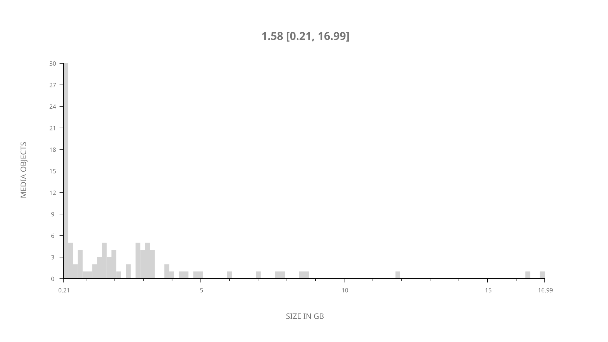
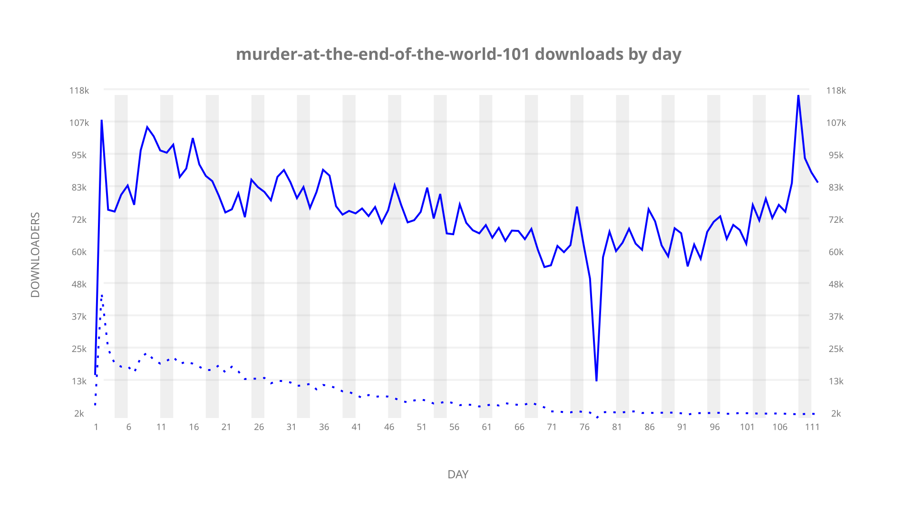
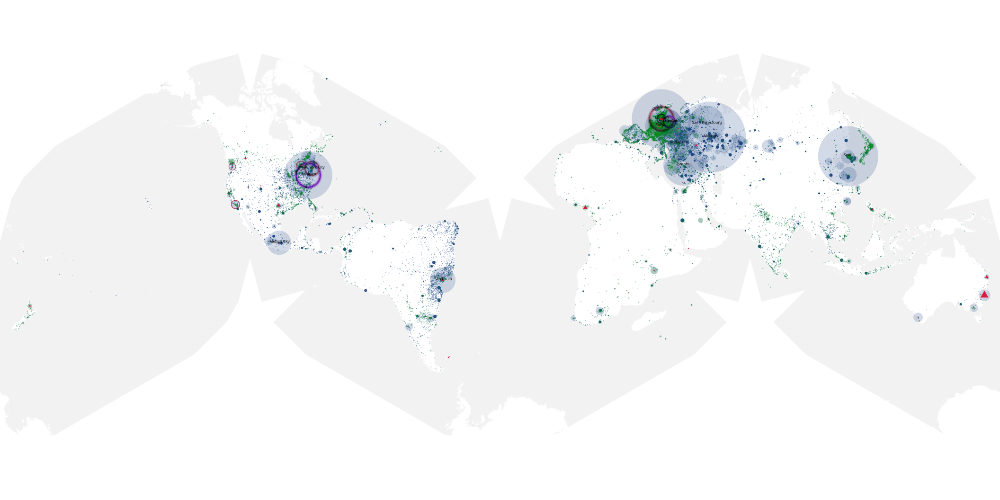
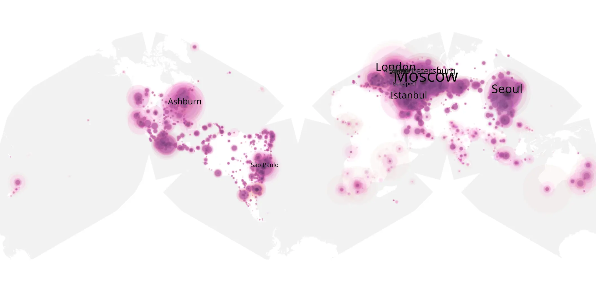
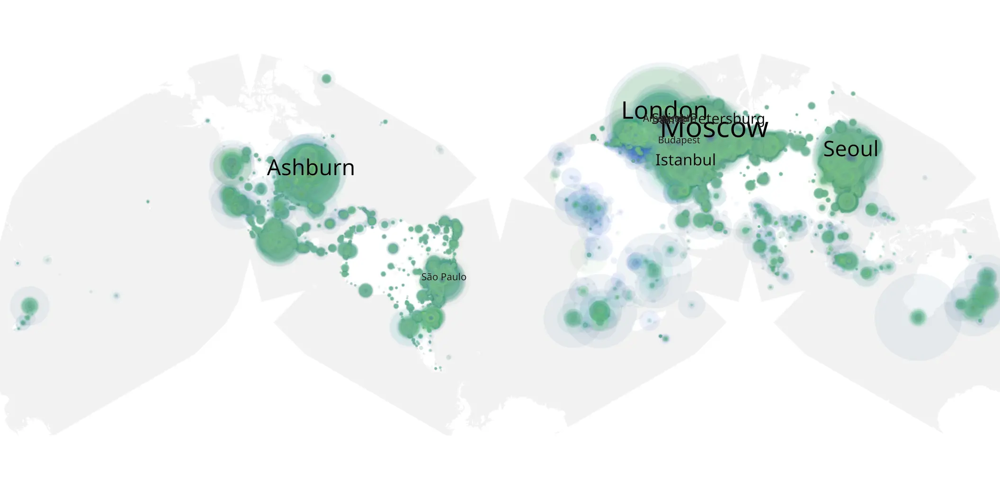

# murder-at-the-end-of-the-world-101 sample cache audit

## 1. Media object

| Field | Value |
| --- | --- |
| Media object | A Murder at the End of the World |
| Collection key | `murder-at-the-end-of-the-world-101` |
| imdb_id | [tt15227418](https://www.imdb.com/title/tt15227418/) |
| wikipedia_url | [A Murder at the End of the World](https://en.wikipedia.org/wiki/A_Murder_at_the_End_of_the_World) |
| Sample dates | 2023-11-14-to-2024-03-04 |
| Sample days | 112 |
| BTIH count | 114 |
| Unique BTIH count | 97 |
| Downloaders total | 6,929,283 |
| Uploaders total | 639,662 |
| Data version | `2026-08-05` |
| IP geolocation version | `6:1777968300` |

## 2. Sample coverage report

- Generated: 2026-08-31T06:28:24Z
- Sample archive directory: `/run/media/bkoz/gold/src/alpha60-samples-raw.gold/murder-at-the-end-of-the-world-101.xz`
- Hour directories: 2666
- Zero-length sample files: 0
- Other unparsable sample files: 0
- Hourly discontinuities: 1 (1 missing hours)
- Missing days: 0

### Sample archive discontinuities

- hourly gap: last `2024-01-29 22:00`, resumed `2024-01-30 00:00` — missing 1 hour(s)

## 3. Media objects file size histogram

## 4. Visualization pass — graphs

### Downloads by week cumulative (normalized start)



### Downloads by day, Saturday and Sunday in gray

## 5. Visualization pass — maps

### Cumulative geographic slices

| Africa | Americas | Asia | Europe | Oceania | Unknown |
| --- | --- | --- | --- | --- | --- |
| 2.73 | 23.59 | 19.53 | 48.90 | 1.58 | 0.47 |

### Cumulative network infrastructure

{:target="_blank" rel="noopener"}

### Cumulative data maps

**Cumulative >= 1080p**

{:target="_blank" rel="noopener"}

**Cumulative < 1080p**

{:target="_blank" rel="noopener"}
