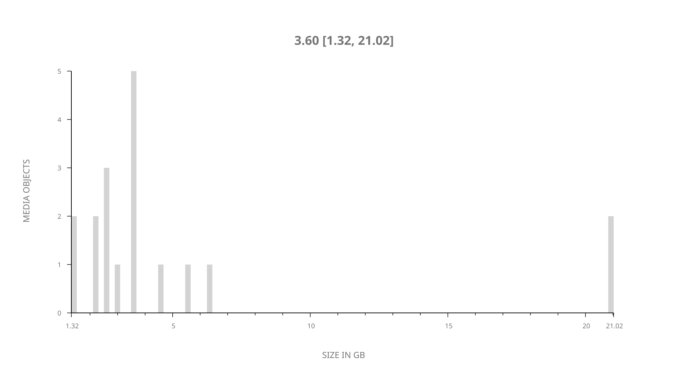
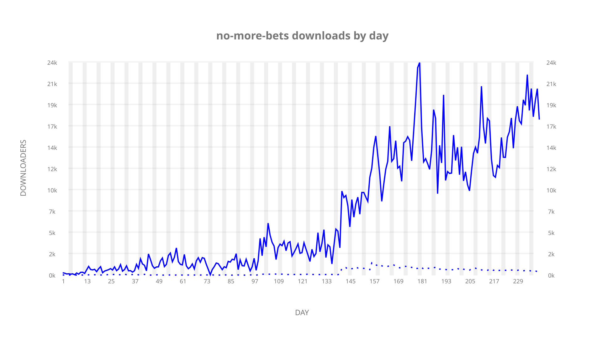
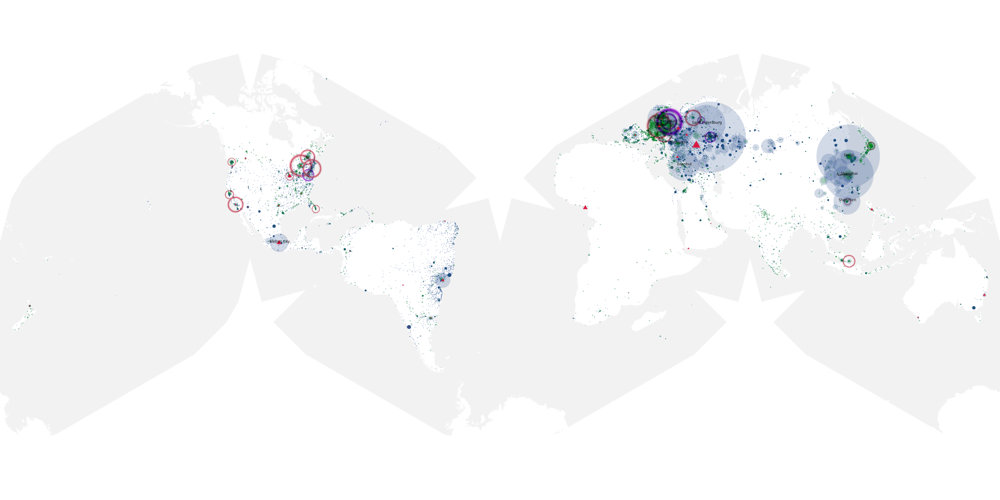
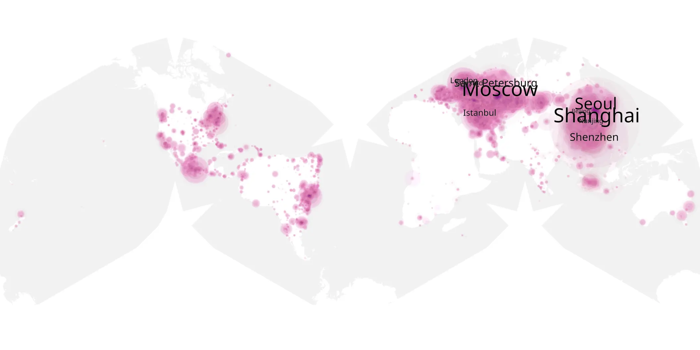
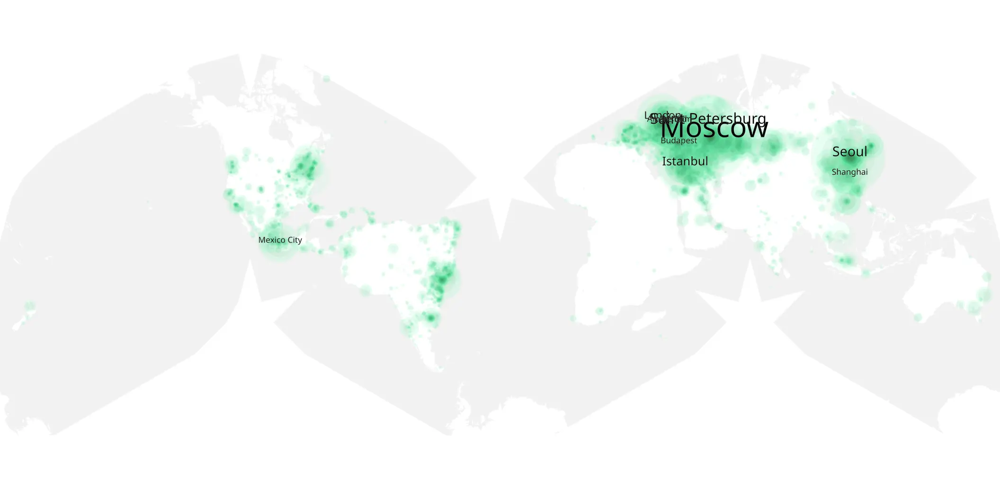

# no-more-bets sample cache audit

## 1. Media object

| Field | Value |
| --- | --- |
| Media object | No More Bets |
| Collection key | `no-more-bets` |
| imdb_id | [tt28076784](https://www.imdb.com/title/tt28076784/) |
| wikipedia_url | [No More Bets](https://en.wikipedia.org/wiki/No_More_Bets) |
| Sample dates | 2023-09-19-to-2024-05-15 |
| Sample days | 240 |
| BTIH count | 20 |
| Unique BTIH count | 18 |
| Downloaders total | 1,426,566 |
| Uploaders total | 63,800 |
| Data version | `2026-08-05` |
| IP geolocation version | `6:1777968300` |

## 2. Sample coverage report

- Generated: 2026-08-31T06:28:24Z
- Sample archive directory: `/run/media/bkoz/gold/src/alpha60-samples-raw.gold/no-more-bets.xz`
- Hour directories: 5735
- Zero-length sample files: 0
- Other unparsable sample files: 0
- Hourly discontinuities: 2 (25 missing hours)
- Missing days: 0

### Sample archive discontinuities

- hourly gap: last `2023-12-01 22:00`, resumed `2023-12-02 23:00` — missing 24 hour(s)
- hourly gap: last `2024-03-31 01:00`, resumed `2024-03-31 03:00` — missing 1 hour(s)

## 3. Media objects file size histogram

## 4. Visualization pass — graphs

### Downloads by week cumulative (normalized start)



### Downloads by day, Saturday and Sunday in gray

## 5. Visualization pass — maps

### Cumulative geographic slices

| Africa | Americas | Asia | Europe | Oceania | Unknown |
| --- | --- | --- | --- | --- | --- |
| 0.62 | 15.41 | 27.92 | 43.99 | 0.55 | 0.63 |

### Cumulative network infrastructure

{:target="_blank" rel="noopener"}

### Cumulative data maps

**Cumulative >= 1080p**

{:target="_blank" rel="noopener"}

**Cumulative < 1080p**

{:target="_blank" rel="noopener"}
