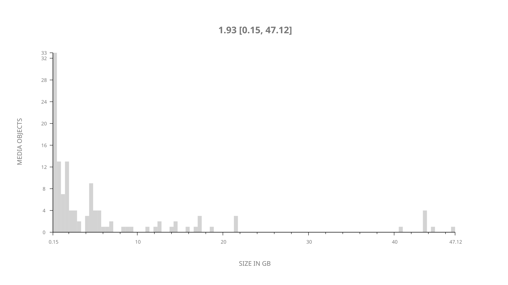
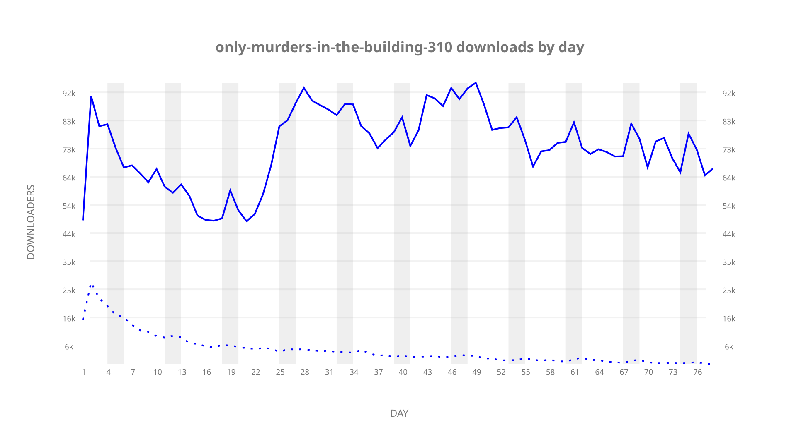
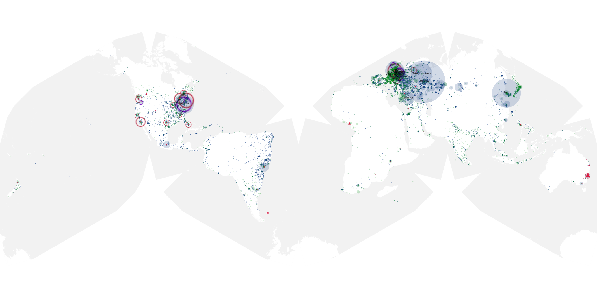
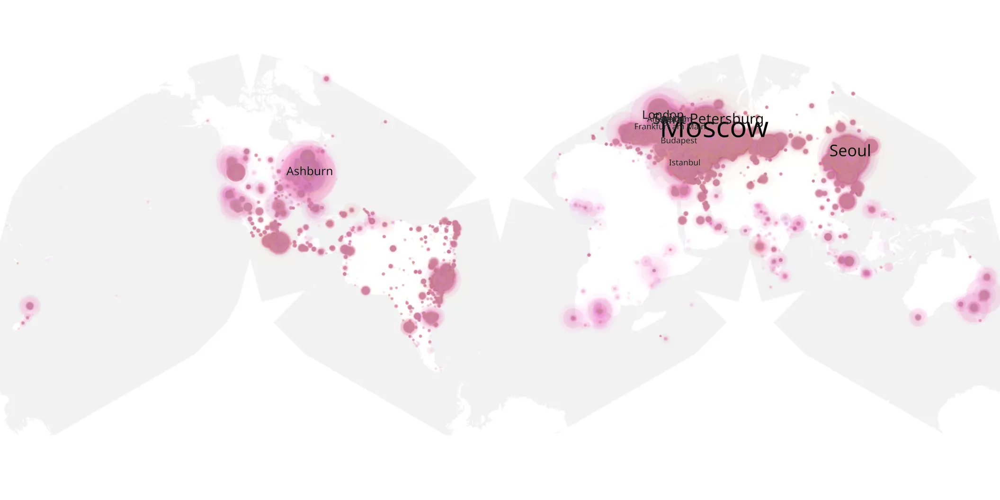
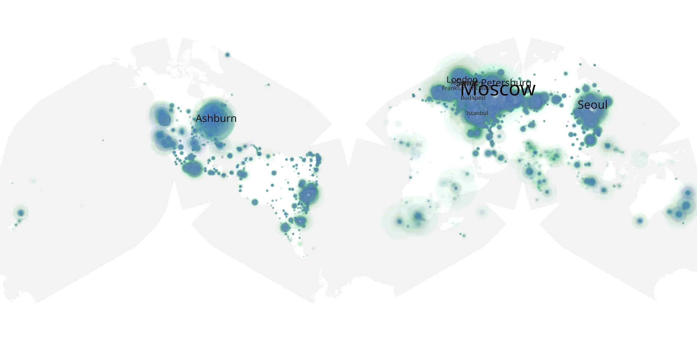

# only-murders-in-the-building-310 sample cache audit

## 1. Media object

| Field | Value |
| --- | --- |
| Media object | Only Murders In the Building |
| Collection key | `only-murders-in-the-building-310` |
| imdb_id | [tt11691774](https://www.imdb.com/title/tt11691774/) |
| wikipedia_url | [Only Murders in the Building](https://en.wikipedia.org/wiki/Only_Murders_in_the_Building) |
| Sample dates | 2023-10-03-to-2023-12-19 |
| Sample days | 78 |
| BTIH count | 146 |
| Unique BTIH count | 126 |
| Downloaders total | 5,073,381 |
| Uploaders total | 465,948 |
| Data version | `2026-08-05` |
| IP geolocation version | `6:1777968300` |

## 2. Sample coverage report

- Generated: 2026-08-31T06:28:24Z
- Sample archive directory: `/run/media/bkoz/gold/src/alpha60-samples-raw.gold/only-murders-in-the-building-310.xz`
- Hour directories: 2846
- Zero-length sample files: 0
- Other unparsable sample files: 0
- Hourly discontinuities: 1 (185 missing hours)
- Missing days: 7

### Sample archive discontinuities

- hourly gap: last `2024-01-02 23:06`, resumed `2024-01-10 17:06` — missing 185 hour(s)
- missing day: `2024-01-03`
- missing day: `2024-01-04`
- missing day: `2024-01-05`
- missing day: `2024-01-06`
- missing day: `2024-01-07`
- missing day: `2024-01-08`
- missing day: `2024-01-09`

## 3. Media objects file size histogram

## 4. Visualization pass — graphs

### Downloads by week cumulative (normalized start)



### Downloads by day, Saturday and Sunday in gray

## 5. Visualization pass — maps

### Cumulative geographic slices

| Africa | Americas | Asia | Europe | Oceania | Unknown |
| --- | --- | --- | --- | --- | --- |
| 1.85 | 21.72 | 18.30 | 53.20 | 1.19 | 0.49 |

### Cumulative network infrastructure

{:target="_blank" rel="noopener"}

### Cumulative data maps

**Cumulative >= 1080p**

{:target="_blank" rel="noopener"}

**Cumulative < 1080p**

{:target="_blank" rel="noopener"}
