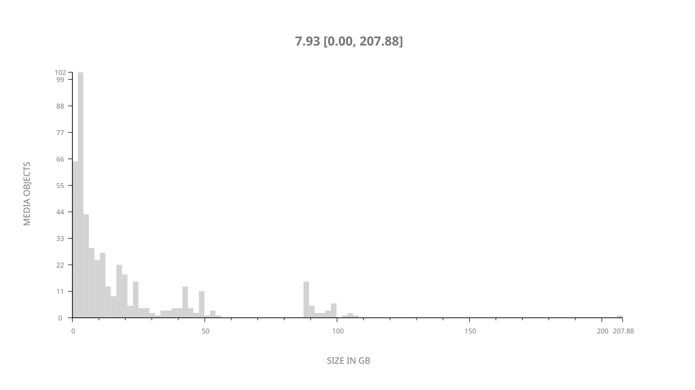
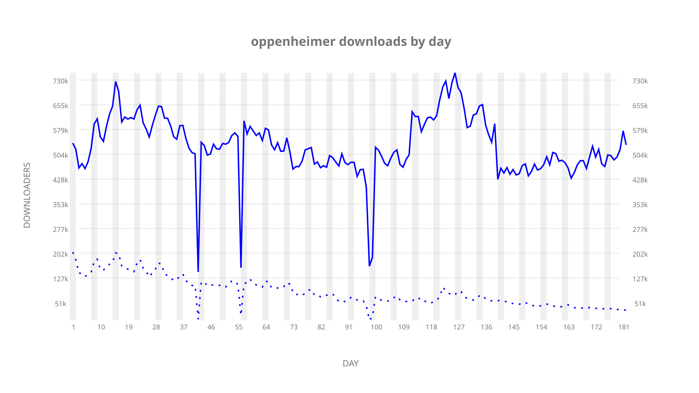
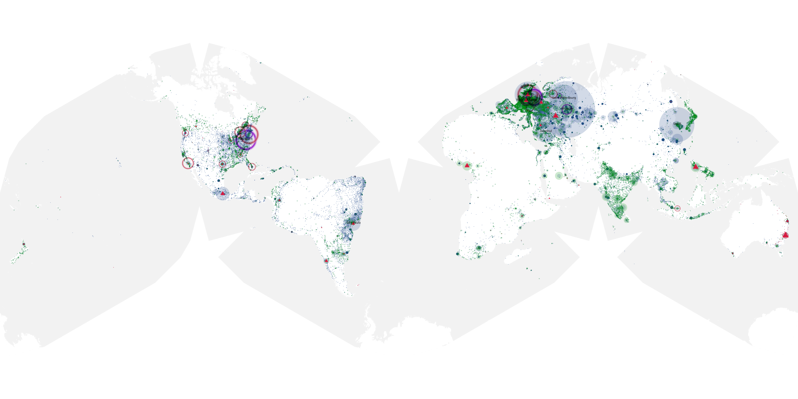
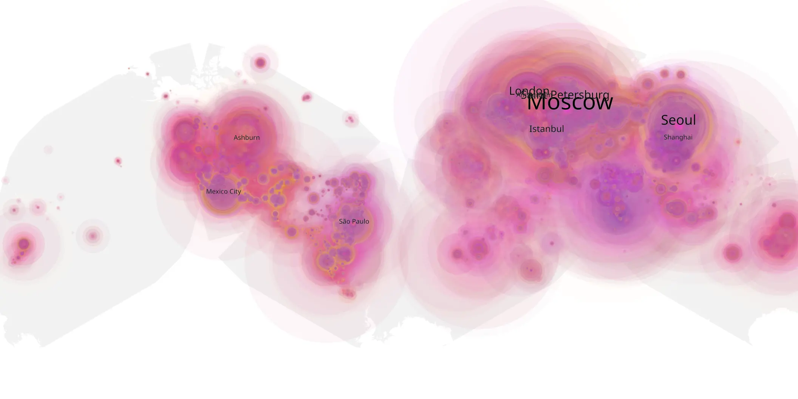
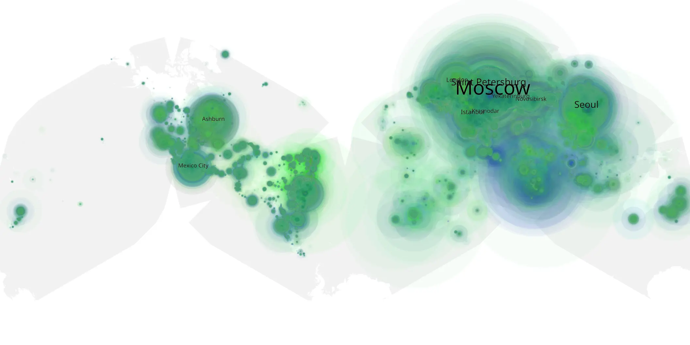

# oppenheimer sample cache audit

## 1. Media object

| Field | Value |
| --- | --- |
| Media object | Oppenheimer |
| Collection key | `oppenheimer` |
| imdb_id | [tt15398776](https://www.imdb.com/title/tt15398776/) |
| wikipedia_url | [Oppenheimer (film)](https://en.wikipedia.org/wiki/Oppenheimer_(film)) |
| Sample dates | 2023-11-11-to-2024-05-10 |
| Sample days | 182 |
| BTIH count | 528 |
| Unique BTIH count | 470 |
| Downloaders total | 70,063,331 |
| Uploaders total | 11,717,294 |
| Data version | `2026-08-05` |
| IP geolocation version | `6:1777968300` |

## 2. Sample coverage report

- Generated: 2026-08-31T06:28:24Z
- Sample archive directory: `/run/media/bkoz/gold/src/alpha60-samples-raw.gold/oppenheimer.xz`
- Hour directories: 4308
- Zero-length sample files: 0
- Other unparsable sample files: 0
- Hourly discontinuities: 5 (61 missing hours)
- Missing days: 0

### Sample archive discontinuities

- hourly gap: last `2023-12-22 05:00`, resumed `2023-12-23 00:00` — missing 18 hour(s)
- hourly gap: last `2024-01-04 23:00`, resumed `2024-01-05 20:00` — missing 20 hour(s)
- hourly gap: last `2024-02-16 03:00`, resumed `2024-02-16 05:00` — missing 1 hour(s)
- hourly gap: last `2024-02-16 19:00`, resumed `2024-02-17 17:56` — missing 21 hour(s)
- hourly gap: last `2024-03-31 01:03`, resumed `2024-03-31 03:03` — missing 1 hour(s)

## 3. Media objects file size histogram

## 4. Visualization pass — graphs

### Downloads by week cumulative (normalized start)



### Downloads by day, Saturday and Sunday in gray

## 5. Visualization pass — maps

### Cumulative geographic slices

| Africa | Americas | Asia | Europe | Oceania | Unknown |
| --- | --- | --- | --- | --- | --- |
| 3.23 | 18.87 | 23.85 | 49.00 | 0.98 | 0.50 |

### Cumulative network infrastructure

{:target="_blank" rel="noopener"}

### Cumulative data maps

**Cumulative >= 1080p**

{:target="_blank" rel="noopener"}

**Cumulative < 1080p**

{:target="_blank" rel="noopener"}
