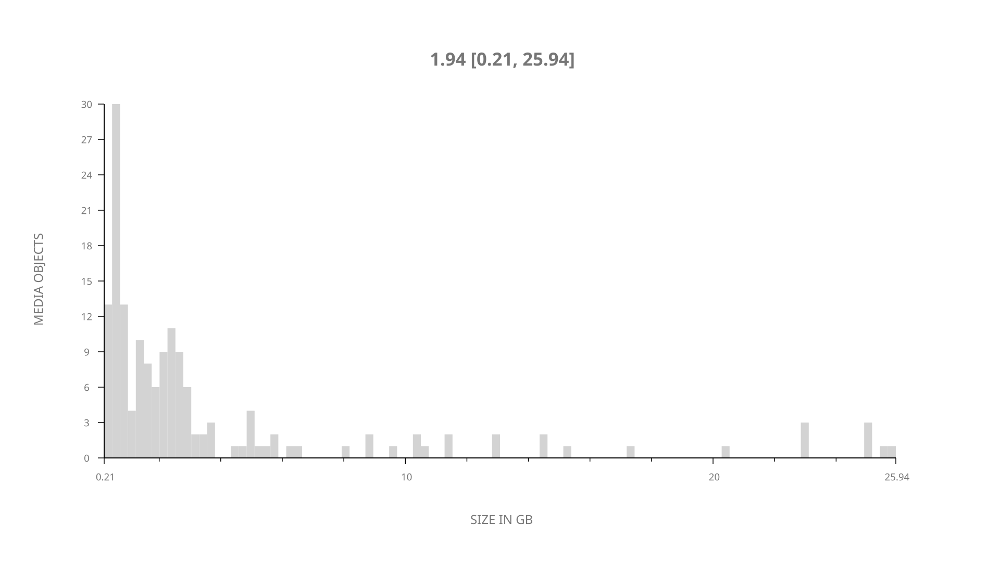
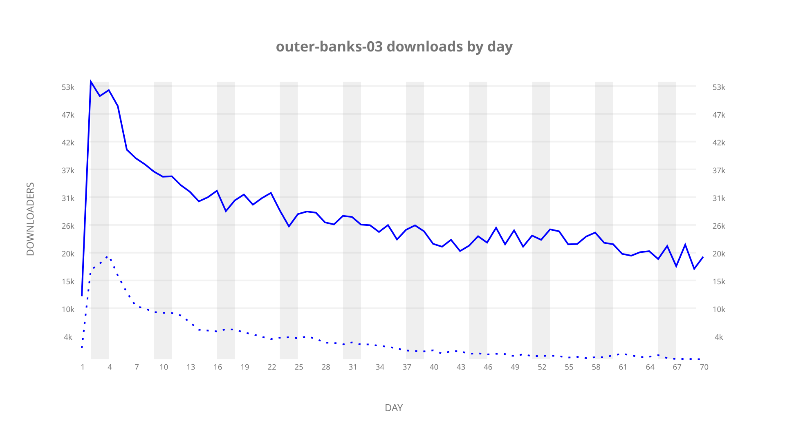
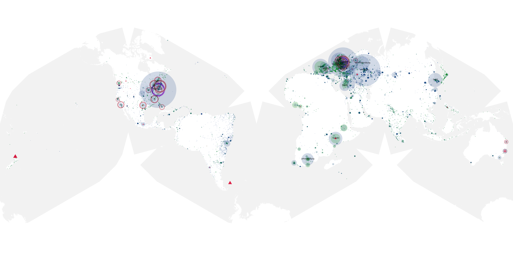
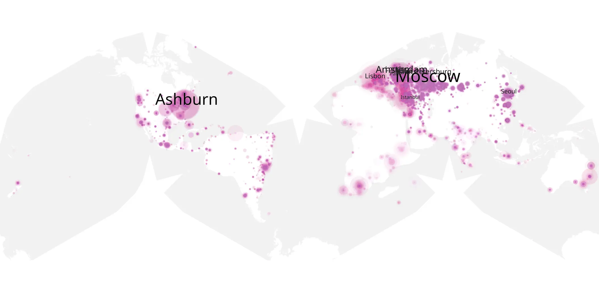
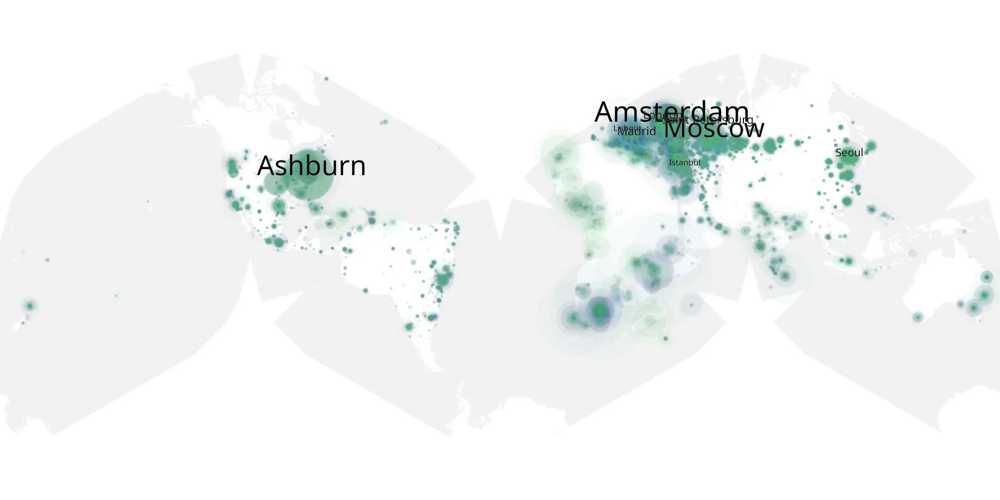

# outer-banks-03 sample cache audit

## 1. Media object

| Field | Value |
| --- | --- |
| Media object | Outer Banks |
| Collection key | `outer-banks-03` |
| imdb_id | [tt10293938](https://www.imdb.com/title/tt10293938/) |
| wikipedia_url | [Outer Banks (TV series)](https://en.wikipedia.org/wiki/Outer_Banks_(TV_series)) |
| Sample dates | 2023-02-23-to-2023-05-03 |
| Sample days | 70 |
| BTIH count | 179 |
| Unique BTIH count | 162 |
| Downloaders total | 1,359,564 |
| Uploaders total | 283,148 |
| Data version | `2026-08-05` |
| IP geolocation version | `6:1777968300` |

## 2. Coverage report

- Generated: 2026-08-31T06:28:24Z
- Sample archive directory: `/run/media/bkoz/gold/src/alpha60-samples-raw.gold/outer-banks-03.xz`
- Hour directories: 1658
- Zero-length sample files: 0
- Other unparsable sample files: 0
- Hourly discontinuities: 1 (1 missing hours)
- Missing days: 0

### Sample archive discontinuities

- hourly gap: last `2023-03-26 01:00`, resumed `2023-03-26 03:00` — missing 1 hour(s)

## 3. File sizes histogram *median[lowest, highest]*

## 4. Graphs

### Downloads by week cumulative (normalized start)



### Downloads by day, Saturday and Sunday in gray

## 5. Cumulative Maps

<!-- https://raw.githubusercontent.com/alpha60-devops/alpha60-results-2023/refs/heads/main/data/ -->

### <a href="https://raw.githubusercontent.com/alpha60-devops/alpha60-results-2023/refs/heads/main/data/geojson.cumulative/outer-banks-03-cumulative-aggregate.geojson.gz" data-map-title="Outer Banks — outer-banks-03" onclick="leaflet_map_open_window(this.href, this.dataset.mapTitle); return false;" class="table-link" aria-label="Open Outer Banks (outer-banks-03) cumulative data map in new window" title="Opens interactive map for Outer Banks (outer-banks-03) data">Swarm Detail</a>

### Geographic Regions

| Africa | Americas | Asia | Europe | Oceania | Unknown |
| --- | --- | --- | --- | --- | --- |
| 7.52 | 19.23 | 13.51 | 47.17 | 1.35 | 0.41 |

### Network infrastructure

{:target="_blank" rel="noopener"}

### Resolution >= 1080p

{:target="_blank" rel="noopener"}

### Resolution < 1080p

{:target="_blank" rel="noopener"}
