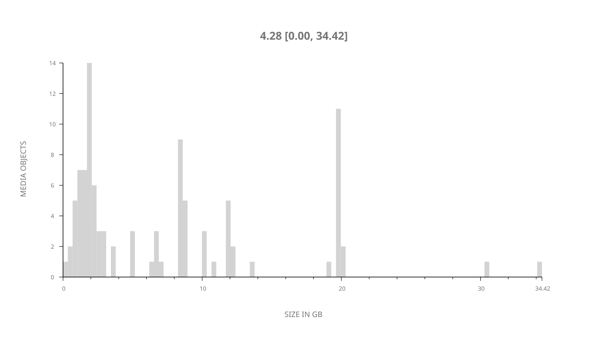
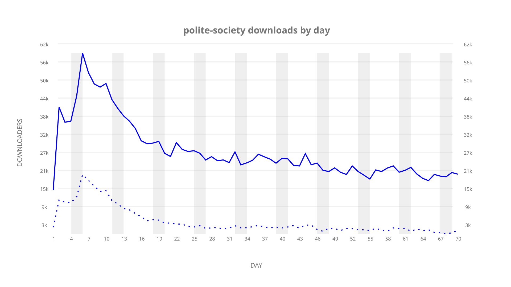
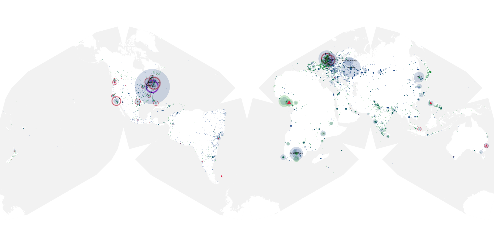
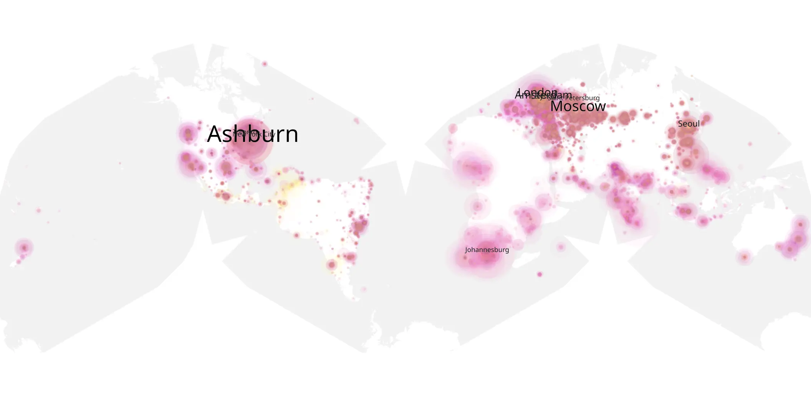
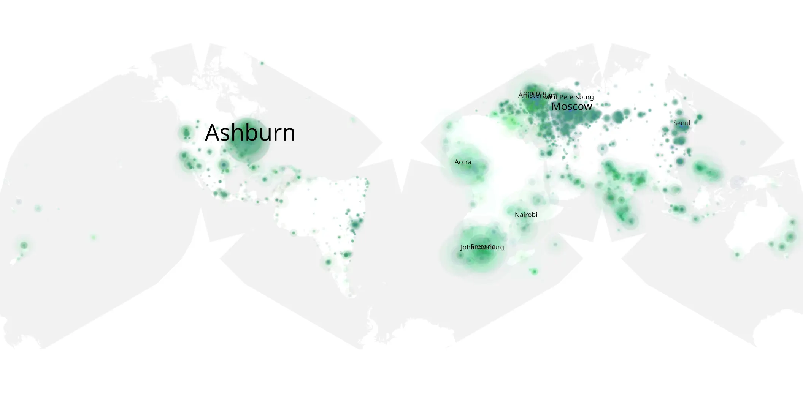

# polite-society sample cache audit

## 1. Media object

| Field | Value |
| --- | --- |
| Media object | Polite Society |
| Collection key | `polite-society` |
| imdb_id | [tt18257464](https://www.imdb.com/title/tt18257464/) |
| wikipedia_url | [Polite Society (film)](https://en.wikipedia.org/wiki/Polite_Society_(film)) |
| Sample dates | 2023-05-16-to-2023-07-24 |
| Sample days | 70 |
| BTIH count | 123 |
| Unique BTIH count | 100 |
| Downloaders total | 1,475,455 |
| Uploaders total | 286,867 |
| Data version | `2026-08-05` |
| IP geolocation version | `6:1777968300` |

## 2. Sample coverage report

- Generated: 2026-08-31T06:28:24Z
- Sample archive directory: `/run/media/bkoz/gold/src/alpha60-samples-raw.gold/polite-society.xz`
- Hour directories: 1656
- Zero-length sample files: 0
- Other unparsable sample files: 0
- Hourly discontinuities: 1 (4 missing hours)
- Missing days: 0

### Sample archive discontinuities

- hourly gap: last `2023-07-04 08:06`, resumed `2023-07-04 13:06` — missing 4 hour(s)

## 3. Media objects file size histogram

## 4. Visualization pass — graphs

### Downloads by week cumulative (normalized start)



### Downloads by day, Saturday and Sunday in gray

## 5. Visualization pass — maps

### Cumulative geographic slices

| Africa | Americas | Asia | Europe | Oceania | Unknown |
| --- | --- | --- | --- | --- | --- |
| 12.24 | 21.27 | 21.03 | 34.98 | 1.95 | 0.45 |

### Cumulative network infrastructure

{:target="_blank" rel="noopener"}

### Cumulative data maps

**Cumulative >= 1080p**

{:target="_blank" rel="noopener"}

**Cumulative < 1080p**

{:target="_blank" rel="noopener"}
