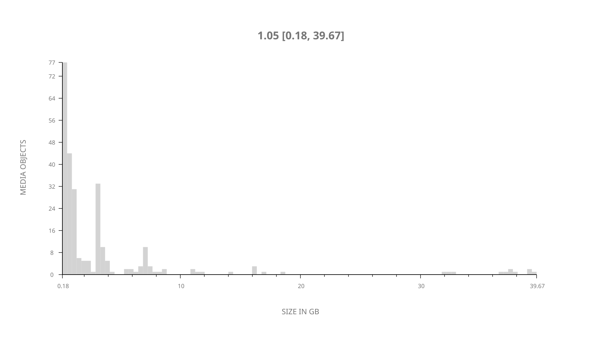
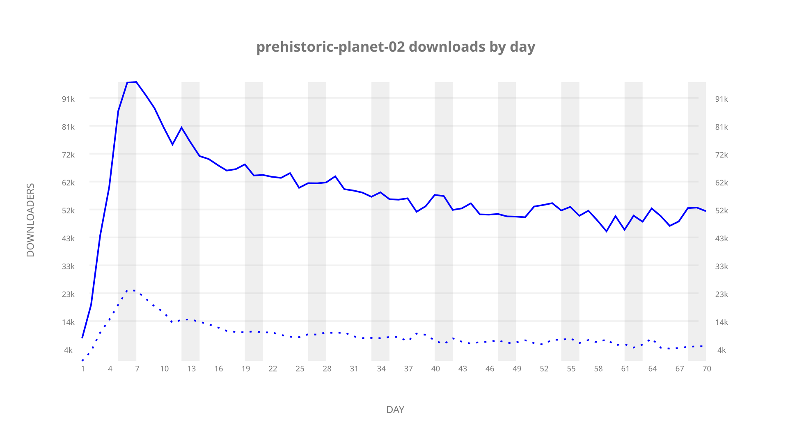
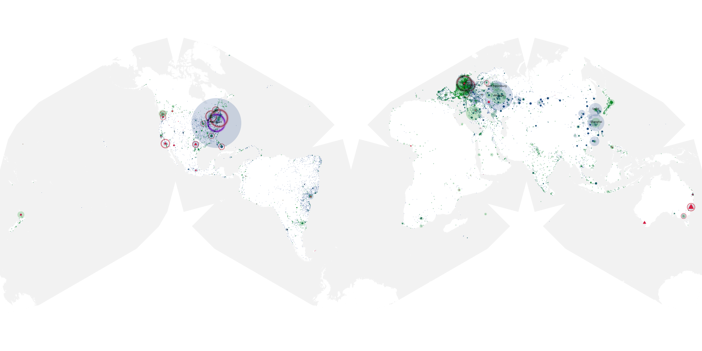
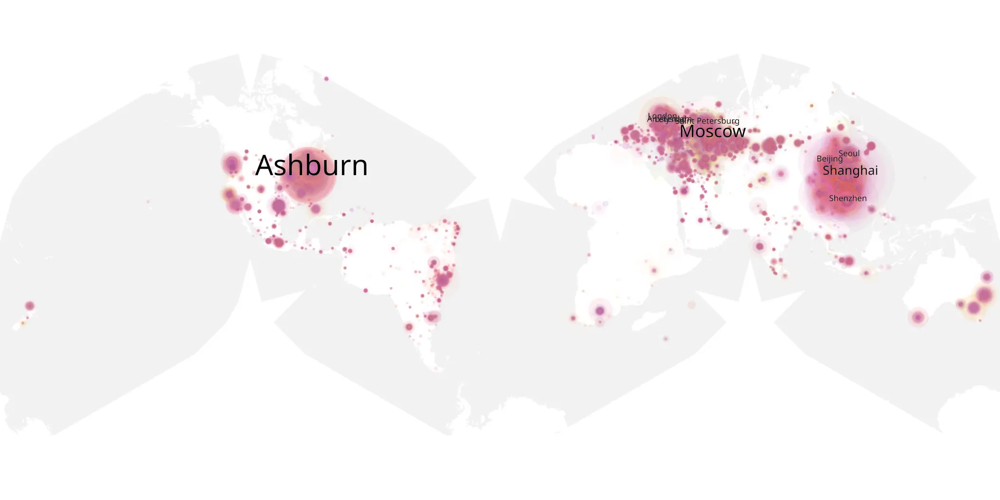
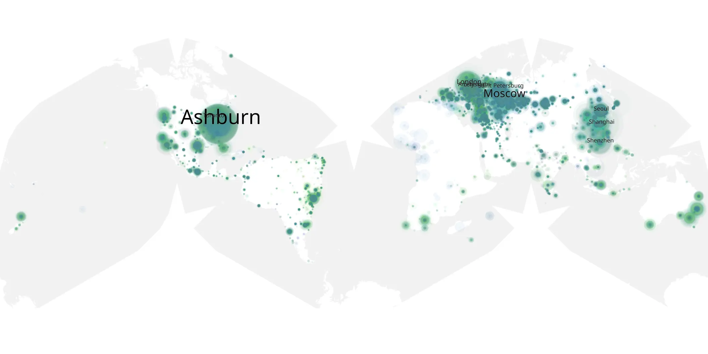

# prehistoric-planet-02 sample cache audit

## 1. Media object

| Field | Value |
| --- | --- |
| Media object | Prehistoric Planet |
| Collection key | `prehistoric-planet-02` |
| imdb_id | [tt10324164](https://www.imdb.com/title/tt10324164/) |
| wikipedia_url | [Prehistoric Planet](https://en.wikipedia.org/wiki/Prehistoric_Planet) |
| Sample dates | 2023-05-22-to-2023-07-30 |
| Sample days | 70 |
| BTIH count | 289 |
| Unique BTIH count | 264 |
| Downloaders total | 2,487,569 |
| Uploaders total | 385,085 |
| Data version | `2026-08-05` |
| IP geolocation version | `6:1777968300` |

## 2. Sample coverage report

- Generated: 2026-08-31T06:28:24Z
- Sample archive directory: `/run/media/bkoz/gold/src/alpha60-samples-raw.gold/prehistoric-planet-02.xz`
- Hour directories: 1659
- Zero-length sample files: 0
- Other unparsable sample files: 0
- Hourly discontinuities: 1 (4 missing hours)
- Missing days: 0

### Sample archive discontinuities

- hourly gap: last `2023-05-23 09:03`, resumed `2023-05-23 14:03` — missing 4 hour(s)

## 3. Media objects file size histogram

## 4. Visualization pass — graphs

### Downloads by week cumulative (normalized start)



### Downloads by day, Saturday and Sunday in gray

## 5. Visualization pass — maps

### Cumulative geographic slices

| Africa | Americas | Asia | Europe | Oceania | Unknown |
| --- | --- | --- | --- | --- | --- |
| 1.38 | 24.83 | 22.95 | 46.58 | 2.03 | 0.64 |

### Cumulative network infrastructure

{:target="_blank" rel="noopener"}

### Cumulative data maps

**Cumulative >= 1080p**

{:target="_blank" rel="noopener"}

**Cumulative < 1080p**

{:target="_blank" rel="noopener"}
