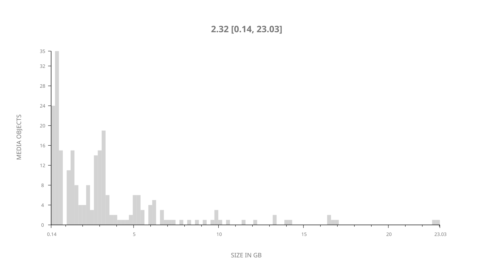
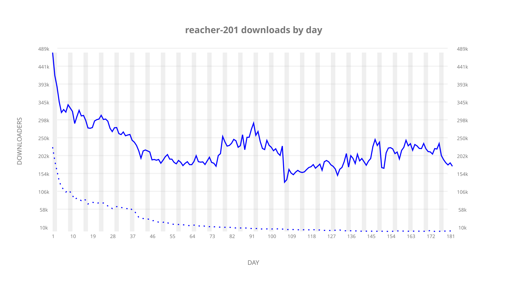
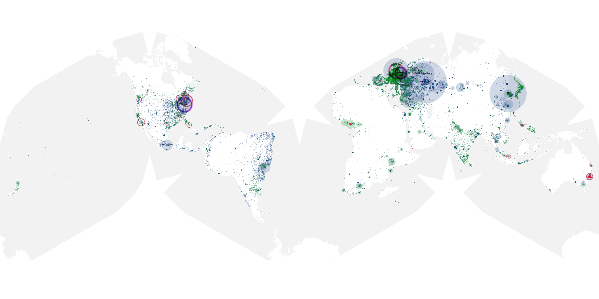
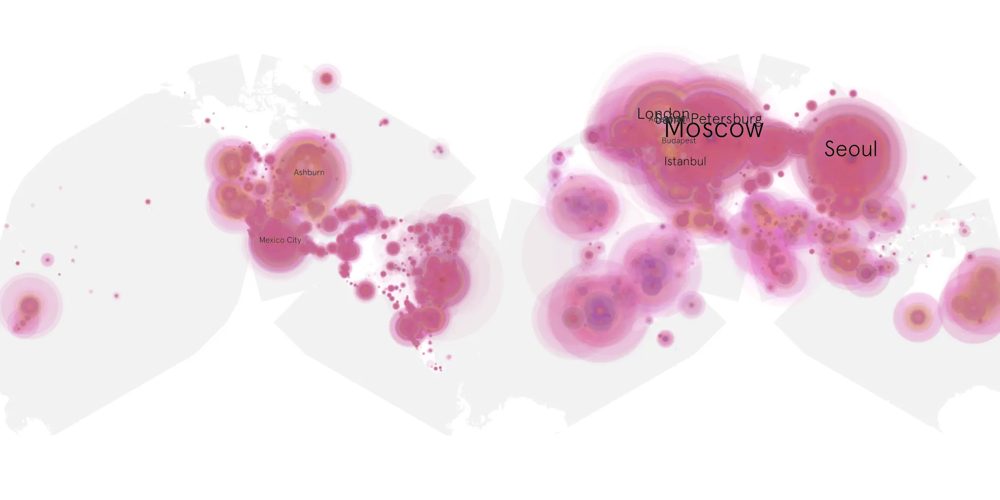
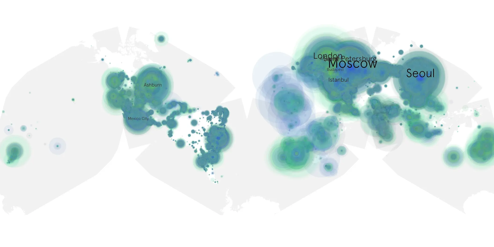

# reacher-201 sample cache audit

## 1. Media object

| Field | Value |
| --- | --- |
| Media object | Reacher |
| Collection key | `reacher-201` |
| imdb_id | [tt9288030](https://www.imdb.com/title/tt9288030/) |
| wikipedia_url | [Reacher (TV series)](https://en.wikipedia.org/wiki/Reacher_(TV_series)) |
| Sample dates | 2023-12-15-to-2024-06-13 |
| Sample days | 182 |
| BTIH count | 282 |
| Unique BTIH count | 242 |
| Downloaders total | 31,651,948 |
| Uploaders total | 3,489,993 |
| Data version | `2026-08-05` |
| IP geolocation version | `6:1777968300` |

## 2. Coverage report

- Generated: 2026-08-31T06:28:24Z
- Sample archive directory: `/run/media/bkoz/gold/src/alpha60-samples-raw.gold/reacher-201.xz`
- Hour directories: 4361
- Zero-length sample files: 0
- Other unparsable sample files: 0
- Hourly discontinuities: 1 (1 missing hours)
- Missing days: 0

### Sample archive discontinuities

- hourly gap: last `2024-03-31 01:06`, resumed `2024-03-31 03:06` — missing 1 hour(s)

## 3. File sizes histogram *median[lowest, highest]*

## 4. Graphs

### Downloads by week cumulative (normalized start)



### Downloads by day, Saturday and Sunday in gray

## 5. Cumulative Maps

<!-- https://raw.githubusercontent.com/alpha60-devops/alpha60-results-2023/refs/heads/main/data/ -->

### <a href="https://raw.githubusercontent.com/alpha60-devops/alpha60-results-2023/refs/heads/main/data/geojson.cumulative/reacher-201-cumulative-aggregate.geojson.gz" data-map-title="Reacher — reacher-201" onclick="leaflet_map_open_window(this.href, this.dataset.mapTitle); return false;" class="table-link" aria-label="Open Reacher (reacher-201) cumulative data map in new window" title="Opens interactive map for Reacher (reacher-201) data">Swarm Detail</a>

### Geographic Regions

| Africa | Americas | Asia | Europe | Oceania | Unknown |
| --- | --- | --- | --- | --- | --- |
| 4.58 | 19.68 | 22.71 | 48.82 | 1.79 | 0.58 |

### Network infrastructure

{:target="_blank" rel="noopener"}

### Resolution >= 1080p

{:target="_blank" rel="noopener"}

### Resolution < 1080p

{:target="_blank" rel="noopener"}
