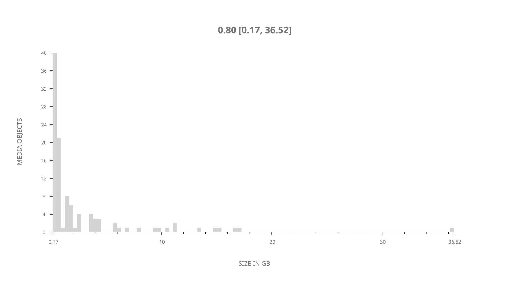
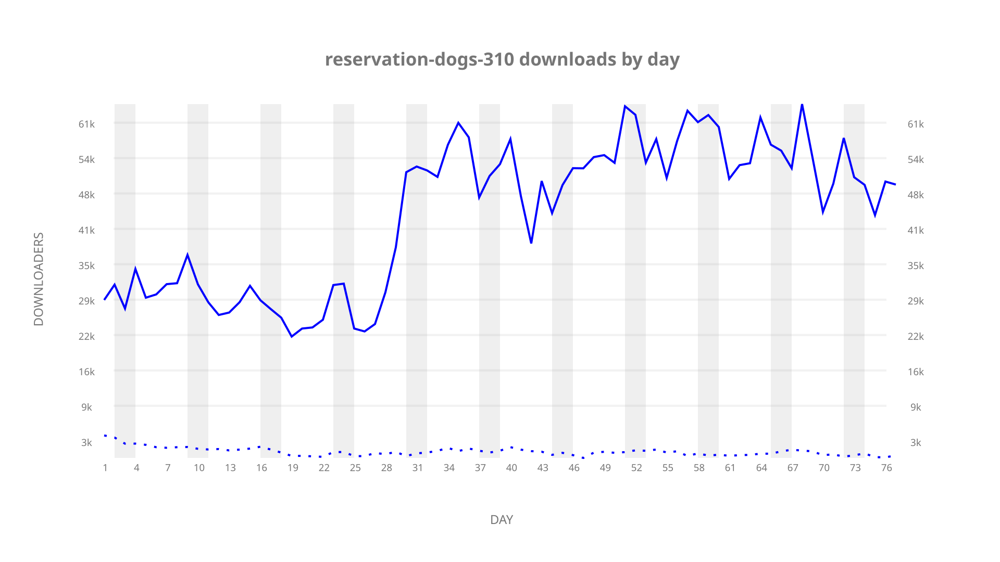
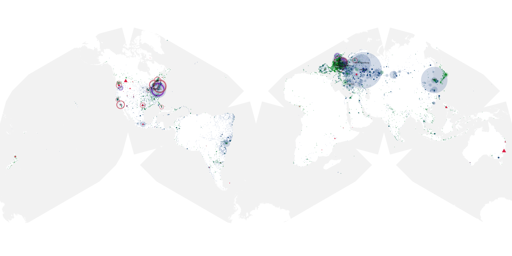
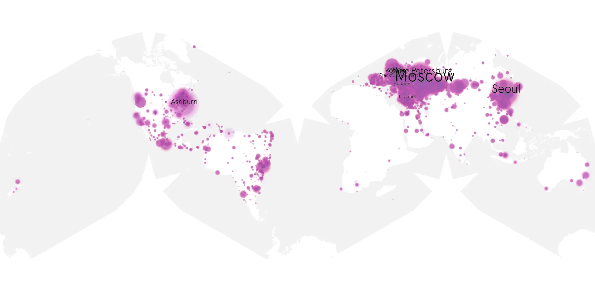
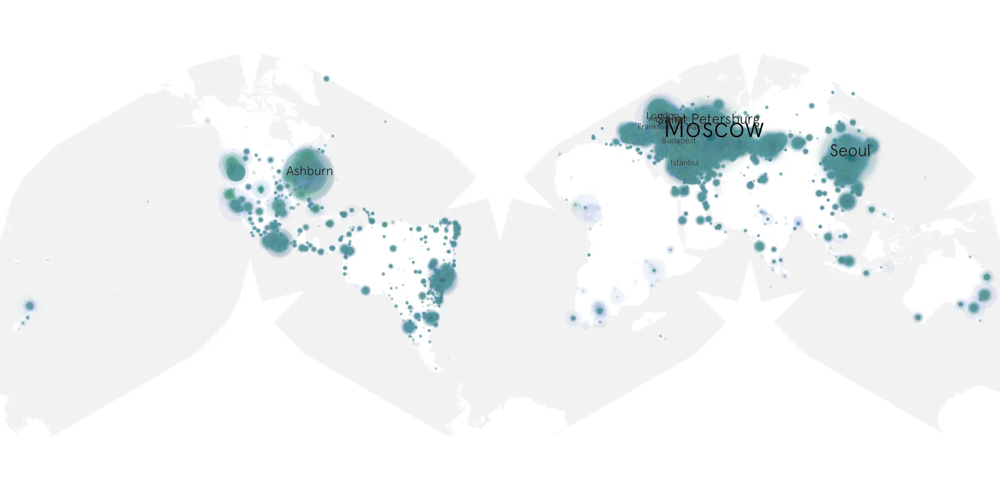

# reservation-dogs-310 sample cache audit

## 1. Media object

| Field | Value |
| --- | --- |
| Media object | Reservation Dogs |
| Collection key | `reservation-dogs-310` |
| imdb_id | [tt13623580](https://www.imdb.com/title/tt13623580/) |
| wikipedia_url | [Reservation Dogs](https://en.wikipedia.org/wiki/Reservation_Dogs) |
| Sample dates | 2023-09-28-to-2023-12-13 |
| Sample days | 77 |
| BTIH count | 115 |
| Unique BTIH count | 107 |
| Downloaders total | 3,047,343 |
| Uploaders total | 134,593 |
| Data version | `2026-08-05` |
| IP geolocation version | `6:1777968300` |

## 2. Coverage report

- Generated: 2026-08-31T06:28:24Z
- Sample archive directory: `/run/media/bkoz/gold/src/alpha60-samples-raw.gold/reservation-dogs-310.xz`
- Hour directories: 1842
- Zero-length sample files: 0
- Other unparsable sample files: 0
- Hourly discontinuities: 0 (0 missing hours)
- Missing days: 0

### Sample archive discontinuities

None detected.

## 3. File sizes histogram *median[lowest, highest]*

## 4. Graphs

### Downloads by week cumulative (normalized start)



### Downloads by day, Saturday and Sunday in gray

## 5. Cumulative Maps

<!-- https://raw.githubusercontent.com/alpha60-devops/alpha60-results-2023/refs/heads/main/data/ -->

### <a href="https://raw.githubusercontent.com/alpha60-devops/alpha60-results-2023/refs/heads/main/data/geojson.cumulative/reservation-dogs-310-cumulative-aggregate.geojson.gz" data-map-title="Reservation Dogs — reservation-dogs-310" onclick="leaflet_map_open_window(this.href, this.dataset.mapTitle); return false;" class="table-link" aria-label="Open Reservation Dogs (reservation-dogs-310) cumulative data map in new window" title="Opens interactive map for Reservation Dogs (reservation-dogs-310) data">Swarm Detail</a>

### Geographic Regions

| Africa | Americas | Asia | Europe | Oceania | Unknown |
| --- | --- | --- | --- | --- | --- |
| 0.84 | 21.05 | 18.53 | 54.88 | 0.78 | 0.51 |

### Network infrastructure

{:target="_blank" rel="noopener"}

### Resolution >= 1080p

{:target="_blank" rel="noopener"}

### Resolution < 1080p

{:target="_blank" rel="noopener"}
