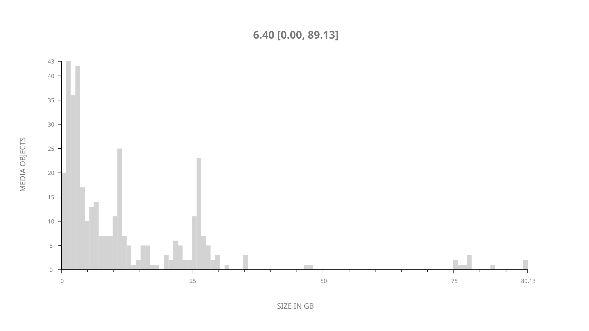
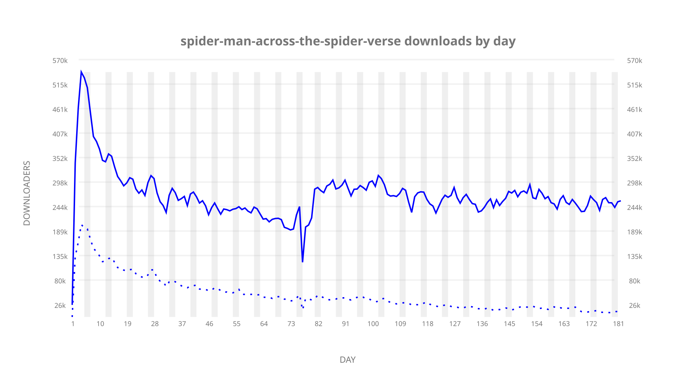
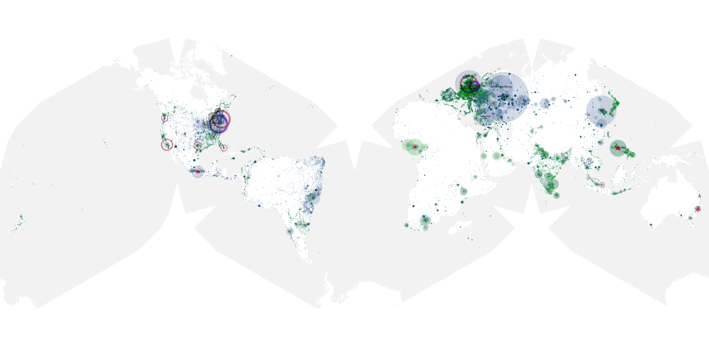
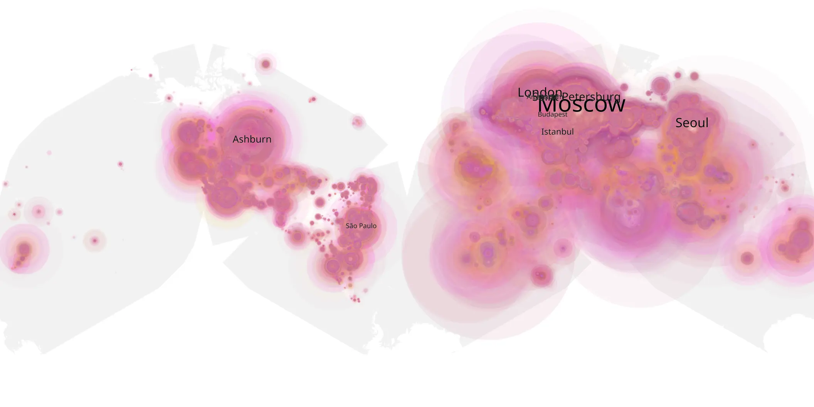
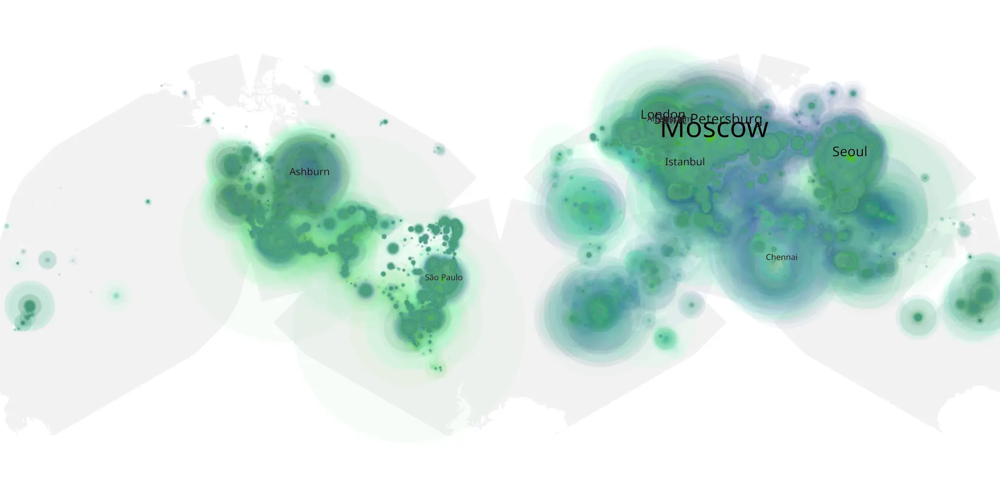

# spider-man-across-the-spider-verse sample cache audit

## 1. Media object

| Field | Value |
| --- | --- |
| Media object | Spider Man Across The Spider Verse |
| Collection key | `spider-man-across-the-spider-verse` |
| imdb_id | [tt9362722](https://www.imdb.com/title/tt9362722/) |
| wikipedia_url | [Spider-Man: Across the Spider-Verse](https://en.wikipedia.org/wiki/Spider-Man:_Across_the_Spider-Verse) |
| Sample dates | 2023-08-07-to-2024-02-05 |
| Sample days | 183 |
| BTIH count | 421 |
| Unique BTIH count | 366 |
| Downloaders total | 37,574,408 |
| Uploaders total | 7,126,774 |
| Data version | `2026-08-05` |
| IP geolocation version | `6:1777968300` |

## 2. Sample coverage report

- Generated: 2026-08-31T06:28:24Z
- Sample archive directory: `/run/media/bkoz/gold/src/alpha60-samples-raw.gold/spider-man-across-the-spider-verse.xz`
- Hour directories: 4331
- Zero-length sample files: 0
- Other unparsable sample files: 0
- Hourly discontinuities: 3 (42 missing hours)
- Missing days: 1

### Sample archive discontinuities

- hourly gap: last `2023-09-07 09:00`, resumed `2023-09-07 13:00` — missing 3 hour(s)
- hourly gap: last `2023-10-22 11:00`, resumed `2023-10-24 01:23` — missing 37 hour(s)
- hourly gap: last `2023-11-27 23:00`, resumed `2023-11-28 02:00` — missing 2 hour(s)
- missing day: `2023-10-23`

## 3. Media objects file size histogram

## 4. Visualization pass — graphs

### Downloads by week cumulative (normalized start)



### Downloads by day, Saturday and Sunday in gray

## 5. Visualization pass — maps

### Cumulative geographic slices

| Africa | Americas | Asia | Europe | Oceania | Unknown |
| --- | --- | --- | --- | --- | --- |
| 5.57 | 19.52 | 25.40 | 44.19 | 1.16 | 0.49 |

### Cumulative network infrastructure

{:target="_blank" rel="noopener"}

### Cumulative data maps

**Cumulative >= 1080p**

{:target="_blank" rel="noopener"}

**Cumulative < 1080p**

{:target="_blank" rel="noopener"}
