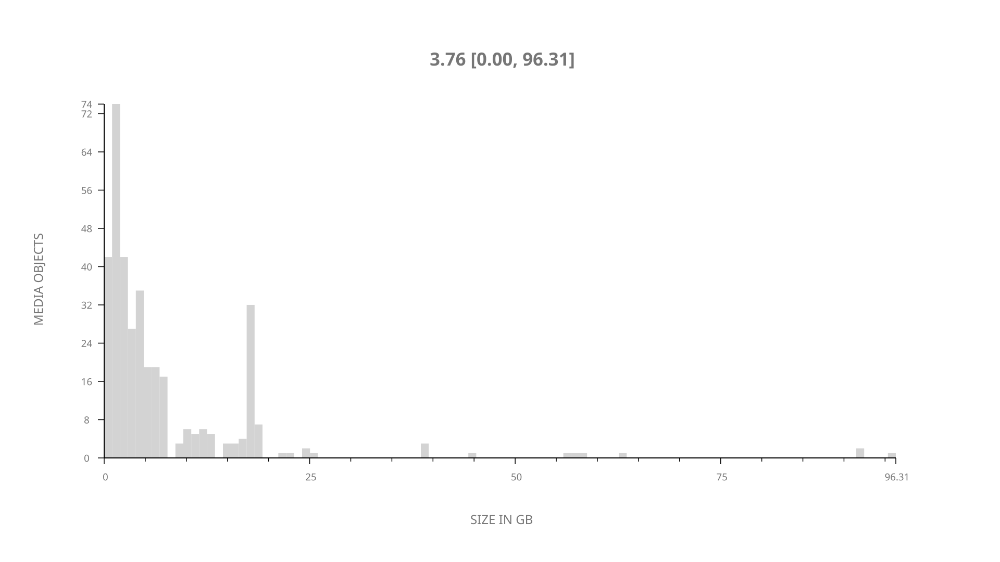
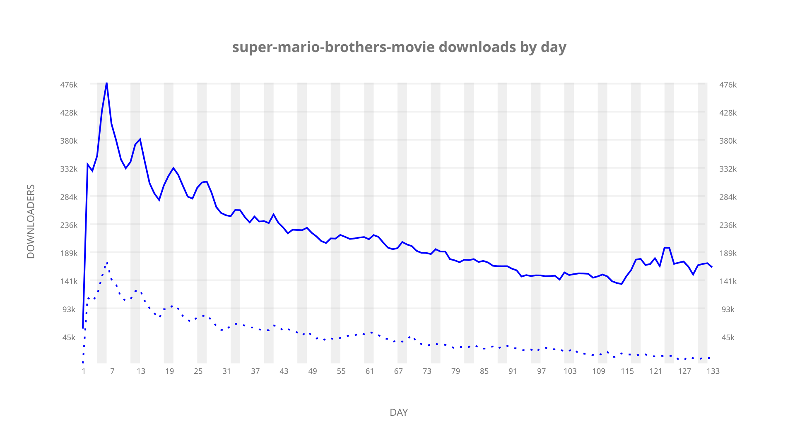
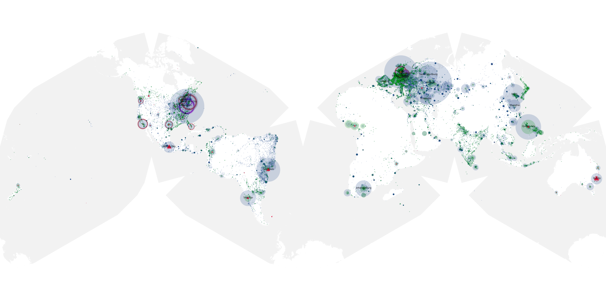
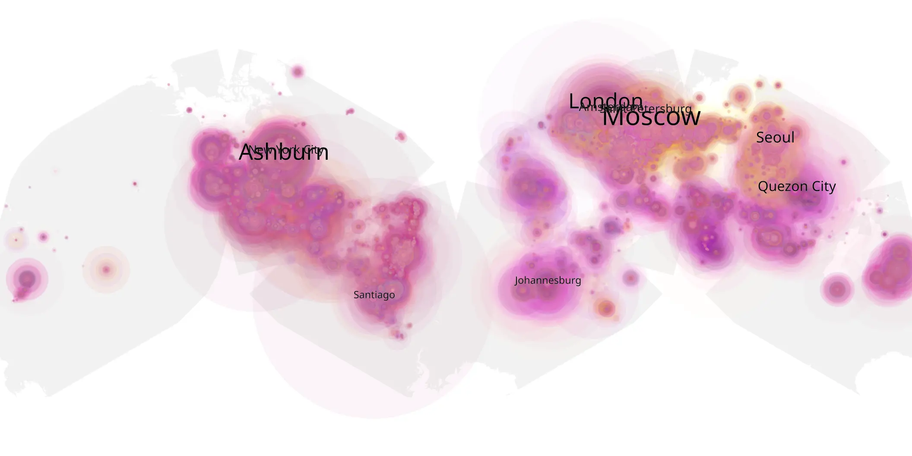
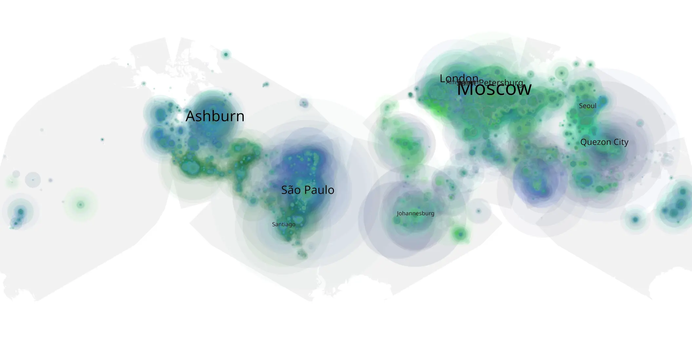

# super-mario-brothers-movie sample cache audit

## 1. Media object

| Field | Value |
| --- | --- |
| Media object | Super Mario Brothers: The Movie |
| Collection key | `super-mario-brothers-movie` |
| imdb_id | [tt6718170](https://www.imdb.com/title/tt6718170/) |
| wikipedia_url | [The Super Mario Bros. Movie](https://en.wikipedia.org/wiki/The_Super_Mario_Bros._Movie) |
| Sample dates | 2023-05-16-to-2023-09-25 |
| Sample days | 133 |
| BTIH count | 406 |
| Unique BTIH count | 365 |
| Downloaders total | 18,499,894 |
| Uploaders total | 5,529,290 |
| Data version | `2026-08-05` |
| IP geolocation version | `6:1777968300` |

## 2. Sample coverage report

- Generated: 2026-08-31T06:28:24Z
- Sample archive directory: `/run/media/bkoz/gold/src/alpha60-samples-raw.gold/super-mario-brothers-movie.xz`
- Hour directories: 3172
- Zero-length sample files: 0
- Other unparsable sample files: 0
- Hourly discontinuities: 0 (0 missing hours)
- Missing days: 0

### Sample archive discontinuities

None detected.

## 3. Media objects file size histogram

## 4. Visualization pass — graphs

### Downloads by week cumulative (normalized start)



### Downloads by day, Saturday and Sunday in gray

## 5. Visualization pass — maps

### Cumulative geographic slices

| Africa | Americas | Asia | Europe | Oceania | Unknown |
| --- | --- | --- | --- | --- | --- |
| 6.03 | 28.21 | 21.39 | 38.07 | 1.80 | 0.60 |

### Cumulative network infrastructure

{:target="_blank" rel="noopener"}

### Cumulative data maps

**Cumulative >= 1080p**

{:target="_blank" rel="noopener"}

**Cumulative < 1080p**

{:target="_blank" rel="noopener"}
