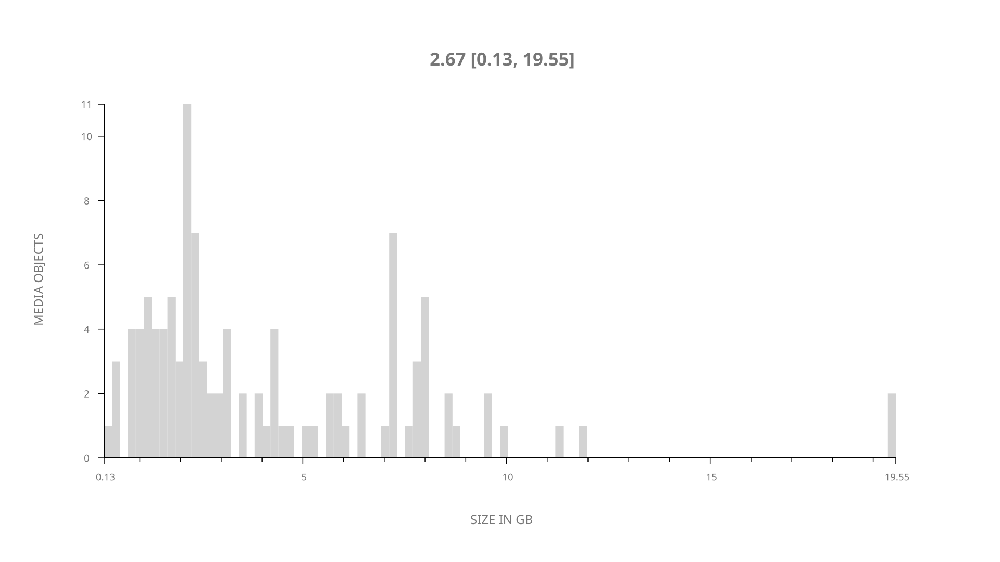
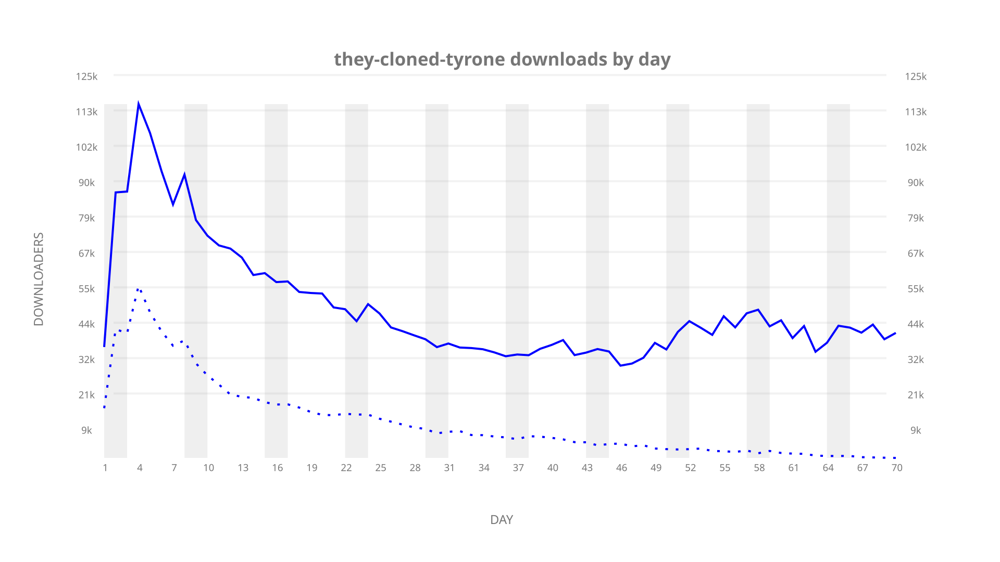
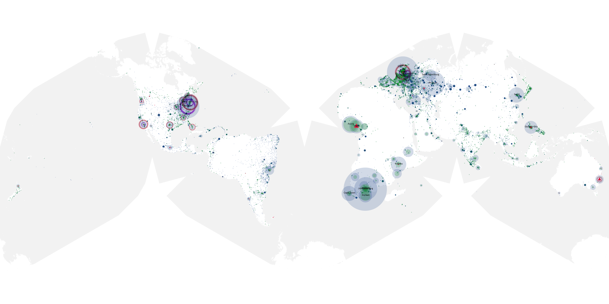
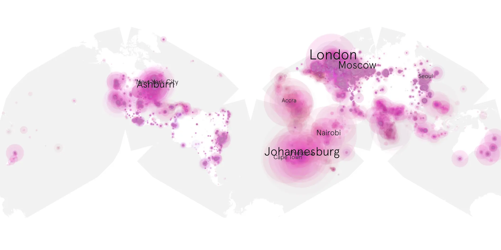
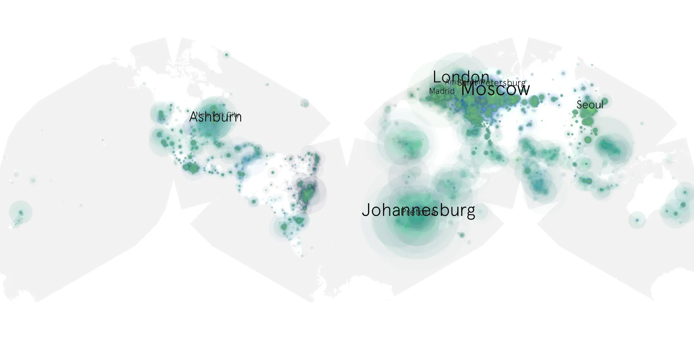

# they-cloned-tyrone sample cache audit

## 1. Media object

| Field | Value |
| --- | --- |
| Media object | They Cloned Tyrone |
| Collection key | `they-cloned-tyrone` |
| imdb_id | [tt9873892](https://www.imdb.com/title/tt9873892/) |
| wikipedia_url | [They Cloned Tyrone](https://en.wikipedia.org/wiki/They_Cloned_Tyrone) |
| Sample dates | 2023-07-21-to-2023-09-28 |
| Sample days | 70 |
| BTIH count | 124 |
| Unique BTIH count | 109 |
| Downloaders total | 3,144,702 |
| Uploaders total | 1,039,740 |
| Data version | `2026-08-05` |
| IP geolocation version | `6:1777968300` |

## 2. Coverage report

- Generated: 2026-08-31T06:28:24Z
- Sample archive directory: `/run/media/bkoz/gold/src/alpha60-samples-raw.gold/they-cloned-tyrone.xz`
- Hour directories: 1664
- Zero-length sample files: 0
- Other unparsable sample files: 0
- Hourly discontinuities: 0 (0 missing hours)
- Missing days: 0

### Sample archive discontinuities

None detected.

## 3. File sizes histogram *median[lowest, highest]*

## 4. Graphs

### Downloads by week cumulative (normalized start)



### Downloads by day, Saturday and Sunday in gray

## 5. Cumulative Maps

<!-- https://raw.githubusercontent.com/alpha60-devops/alpha60-results-2023/refs/heads/main/data/ -->

### <a href="https://raw.githubusercontent.com/alpha60-devops/alpha60-results-2023/refs/heads/main/data/geojson.cumulative/they-cloned-tyrone-cumulative-aggregate.geojson.gz" data-map-title="They Cloned Tyrone — they-cloned-tyrone" onclick="leaflet_map_open_window(this.href, this.dataset.mapTitle); return false;" class="table-link" aria-label="Open They Cloned Tyrone (they-cloned-tyrone) cumulative data map in new window" title="Opens interactive map for They Cloned Tyrone (they-cloned-tyrone) data">Swarm Detail</a>

### Geographic Regions

| Africa | Americas | Asia | Europe | Oceania | Unknown |
| --- | --- | --- | --- | --- | --- |
| 17.40 | 20.38 | 17.73 | 34.61 | 1.90 | 0.47 |

### Network infrastructure

{:target="_blank" rel="noopener"}

### Resolution >= 1080p

{:target="_blank" rel="noopener"}

### Resolution < 1080p

{:target="_blank" rel="noopener"}
