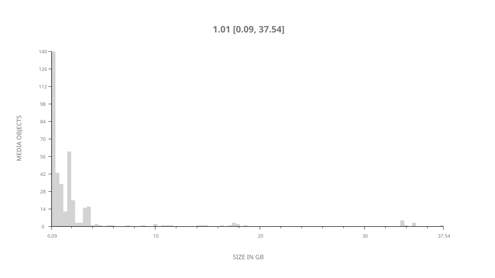
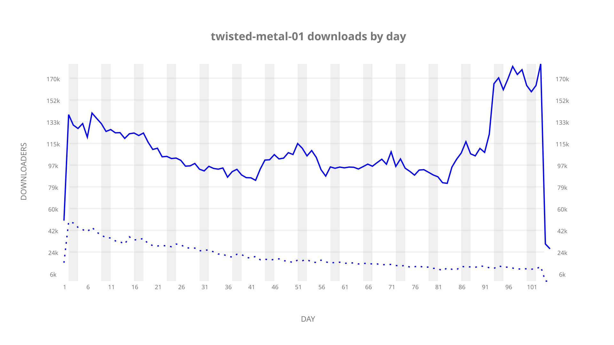
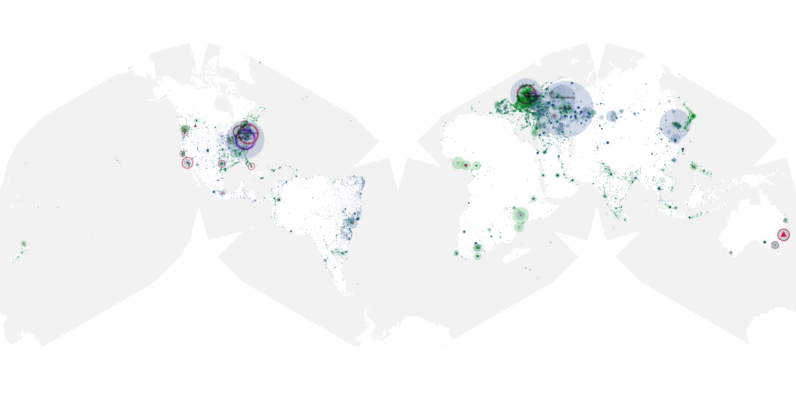
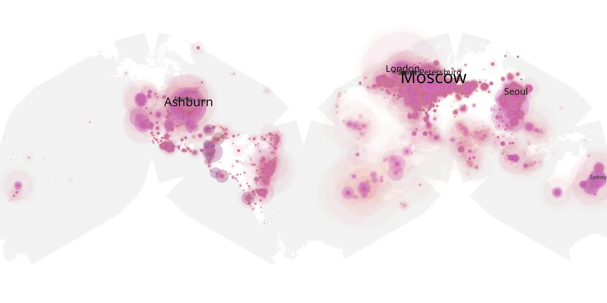
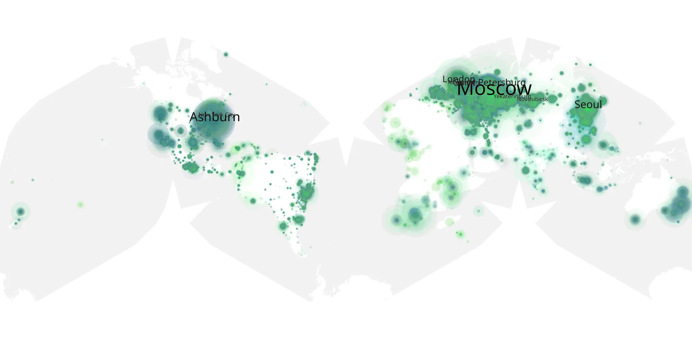

# twisted-metal-01 sample cache audit

## 1. Media object

| Field | Value |
| --- | --- |
| Media object | Twisted Metal |
| Collection key | `twisted-metal-01` |
| imdb_id | [tt14261112](https://www.imdb.com/title/tt14261112/) |
| wikipedia_url | [Twisted Metal (TV series)](https://en.wikipedia.org/wiki/Twisted_Metal_(TV_series)) |
| Sample dates | 2023-07-27-to-2023-11-08 |
| Sample days | 105 |
| BTIH count | 399 |
| Unique BTIH count | 381 |
| Downloaders total | 7,550,495 |
| Uploaders total | 1,197,979 |
| Data version | `2026-08-05` |
| IP geolocation version | `6:1777968300` |

## 2. Coverage report

- Generated: 2026-08-31T06:28:24Z
- Sample archive directory: `/run/media/bkoz/gold/src/alpha60-samples-raw.gold/twisted-metal-01.xz`
- Hour directories: 2460
- Zero-length sample files: 0
- Other unparsable sample files: 0
- Hourly discontinuities: 1 (42 missing hours)
- Missing days: 0

### Sample archive discontinuities

- hourly gap: last `2023-11-07 02:06`, resumed `2023-11-08 21:44` — missing 42 hour(s)

## 3. File sizes histogram *median[lowest, highest]*

## 4. Graphs

### Downloads by week cumulative (normalized start)



### Downloads by day, Saturday and Sunday in gray

## 5. Cumulative Maps

<!-- https://raw.githubusercontent.com/alpha60-devops/alpha60-results-2023/refs/heads/main/data/ -->

### <a href="https://raw.githubusercontent.com/alpha60-devops/alpha60-results-2023/refs/heads/main/data/geojson.cumulative/twisted-metal-01-cumulative-aggregate.geojson.gz" data-map-title="Twisted Metal — twisted-metal-01" onclick="leaflet_map_open_window(this.href, this.dataset.mapTitle); return false;" class="table-link" aria-label="Open Twisted Metal (twisted-metal-01) cumulative data map in new window" title="Opens interactive map for Twisted Metal (twisted-metal-01) data">Swarm Detail</a>

### Geographic Regions

| Africa | Americas | Asia | Europe | Oceania | Unknown |
| --- | --- | --- | --- | --- | --- |
| 3.64 | 22.11 | 16.91 | 48.74 | 2.20 | 0.54 |

### Network infrastructure

{:target="_blank" rel="noopener"}

### Resolution >= 1080p

{:target="_blank" rel="noopener"}

### Resolution < 1080p

{:target="_blank" rel="noopener"}
