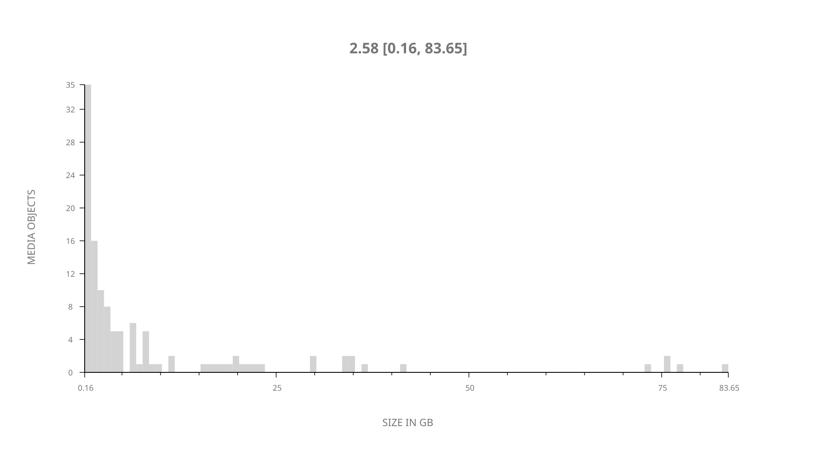
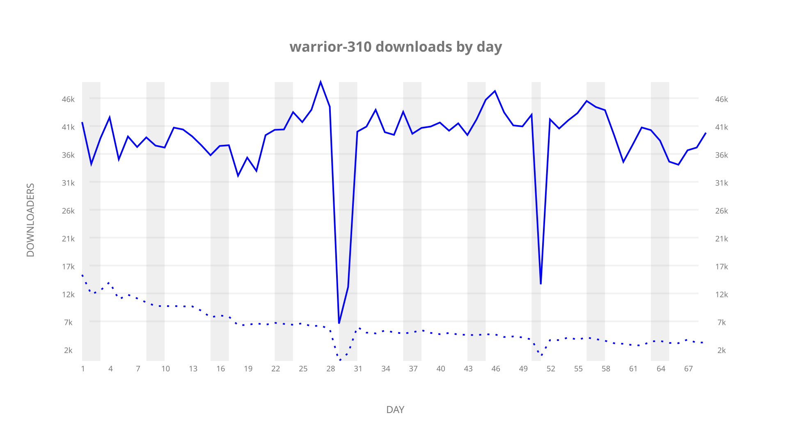
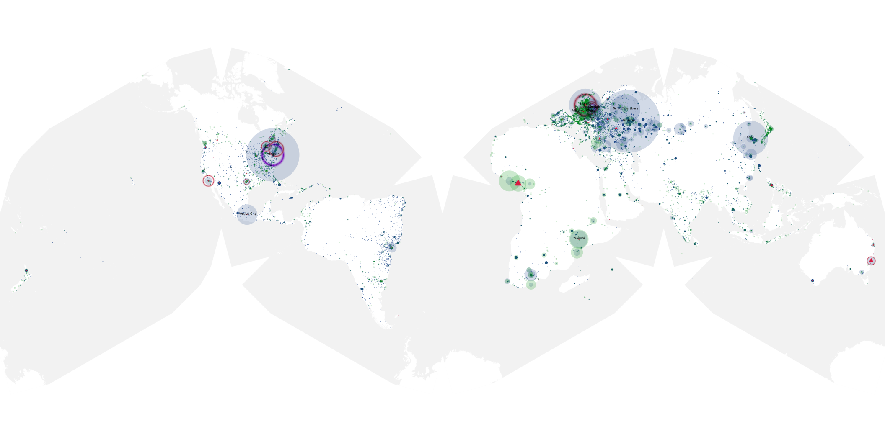
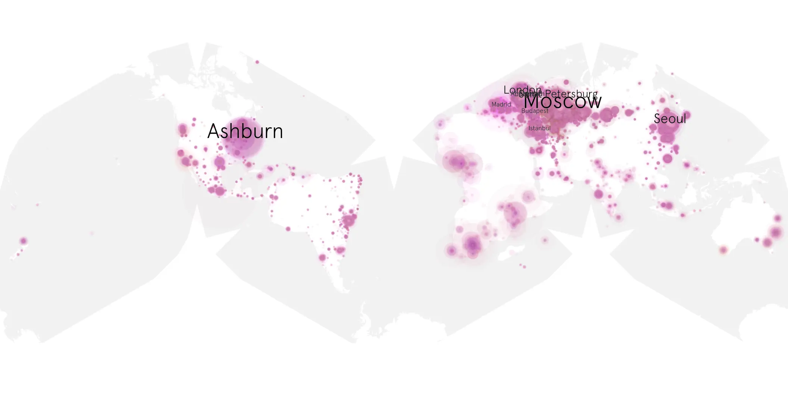
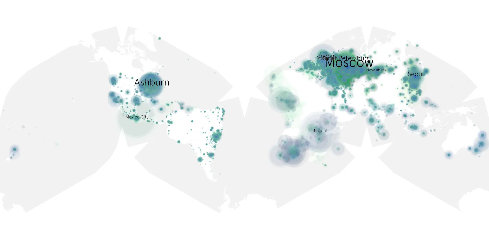

# warrior-310 sample cache audit

## 1. Media object

| Field | Value |
| --- | --- |
| Media object | Warrior |
| Collection key | `warrior-310` |
| imdb_id | [tt5743796](https://www.imdb.com/title/tt5743796/) |
| wikipedia_url | [Warrior (TV series)](https://en.wikipedia.org/wiki/Warrior_(TV_series)) |
| Sample dates | 2023-08-18-to-2023-10-26 |
| Sample days | 70 |
| BTIH count | 131 |
| Unique BTIH count | 119 |
| Downloaders total | 2,098,320 |
| Uploaders total | 288,719 |
| Data version | `2026-08-05` |
| IP geolocation version | `6:1777968300` |

## 2. Coverage report

- Generated: 2026-08-31T06:28:24Z
- Sample archive directory: `/run/media/bkoz/gold/src/alpha60-samples-raw.gold/warrior-310.xz`
- Hour directories: 1589
- Zero-length sample files: 0
- Other unparsable sample files: 0
- Hourly discontinuities: 2 (86 missing hours)
- Missing days: 1

### Sample archive discontinuities

- hourly gap: last `2023-09-15 01:03`, resumed `2023-09-16 20:03` — missing 42 hour(s)
- hourly gap: last `2023-10-06 22:03`, resumed `2023-10-08 19:03` — missing 44 hour(s)
- missing day: `2023-10-07`

## 3. File sizes histogram *median[lowest, highest]*

## 4. Graphs

### Downloads by week cumulative (normalized start)



### Downloads by day, Saturday and Sunday in gray

## 5. Cumulative Maps

<!-- https://raw.githubusercontent.com/alpha60-devops/alpha60-results-2023/refs/heads/main/data/ -->

### <a href="https://raw.githubusercontent.com/alpha60-devops/alpha60-results-2023/refs/heads/main/data/geojson.cumulative/warrior-310-cumulative-aggregate.geojson.gz" data-map-title="Warrior — warrior-310" onclick="leaflet_map_open_window(this.href, this.dataset.mapTitle); return false;" class="table-link" aria-label="Open Warrior (warrior-310) cumulative data map in new window" title="Opens interactive map for Warrior (warrior-310) data">Swarm Detail</a>

### Geographic Regions

| Africa | Americas | Asia | Europe | Oceania | Unknown |
| --- | --- | --- | --- | --- | --- |
| 7.15 | 19.29 | 17.80 | 50.21 | 1.40 | 0.58 |

### Network infrastructure

{:target="_blank" rel="noopener"}

### Resolution >= 1080p

{:target="_blank" rel="noopener"}

### Resolution < 1080p

{:target="_blank" rel="noopener"}
