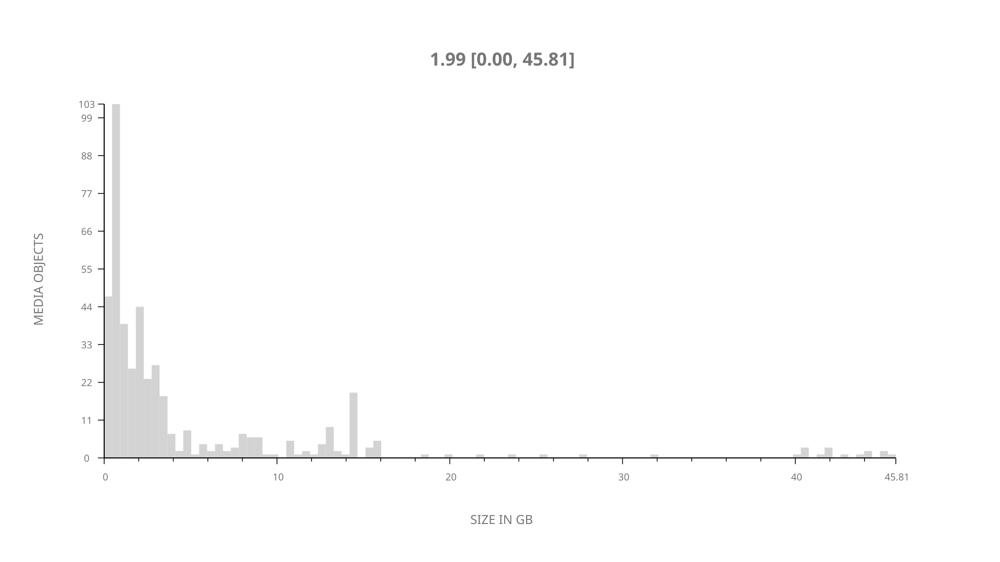
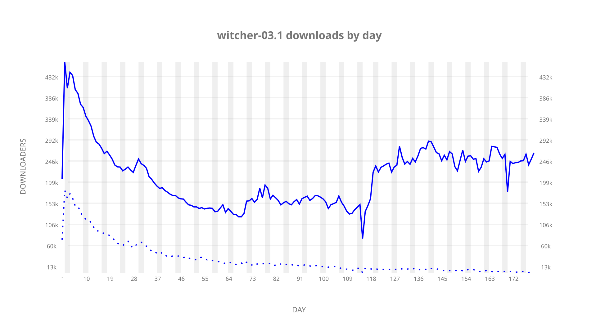
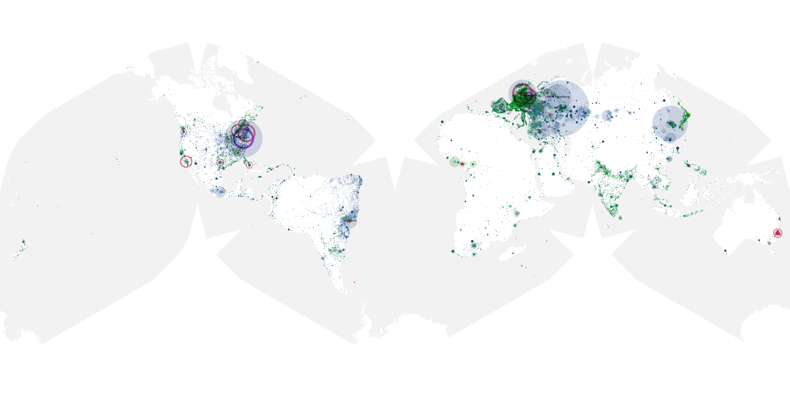
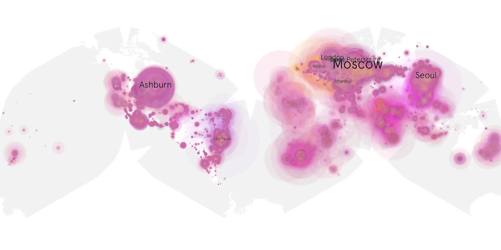
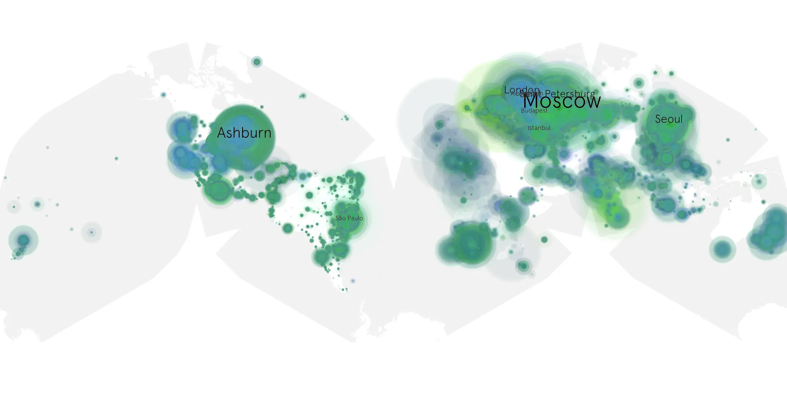

# witcher-03.1 sample cache audit

## 1. Media object

| Field | Value |
| --- | --- |
| Media object | Witcher |
| Collection key | `witcher-03.1` |
| imdb_id | [tt5180504](https://www.imdb.com/title/tt5180504/) |
| wikipedia_url | [The Witcher (TV series)](https://en.wikipedia.org/wiki/The_Witcher_(TV_series)) |
| Sample dates | 2023-06-29-to-2023-12-27 |
| Sample days | 182 |
| BTIH count | 485 |
| Unique BTIH count | 455 |
| Downloaders total | 27,527,867 |
| Uploaders total | 3,452,571 |
| Data version | `2026-08-05` |
| IP geolocation version | `6:1777968300` |

## 2. Sample coverage report

- Generated: 2026-08-31T06:28:24Z
- Sample archive directory: `/run/media/bkoz/gold/src/alpha60-samples-raw.gold/witcher-03.1.xz`
- Hour directories: 4356
- Zero-length sample files: 0
- Other unparsable sample files: 0
- Hourly discontinuities: 4 (44 missing hours)
- Missing days: 1

### Sample archive discontinuities

- hourly gap: last `2023-09-07 08:03`, resumed `2023-09-07 13:03` — missing 4 hour(s)
- hourly gap: last `2023-10-22 11:03`, resumed `2023-10-24 01:31` — missing 37 hour(s)
- hourly gap: last `2023-11-22 22:03`, resumed `2023-11-23 00:03` — missing 1 hour(s)
- hourly gap: last `2023-11-27 23:03`, resumed `2023-11-28 02:03` — missing 2 hour(s)
- missing day: `2023-10-23`

## 3. Media objects file size histogram

## 4. Visualization pass — graphs

### Downloads by week cumulative (normalized start)



### Downloads by day, Saturday and Sunday in gray

## 5. Visualization pass — maps

### Cumulative geographic slices

| Africa | Americas | Asia | Europe | Oceania | Unknown |
| --- | --- | --- | --- | --- | --- |
| 4.75 | 21.11 | 19.54 | 50.88 | 1.25 | 0.50 |

### Cumulative network infrastructure

{:target="_blank" rel="noopener"}

### Cumulative data maps

**Cumulative >= 1080p**

{:target="_blank" rel="noopener"}

**Cumulative < 1080p**

{:target="_blank" rel="noopener"}
