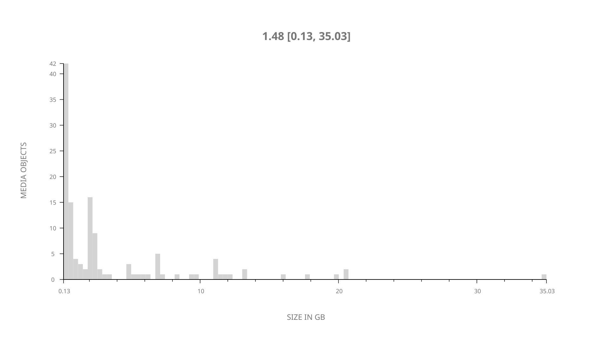
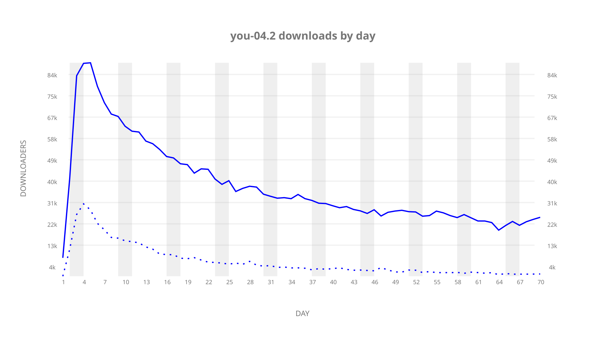
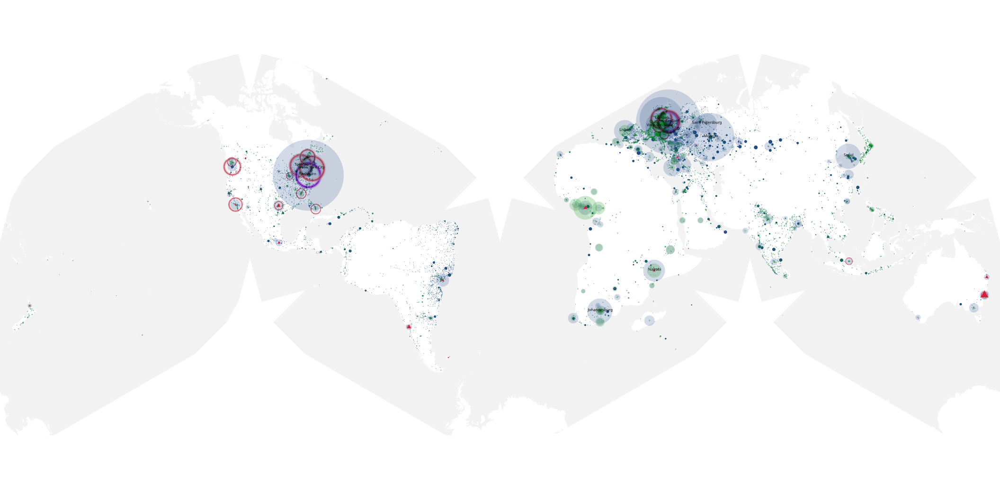
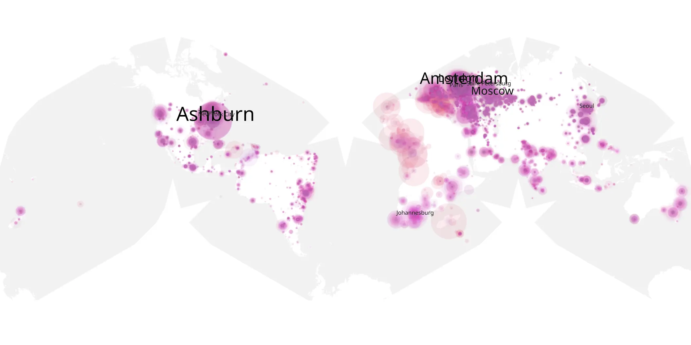
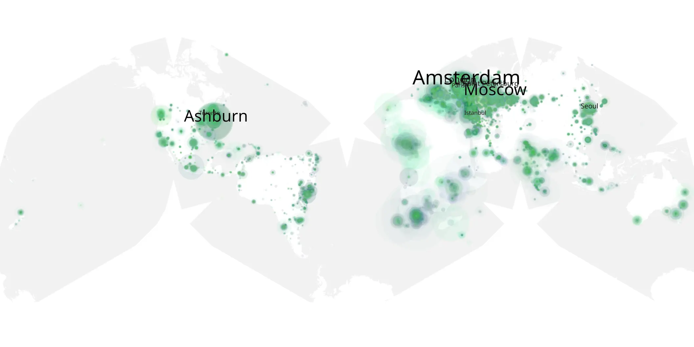

# you-04.2 sample cache audit

## 1. Media object

| Field | Value |
| --- | --- |
| Media object | You |
| Collection key | `you-04.2` |
| imdb_id | [tt7335184](https://www.imdb.com/title/tt7335184/) |
| wikipedia_url | [You (TV series)](https://en.wikipedia.org/wiki/You_(TV_series)) |
| Sample dates | 2023-03-09-to-2023-05-17 |
| Sample days | 70 |
| BTIH count | 133 |
| Unique BTIH count | 126 |
| Downloaders total | 1,630,447 |
| Uploaders total | 355,683 |
| Data version | `2026-08-05` |
| IP geolocation version | `6:1777968300` |

## 2. Sample coverage report

- Generated: 2026-08-31T06:28:24Z
- Sample archive directory: `/run/media/bkoz/gold/src/alpha60-samples-raw.gold/you-04.2.xz`
- Hour directories: 1655
- Zero-length sample files: 0
- Other unparsable sample files: 0
- Hourly discontinuities: 2 (5 missing hours)
- Missing days: 0

### Sample archive discontinuities

- hourly gap: last `2023-03-26 01:03`, resumed `2023-03-26 03:03` — missing 1 hour(s)
- hourly gap: last `2023-05-11 09:03`, resumed `2023-05-11 14:03` — missing 4 hour(s)

## 3. Media objects file size histogram

## 4. Visualization pass — graphs

### Downloads by week cumulative (normalized start)



### Downloads by day, Saturday and Sunday in gray

## 5. Visualization pass — maps

### Cumulative geographic slices

| Africa | Americas | Asia | Europe | Oceania | Unknown |
| --- | --- | --- | --- | --- | --- |
| 12.65 | 20.22 | 15.99 | 40.60 | 1.65 | 0.43 |

### Cumulative network infrastructure

{:target="_blank" rel="noopener"}

### Cumulative data maps

**Cumulative >= 1080p**

{:target="_blank" rel="noopener"}

**Cumulative < 1080p**

{:target="_blank" rel="noopener"}
